# PRISM-Hub 엔지니어링 설계·검증서
> **2026-09-22 후속 검증:** 본문과 기존 부록은 이전 설계 이력이다. 현재 2단 PPRC·SALS 반례·특허 정정은 [통합 개발 보고서](10_검토대응_통합개발.md)를 우선한다.

## — 적용 대상 결정 → 기존 구조 비교 → 수치 타당성 검증 → Simulink 셀·테스트벤치 구축 가이드

작성일: 2026-09-20 | **버전 1.1 (2026-09-21, 전면 재검토·검증 결과 반영본)** | 구현 범위: MATLAB/Simulink 시뮬레이션 (하드웨어 제작 없음)

> v1.1 변경: 부록 A–I의 시뮬레이션 결과를 본문(2.4, 3.3.2, 3.5, 4.3, 5, 6.1, 9)에 직접 반영했다. 검증 전 추정은 각 절 끝의 "v1.0 기록"에 짧게 남겼다. 제어 계층 명칭을 ARL에서 **SALS**(Saturation-Aware Anticipatory Load Shaping)로 바꿨다.
동반 파일: `prism_design_params.m` (WP1 파라미터 스크립트), `fig/` (수치 검증 그래프), 기존 `EV_컨버터_아키텍처_제안서.md` (상위 제안서)

> 이 문서는 제안서(아키텍처·예측 제어 개념)를 **엔지니어링 절차**로 내려 쓴 것이다. 모든 수치는 (a) 수식으로 산정하고 (b) 가능한 곳은 스윕으로 선택 근거를 보이며 (c) 문헌값과 대조하고 (d) 시뮬레이션(부록 A–I)으로 검증한다. 자체 검토(9장)에서 제안서와 달라진 결정 8건을 명시한다.

---

## 0. 엔지니어링 절차와 이 문서의 구조

| 단계 | 내용 | 장 |
|---|---|---|
| Step 1 | **어디에 쓰는 구조인가** — 적용 대상 후보 비교 → 선정 → 요구사양 수치화 | 1 |
| Step 2 | **기존 구조 대비 이점이 있는가** — 하드웨어 4종 + 제어 3종 비교, 이점이 성립/불성립하는 조건 명시 | 2 |
| Step 3 | **구현 가능한가** — 단(stage)별 수식 설계, 파라미터 스윕, 손실·응력·안정성 검증, 판정표 | 3 |
| Step 4 | **어떻게 만드는가** — Simulink 모델 구조, 셀 구성 가이드라인 | 4 |
| Step 5 | **어떻게 검증하는가** — 테스트벤치 가이드라인(자극·측정·합격기준), 자동화 | 5 |
| Step 6 | 검증 계획·KPI·일정 | 6 |
| Step 7 | 참고문헌 (공신력 있는 저널 우선, 학회지·산업자료는 표기) | 7 |
| Step 8 | 리스크 | 8 |
| Step 9 | **처음으로 돌아가 검토** — 오류·수정·잔여 불확실성 | 9 |

---

## 1. Step 1 — 적용 대상 결정

### 1.1 후보 적용처 비교

"고정비 대전력 경로 + 부분전력 조정 + 고정이득 다중포트"라는 원리는 여러 곳에 쓰일 수 있으므로, 먼저 어디에 가장 큰 가치가 있는지를 비교했다.

| 후보 | 400↔800 V 호환 필요 | 다중 출력(48/12 V) 필요 | 부하 선행 신호 존재 | 부분전력 조정 여지(전압 범위 좁음) | 판정 |
|---|---|---|---|---|---|
| A. 800 V 승용 BEV (D/E 세그먼트) | ○ 400 V 충전기 다수 [1], [3] | ○ 48 V 조널 전환 진행 | ○ 열관리·섀시 CAN 명령 | ○ 배터리 ±17 % | **선정** |
| B. 800 V 상용차(버스·트럭) | △ (전용 충전소 비중 ↑) | △ 24 V 계 | △ | ○ | 후순위 |
| C. 오프보드 급속충전기 | ○ (출력 측) | × | × | ○ — PPP 선행연구 다수 [4] | 신규성 낮음 |
| D. 데이터센터 48 V 버스 | × | × | × | ○ — STC+PPP 선행연구 존재 [13] | 신규성 낮음 |

A를 선정한 근거는 세 가지 요구(400 V 충전 호환, 48/12 V 다중출력, 선행 신호)가 **동시에** 존재하는 유일한 후보이며, C·D는 고정비+PPP 조합이 이미 발표되어 시스템 신규성이 약하기 때문이다.

### 1.2 선정 대상의 정의

- 차량: 800 V 플랫폼 승용 BEV, 배터리 216s NMC(3.0–4.2 V/cell). 216s를 택한 이유는 공칭 3.65 V×216 = **788 V**로 "800 V급"의 대표값이고, 최대 4.2 V×216 = **907 V**가 400 V급 충전기 최대 출력 500 V의 절반(2:1 변환 시 454 V)을 넘지 않는 가장 큰 직렬수이기 때문이다(4.2×220/2 = 462 V도 가능하나 여유 마진을 위해 216s).
- 전장: 48 V 조널(zonal) 아키텍처 + 12 V 안전부하 잔존. 48 V 도입 근거는 산업 보고(제안서 [Ref 9–11]) 및 800 V 파워트레인 리뷰 [1]의 APU 논의.
- 충전: DC 급속충전 최대 150 kW(400 V급 충전기 사용 시), 800 V급 충전기는 배터리 직결.

### 1.3 요구사양 (수치화)

| 항목 | 값 | 근거 |
|---|---|---|
| 배터리 전압 | 648 V (min) / 788 V (nom) / 907 V (max) / 920 V (절대) | 216s × (3.0/3.65/4.2 V), 절대값은 밸런싱·OCV 오버슈트 마진 |
| 중간버스 | 400 V ± 2 % (정상), ± 4 % (과도) | 400 V 레거시 부하(컴프레서·PTC) 규격 및 Stage C 고정이득 유지 |
| 400 V 급속충전 | 150 kW, 충전기 측 375 A, 배터리 측 187.5 A | 150 kW/400 V; CCS 액랭 케이블 500 A 이내 |
| 400 V 보조부하 (주행) | 최대 25 kW (히트펌프 컴프레서 ≤ 6 kW + PTC ≤ 7 kW + Stage C 5 kW + V2L 3.6 kW + 마진) | 열관리 부하 크기: 컴프레서 수 kW, PTC 수 kW 급 [21] |
| 48 V 포트 | 3 kW 연속, ±3 kW 과도(능동 서스펜션 회생 포함), 양방향 | 48 V 조널 부하 및 섀시 액추에이터 |
| 12 V 포트 | 1.5 kW | 안전 관련 잔존 부하 |
| 대전력 경로 효율 | ≥ 99 % (Stage A 단독), ≥ 98.5 % (충전 경로 전체) | 기존 풀전력 부스터 97 % 대비 우위 확보 |
| 버스 과도 | 60 A 스텝(24 kW)에서 droop ≤ 2 % (8 V), 회복 ≤ 1 ms | 컴프레서+PTC 동시 투입 상황 |
| 절연 | 48/12 V 포트 절연(기능 절연 ≥ 2.5 kV), 400 V 버스는 비절연 | 400 V 버스는 HV 계통 내부 |

---

## 2. Step 2 — 기존 구조 분석 및 이점 검증

### 2.1 기존 해법의 구조와 손실 특성

| 기존 해법 | 구조 | 대전력 경로 효율(문헌 범위) | 자기소자 | 한계 |
|---|---|---|---|---|
| K1. 별도 풀전력 부스터 | 400 V 충전기 → DAB/인터리브 부스트(150 kW) → 800 V | 96–97.5 % (DAB, SiC) [5] | 150 kVA급 변압기/인덕터 | 충전 시 4–5 kW 발열, 부피, 주행 중 미사용 |
| K2. 배터리 팩 스위칭 | 팩을 2분할 병렬로 재구성 | ≈100 % (컨택터만) | 없음 | 셀 불균형, 컨택터 수·안전, 48/400 V 부하 공급 불가 [1] |
| K3. 구동 인버터·모터 통합 | 모터 권선을 인덕터로 사용 | 95–97 % | 모터 활용 | 토크 리플·모터 발열, 충전 중 구동계 점유 |
| K4. 독립 APM | 800 V → 48/12 V 광범위 LLC/PSFB | 93–95 % | 별도 변압기 | 입력 640–920 V 광범위 → 공진점 이탈 |

K1+K4 조합(산업 사례: 부스터 + 멀티컨버터를 두 장치로, 제안서 [Ref 13])이 가장 직접적인 비교 대상(Baseline)이다.

### 2.2 PRISM-Hub 구조 (본 문서 확정판)

```
 배터리 640–920 V ═══ Stage A: 2:1 공진형 SC 어레이 (4 모듈 × 2 위상, 150 kW, 개루프 ZCS) ═══╗
                                                                                            ║ V_A = V_bat/2 (320–460 V)
                          ┌──────────── Stage B: PPRC (8 kW 절연 DAB, 출력 ±90 V 직렬 삽입) ────┤
                          │                 [충전 모드: 바이패스 스위치로 직렬 셀 우회]             ║
                          │                                                                 ▼
 400 V 급속충전기 ◄───────┴──────── 400 V 중간버스 (C_bus 400 µF) ──── 400 V 부하(컴프레서·PTC·V2L)
                                                       │
                                            Stage C: 고정이득 CLLC 400 → 48 V (3 kW, 양방향)
                                                       │
                                             48 V 조널 버스 ─── 4상 벅 48 → 12 V (1.5 kW)
```

제안서 대비 확정된 변경(근거는 3장, 목록은 9장): ① 충전 모드에서 PPRC 바이패스, ② 12 V는 3권선 CLLC가 아닌 48→12 V 벅, ③ 주행 모드 Stage A 위상 셰딩(1모듈 운전), ④ PPRC 정격 25 % → 8 kW(5.3 %).

### 2.3 하드웨어 이점의 정량 비교 (3장 계산값 요약)

| 운전점 | Baseline (K1+K4) | PRISM-Hub | 차이 |
|---|---|---|---|
| 400 V 충전 150 kW, 배터리→충전기 경로 손실 | 4.5 kW (η 97 %) | **0.50 kW** (η 99.67 %, Stage A + 바이패스) | 발열 −4.0 kW |
| 주행, 400 V 보조 5 kW @788 V | η 96.5 % (175 W) | **η 99.0 %** (51 W) | −124 W |
| 주행, 400 V 보조 25 kW @648 V(최악) | η 96.5 % | **η 98.9 %** (PPRC 19 % 처리) | +2.4 %p |
| 48 V 3 kW (배터리→48 V 총합) | η 94 % (180 W) | **η 96.8 %** (95 W) | −85 W |
| 자기소자 VA 정격 합계 | ≈180 kVA (DAB 150 + 800→400 V 25 + APM 5) | **≈12.4 kVA** (PPRC 8 + CLLC 3.5 + Lr 0.9) | −93 % |
| 대전력 반도체 전압정격 | 1200 V SiC (800 V측) | 750 V SiC (스위치 응력 460 V) | 저전압·저 R_on 소자 |
| 장치 수 | 2 (부스터, 멀티컨버터) | 1 | — |
| 주행 100 km당 에너지(보조 3 kW 평균 1 h 가정) | — | **≈56 Wh 절감** | 소비 17 kWh/100 km 대비 0.3 % — 작음 |

**이점이 성립하는 조건과 불성립하는 조건(정직한 서술)**
- 성립: 400 V 충전 시 손실(발열·냉각 용량)과 부피·자기소자·부품 수. 이는 고정비 SC의 이론 효율(99 %+)과 PPP의 처리 전력 축소(19 % 이하)에서 직접 나온다.
- 약함: 주행 중 에너지 절감(0.3 %)은 마케팅 수준이지 설계 동기가 아니다. 이유는 보조부하 평균이 수 kW로 작기 때문이다.
- 불성립 가능: 800 V급 충전기만 있는 환경(400 V 호환 불필요)이라면 Stage A의 150 kW 정격은 과잉이며, 이 경우 Stage A를 25 kW(1모듈)로 축소한 "주행 전용 허브"가 맞다. 즉 PRISM-Hub의 150 kW 정격은 **400 V 인프라가 지배적인 현재~2030년대 초 시장**을 전제로 한다 [1], [3].

### 2.4 제어 알고리즘 이점 검증 (부록 C·D·H 검증 결과)

직렬 PPRC 경로의 과도응답은 세 가지가 결정한다: (i) 제어 대역폭(경로 공진 감쇠 여부), (ii) 액추에이터(DAB) 지연 15 µs, (iii) 직렬 전류 정격 100 A(포화). 시뮬레이션으로 각각을 분리해 확인했다.

| 제어 방식 (60 A 스텝, C_ser 100 µF + C_bus 400 µF) | droop | 회복(±4 V) | 근거 |
|---|---|---|---|
| PI 단독 (공진 Q ≈ 10 → 대역폭 상한 1.8 kHz) | 8.6 V (2.2 %) | 430 µs | 부록 C.1 |
| **B0: 상태궤환 + 적분 (능동 감쇠, 8 kHz)** | **4.7 V (1.2 %)** | 80 µs | 부록 C.2 |
| B1: 측정 전류 피드포워드 | 4.5 V | 60 µs | |
| B2: 이상 예측 피드포워드 | 2.1 V | — | |
| 학습 예측 ff (오차 20 %, 타이밍 +50 µs) | 4.7 V (B0와 동일) | 87 µs | 과도 80 µs에 50 µs 오차는 치명적 |
| pre-boost 8 V | 0 V (단 +8 V 사전 편차) | 34 µs | |

결론 1 — **빠른 시간 스케일(µs)에서는 예측 제어가 필요 없다.** 상태궤환으로 공진을 능동 감쇠하면 B0가 이미 사양(2 %) 안이다. 커패시터 축소(s = 0.25)는 DAB 지연과 29 kHz 공진 때문에 어떤 제어로도 불안정하며(부록 D.1), s = 0.5는 B0 단독 7.6 V로 경계 통과. **"예측으로 커패시터를 대체한다"는 주장은 성립하지 않는다.**

결론 2 — **느린 시간 스케일(ms)의 포화 회피가 제어 기여의 전부다.** 정격 100 A − 현재 부하 = 헤드룸을 넘는 스텝(≥ 95 A)은 피드포워드·pre-boost로 막을 수 없고 버스가 붕괴한다(부록 C.3). 냉시동 복합 사건(피크 110 A)에서:

| 방식 | 버스 최저 | 지연 부하 |
|---|---|---|
| 셰이핑 없음 (PPRC 100 A) | 붕괴 | — |
| 반응형 저전압 부하 덤프(388 V 트립) | 350 V (−12.5 %, 2.1 ms) | 전부 차단 후 순차 복구 |
| 하드웨어 대안: PPRC 150 A(≈12 kW DAB) | 396 V | 없음 |
| SALS 완전 예측 | 392 V | 배터리 히터·48 V 19 ms |
| SALS 점추정·분위수 예측 + 오차(−20 %, ±5 ms) | 붕괴 | — |
| **SALS 최악값 창(worst-case window) 예측** | **396 V** | 저우선 부하 ≤ 220 ms |

결론 3 — **예측은 점추정·구간이 아니라 집합값(최악값 창)이어야 한다.** 합성 데이터로 학습한 분위수 GBM은 지속 예측과 정확도가 같았고(명령→서지 지연 20–200 ms에 타이밍 정보가 없음), q0.9 구간조차 서지를 놓쳐 폐루프에서 붕괴했다(부록 H). "명령 후 [+20, +220] ms 동안 서지 가정"이라는 창 규칙은 실제 지연 20/100/190 ms 전부에서 생존했다.

따라서 제어 계층의 정의를 **SALS(Saturation-Aware Anticipatory Load Shaping)** 로 확정한다: 차량 선행 신호 → 최악값 창 → 1 ms 주기 강건 LP 스케줄러 → 지연 가능 부하 허용량. 학습 요소는 지연을 결정하는 신호가 있을 때 창을 좁히거나 창 폭·서지 계수를 온라인 식별하는 조건부 역할로 한정한다. 논문 기여는 "**작은 부분전력 셀(정격 5 %)로 대전력 경로를 조정하되, 정격 초과 사건은 불확실한 타이밍 하에서도 강건 스케줄링으로 막는 시스템**"이다. 하드웨어 대안(PPRC 150 A)과의 비교표가 핵심 표가 된다.

> v1.0 기록: 검증 전에는 PI 대역폭 상한을 f_res/3 = 4.8 kHz로 보고 "예측 피드포워드가 커패시터 뱅크를 1/4로 줄인다"고 주장했다. 시뮬레이션 결과 대역폭 상한의 원인은 공진 Q였고(능동 감쇠로 해소), 캡 축소는 액추에이터 지연으로 불가했다.

### 2.5 선행기술 대비 신규성 (참고문헌 검증 결과)

문헌 검색에서 **"고정비 공진 SC(STC) + 부분전력 전압조정"의 회로 원리 자체는 이미 발표되어 있음**을 확인했다.
- He, Jiang, Nan (Google), APEC 2018: 48 V 데이터센터용 STC 기반 부분전력 조정 [13] (학회지).
- Ni et al. (NDSU), APEC 2019: EV용 GaN STC + 부분전력 전압조정(벅형), 넓은 배터리 전압 대응 [14] (학회지).
- Xie et al., IEEE TPEL 2025: 전압조정 기능을 갖는 공진 SC의 성능 한계 이론 [12].

따라서 본 제안의 신규성 주장은 회로 원리가 아니라 다음 세 층위로 한정한다.
1. **시스템 통합**: 400 V 충전 호환(2:1 고정비, 충전 시 PPRC 바이패스) + 400 V 버스 조정(직렬 절연 PPRC) + 고정이득 다중포트 APM을 단일 허브로 구성하고, 모드별 PPRC 역할 전환·바이패스를 정의한 점. [13], [14]는 단일 출력·단일 모드다.
2. **직렬 절연 PPRC의 저전압 소자화**: 직렬 셀 출력이 ±90 V이므로 200 V GaN을 쓰며, 이는 전체 경로에 저 R_on 소자를 넣는 설계다(3.3절). [14]는 비절연 벅.
3. **제어(SALS)**: 차량 선행 신호를 최악값 창으로 변환해 정격 5 %의 직렬 셀이 정격 초과 사건에서도 버스를 잃지 않게 하는 강건 부하 스케줄링. 기존 예측 피드포워드 [17]는 측정값 기반 상태공간 예측, ANN 제어 연구 [18]는 PI 대체에 머물며, 컨버터 정격 제약을 차량 부하 스케줄링으로 넘기는 vehicle-to-converter 협조는 확인되지 않았다(정밀 검색 필요).

추가 검색(2026-09-21)에서 두 특허가 더 확인되었다: GM의 공진 SC 충전 조정 특허 [25](800 V 충전기 → 400 V 파워트레인, 본 제안과 방향이 반대이나 원리 동일)와 결합 컨버터/APM 회로 [26](통합 자체의 선행). 따라서 "단일 장치 통합"은 신규성 근거에서 제외하고, **무조정 2:1 경로 + 충전 모드 바이패스 + 저전압 절연 직렬 셀 + 설계 규칙 4건**으로 좁힌다. IEEE Xplore·특허 전수 검색은 여전히 남아 있다.

---
## 3. Step 3 — 수치 설계 및 타당성 검증

각 항목은 **[수식] → [값] → [스윕/대안 비교] → [선택 이유] → [판정]** 순서로 기술한다. 계산은 `prism_design_params.m`으로 재현된다.

### 3.1 시스템 수준 파라미터

| 파라미터 | 수식 | 값 |
|---|---|---|
| Stage A 출력(무부하) | V_A0 = V_bat/2 | 324 / 394 / 454 V (min/nom/max) |
| 충전기 측 전류 | I = P/V_bus | 375 A @150 kW |
| 배터리 측 전류 | I/2 | 187.5 A |
| 400 V 보조 최대 전류 | 25 kW/400 V | 62.5 A |
| 400 V 충전기 전압 범위 요구 | V_A0 ± 조정 | 320–460 V → 400 V급 CCS 충전기(200–500 V)로 커버 가능 |

**판정**: 2:1 고정비만으로 400 V급 충전기 전압 창(≤500 V) 안에 들어온다. 이것이 PPRC를 충전 모드에서 생략(바이패스)할 수 있는 수치적 근거다. 충전기는 CCS 규격상 차량이 요청한 전류를 스스로 제어하므로(IEC 61851-23/ISO 15118, 표준), 차량 측 전류 조정 셀은 필수가 아니다.

### 3.2 Stage A — 2:1 공진형 스위치드-커패시터 어레이

#### 3.2.1 토폴로지와 동작

2:1 래더 셀(스위치 S1–S4, 플라잉 캡 C_fly, 직렬 공진 인덕터 L_r). 위상 1(S1,S3 on): V_bat → C_fly → V_A, 위상 2(S2,S4 on): C_fly → V_A. 두 위상 모두 출력으로 전류가 흐르며, C_fly 전류는 반파 정현(공진)이고 스위칭 주파수 f_s = f_r = 1/(2π√(L_r C_fly))에서 ZCS가 된다 [10], [11]. 각 스위치의 차단 전압은 V_A = V_bat/2이다.

#### 3.2.2 모듈·위상 수

- 총 150 kW를 4 모듈 × 2 위상 = 8 위상으로 분할 → 위상당 18.75 kW, 평균 출력전류 I_ph = 46.9 A.
- 반파 정현 피크 I_pk = (π/2)·I_ph = **73.6 A**, 스위치 rms(반주기 도통) I_rms,sw = I_pk/2 = **36.8 A**, 플라잉 캡 rms = I_pk/√2 = **52.1 A**.
- 선택 이유: (a) 73.6 A 피크는 TO-247/TOLL SiC 2병렬로 처리 가능한 수준(단일 소자 100 A급 상한 이내), (b) 8위상을 22.5° 간격으로 인터리브(각 위상 출력전류가 전파정류형이므로 180° 안에 균등 배치)하여 출력 리플 주파수 16·f_s = 2.4 MHz, (c) 모듈 단위 위상 셰딩(3.2.7)과 N+1 고장 허용이 가능. 6위상(25 kW/위상, I_pk 98 A)은 소자 3병렬이 필요해 기각.

#### 3.2.3 소자 선정 (전압 응력)

- 스위치 응력 = V_bat,abs/2 = **460 V**. 750 V SiC MOSFET 사용 시 이용률 61 %, 650 V GaN은 71 %.
- 자동차 규칙(직류 응력 ≤ 정격의 70 %, 링잉 마진 포함)을 적용하면 650 V GaN은 경계값이고, 750 V SiC가 안전하다. 또한 위상당 52 A rms를 처리하려면 대전류 패키지가 필요하므로 **750 V SiC, R_ds(on) 12 mΩ @125 °C, 2병렬(6 mΩ)** 을 기준 소자로 정한다.
- 플라잉 캡: 460 V + 스윙 → **500 V 필름 캡** (ESR 1.5 mΩ 가정).

#### 3.2.4 스위칭 주파수 스윕 → f_s 선정

수식: C_fly = I_ph/(2 f_s ΔV_c), L_r = 1/((2π f_s)² C_fly), ΔV_c = 5 %·400 V = 20 V (스윙이 크면 캡 rms 응력과 출력 임피던스가 커지고, 작으면 캡이 커짐 — 5 %는 문헌 STC 설계의 통상 범위 [10]).
손실: P_cond = 4·I_rms,sw²·R_ds, P_Coss = 4·E_oss·f_s(ZCS이므로 턴온 시 C_oss 에너지 소산, 보수적으로 100 %), P_gate, P_cap = I_rms,c²·ESR, P_L, P_misc(버스바 1.5 mΩ).

| f_s (kHz) | C_fly (µF) | L_r (nH) | 손실/위상 (W) | η (%) | 비고 |
|---|---|---|---|---|---|
| 50 | 23.4 | 432 | 48.6 | 99.74 | 캡 3배, 리플 주파수 낮음 |
| 100 | 11.7 | 216 | 53.8 | 99.71 | |
| **150** | **7.8** | **144** | **59.0** | **99.69** | **선정** |
| 200 | 5.9 | 108 | 64.2 | 99.66 | |
| 300 | 3.9 | 72 | 74.6 | 99.60 | Coss 손실 지배 시작 |
| 400 | 2.9 | 54 | 85.0 | 99.55 | |

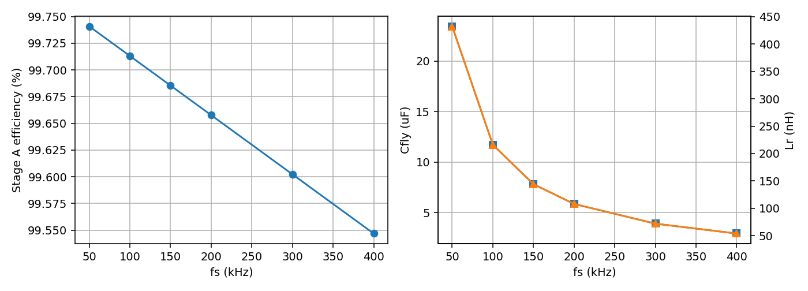

선택 이유: 효율은 f_s에 대해 완만히 감소(Coss 손실 ∝ f_s)하고, 캡 크기는 1/f_s로 급감한다. 150 kHz에서 C_fly 7.8 µF/500 V는 이미 소형(필름 1–2개)이고 L_r 144 nH는 공심/PCB 인덕터로 구현되어 자기소자가 사실상 사라진다. 그 이상 올리면 캡 이득은 미미하고 Coss 손실만 늘어난다. 50–100 kHz는 캡 부피 2–3배와 낮은 리플 주파수(EMI 필터 부담) 때문에 기각. **f_r = 150 kHz, C_fly = 7.8 µF, L_r = 144 nH.** 스위칭 주파수는 데드타임·출력캡 공진 이동을 보정해 **f_s = 0.98·f_r = 147 kHz** 로 둔다(부록 A.3, TB-A1 결과).

#### 3.2.5 손실·효율·출력 임피던스

- 위상당 손실 59 W (도통 32.5, Coss 14.4, 캡 4.1, 인덕터 2.7, 버스바 4.1, 게이트 1.2). 모듈 118 W, 전 어레이 472 W.
- 전부하 효율 **99.69 %** (이상화). 미모델 항목(데드타임 중 바디다이오드 도통, 공진 이탈로 인한 부분 하드스위칭, 온도 상승) 마진 0.3 %p를 두어 **설계 목표 ≥ 99.3 %** 로 정한다. 이는 상용 고정비 모듈(제안서 [Ref 14], [20], 98–99 % 급)과 STC EV 시제품 [14] 보고 범위와 일관된다.
- 등가 출력저항: 손실 전체를 I²R로 환산하면 R_out,mod = **13.4 mΩ**(4모듈 3.35 mΩ)이나, Coss·게이트 고정손실을 제외한 실제 부하 의존 저항은 스위칭 시뮬레이션에서 **10.2 mΩ**(어레이 2.6 mΩ, 부록 A.5)이다. 충전 375 A에서 전압 강하 **1.0 V**(0.25 %). Seeman–Sanders의 FSL 관점 [9]에서 R_out은 도통 저항 합에 지배되며 위 값과 부합한다.
- 부하별 효율(그림 5): 45 % 부하에서 피크 99.72 %, 5 % 부하에서 98.3 % (Coss·게이트 고정손실 때문). → 3.2.7 위상 셰딩의 근거.

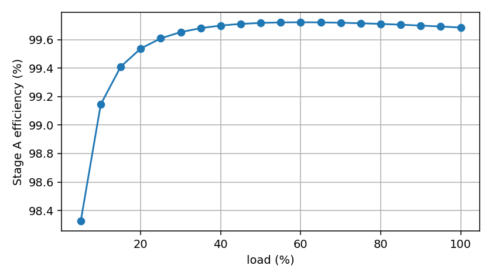

#### 3.2.6 돌입전류와 프리차지

특성 임피던스 Z_r = √(L_r/C_fly) = **0.136 Ω**. 방전된 C_fly에 460 V가 걸리면 이론 피크 460/0.136 = **3.4 kA** → 소자 파괴. 따라서 프리차지가 필수이며 시뮬레이션에서도 반드시 모델링한다. 방법: (a) 배터리 컨택터 폐로 전 프리차지 저항(20 Ω → 시정수 20 Ω×7.8 µF×8 = 1.2 ms, 5τ = 6 ms) 경유, (b) 48 V → 400 V 역방향(Stage C 양방향)으로 버스와 C_fly를 320 V까지 올린 후 컨택터 폐로(제안서 M5 모드). 시뮬레이션에서는 (a)를 기본, (b)를 M5 시나리오로 검증.

#### 3.2.7 주행 모드 위상 셰딩

주행 모드 부하(≤25 kW)에서 8위상 전부 운전하면 고정손실 8×15.6 W = 125 W가 3 kW 부하의 4.2 %에 달한다. 1모듈(2위상)만 운전하면 고정손실 31 W, 25 kW까지 정격 여유(37.5 kW). 계산 결과(1모듈 운전): 3 kW에서 32 W, 5 kW 33 W, 10 kW 37 W, 25 kW 70 W. **결정: 주행 모드는 1모듈 운전, 나머지 3모듈 게이트 차단(플라잉 캡은 400 V로 대기 → 충전 모드 진입 시 돌입 없음).** 부하 > 30 kW 또는 충전 모드 진입 시 순차 기동(모듈당 1 ms 간격 소프트스타트).

#### 3.2.8 판정

| 항목 | 결과 | 판정 |
|---|---|---|
| 소자 응력 460 V / 750 V | 61 % | PASS |
| 위상 피크 73.6 A, 2병렬 12 mΩ SiC | 열: 위상당 59 W → 소자당 ≈ 5 W | PASS |
| 효율 ≥ 99.3 % (목표) | 계산 99.69 %, 스위칭 시뮬 99.68 %(부록 A) | PASS — 단 ZCS 창 ±1 %이므로 **적응형 온타임 제어 필수**(부록 A.3) |
| 돌입 3.4 kA | 프리차지 회로로 회피 | PASS(조건부) |
| 자기소자 | L_r 144 nH×8, 에너지 ½·L·I_pk² = 0.4 mJ | PASS |

### 3.3 Stage B — 부분전력 직렬 조정 셀 (PPRC)

#### 3.3.1 요구 조정 전압 범위 (스윕)

주행 모드(1모듈 운전, R_out,mod 13.4 mΩ)에서 25 kW 부하 시:

```
ΔV = V_bus − (V_bat/2 − I_aux·R_out,mod)
```

| V_bat (V) | V_A (V) | ΔV (V) | 처리 비율 k_pr = |ΔV|/400 | PPRC 전력 = |ΔV|·62.5 A |
|---|---|---|---|---|
| 648 | 323.2 | **+76.8** | 19.2 % | **4.8 kW** |
| 788 | 393.4 | +6.6 | 1.7 % | 0.41 kW |
| 907 | 452.7 | **−52.7** | 13.2 % | 3.3 kW |
| 920 (절대) | 459.2 | −59.2 | 14.8 % | 3.7 kW |

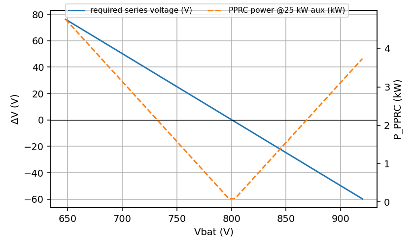

관찰: (a) 처리 전력은 배터리가 비었을 때 최대 4.8 kW이고 공칭점 부근에서는 거의 0이다. (b) SoC 가중 평균(대부분 20–80 % SoC, 690–860 V)으로는 k_pr ≈ 2–8 %. 이것이 부분전력 처리의 효율 이득 근거다(Anzola 등의 PPP 효율식 η_sys = 1 − k_pr(1 − η_cell) [4]).

#### 3.3.2 정격 결정

- 요구 최대 4.8 kW에 대해 **정격 8 kW, 출력 ±90 V, 직렬 전류 100 A** 로 정한다.
- 근거: (a) 마진 1.67× — 배터리 셀 2.8 V 방전 한계(605 V → ΔV 98 V) 및 컨택터·케이블 저항 추가 강하, (b) V2L·V2H(3.6 kW 인버터) 동시 운전, (c) 조정 가능한 최대 부하전류는 **min(직렬 전류 정격 100 A, 8 kW/|ΔV|)** 이다. V_bat,min(648 V)에서 8 kW/77 V = 104 A이므로 100 A 정격이 먼저 제한하고, 25 kW 정격 대비 1.6배 순간 과부하 여유. 600 V(2.78 V/cell) 코너에서는 ΔV 101 V > 90 V 설계 범위이므로 **V_bat < 640 V에서 보조부하를 20 kW로 디레이팅**한다(부록 I, TB-S5). SALS의 헤드룸 제약 I_max = min(100 A, 8 kW/|ΔV|)에 이 규칙을 포함한다.
- 제안서의 "25 %(37.5 kW)"는 충전 전류 조정을 PPRC가 맡는다는 가정에서 나온 값이었으나, 3.1의 판정(충전기 자체 전류 제어, 2:1만으로 전압 창 만족)에 따라 충전 모드 바이패스를 채택하여 **8 kW(150 kW의 5.3 %)** 로 축소했다.

#### 3.3.3 토폴로지: 절연 DAB, 400 V → 100 V 계 직렬 삽입

- 직렬 셀 출력은 배터리 전위에 떠 있으므로 절연이 필요 → DAB(1차: 400 V 버스에서 급전, 2차: 직렬 삽입 풀브리지). DAB 선택 이유: 양방향(ΔV 부호 변화), 위상천이 제어로 전력 방향·크기 즉시 제어, 설계 문헌 풍부 [5].
- 권선비 n = 4 (400:100). 2차 브리지 DC 전압 100 V, 출력 ±90 V 범위(듀티/위상천이로 조정).
- 인덕턴스(1차 환산): P = V1·nV2·φ(1−φ/π)/(2π f_s L_s). f_s = 200 kHz(650 V GaN 1차, 200 V GaN 2차), 정격 8 kW를 φ_max = 60°에서 내도록 **L_s = 11.1 µH** (φ = 90° 기준 12.5 µH). 60°를 최대로 두는 이유는 위상천이 이득이 90° 부근에서 포화(dP/dφ → 0)되어 제어 선형성이 나빠지기 때문.
- 2차(직렬) 소자: **200 V GaN, 4 mΩ, 4병렬(1 mΩ/스위치)**. 경로에 항상 2스위치 도통 → 2 mΩ. 주행 62.5 A: **7.8 W**(0.03 %). 이 저손실이 "직렬 셀은 저전압 소자"라는 PPP 이점의 실체다.
- 변압기: 8 kVA, 2차 100 A rms — Stage A 대비 1/19 용량.

#### 3.3.4 충전 모드 바이패스 결정 (정량)

바이패스 없이 375 A를 직렬 셀에 흘리면 도통 손실 375²×2 mΩ = 281 W + 2차 권선 0.3 mΩ → 42 W, 합 **323 W(0.22 %)**. 손실 자체는 작으나, 변압기 2차·SR 소자를 375 A rms(정격의 3.75배)로 열설계해야 하므로 PPRC 부피가 약 3배가 된다. 따라서 **충전 모드에는 SiC/기계식 바이패스 스위치(0.2 mΩ)로 직렬 셀을 우회**하고 PPRC는 정지한다. 트레이드오프: 충전 중 차량 측 미세 전류 조정 기능 상실 → CCS 충전기가 담당(3.1). 연구 변형으로 "충전 중 PPRC 활성(전류 리플 억제)"은 선택 시나리오로 남긴다.

#### 3.3.5 주행 모드 효율 (Stage A 1모듈 + PPRC + 직렬 도통)

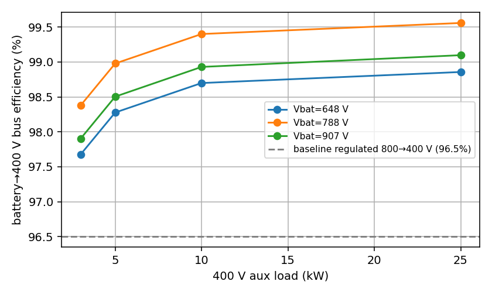

| 부하 | 648 V | 788 V | 907 V |
|---|---|---|---|
| 3 kW | 97.7 % | 98.4 % | 97.9 % |
| 5 kW | 98.3 % | 99.0 % | 98.5 % |
| 10 kW | 98.7 % | 99.4 % | 98.9 % |
| 25 kW | 98.9 % | 99.6 % | 99.1 % |

가정: DAB 효율 96 %, 유휴 손실 15 W. 최악점(648 V, 3 kW)에서도 Baseline 96.5 %보다 1.2 %p 높다. 광범위 조정형과의 차이는 처리 전력 비율(≤19 %)에서 나온다.

#### 3.3.6 판정

| 항목 | 결과 | 판정 |
|---|---|---|
| 조정 범위 −59 ~ +77 V (요구) vs ±90 V (설계) | 마진 1.17× 이상 | PASS |
| 정격 8 kW vs 최대 4.8 kW | 1.67× | PASS |
| 직렬 소자 200 V vs 출력 ±90 V + 링잉 | 이용률 ≤ 60 % (안전 마진 포함) | PASS |
| 충전 모드 직렬 손실 | 바이패스로 0 | PASS |
| 제어 대역폭 | 상태궤환 8–10 kHz (3.5.3) | PASS — 60 A droop 4.7 V |

### 3.4 Stage C — 고정이득 CLLC (400 → 48 V) 및 12 V 단

#### 3.4.1 권선비와 12 V 처리 방식 변경

- 400 : 48 = 8.33 → 정수 권선 **25 : 3** (정확히 8.33). 이득 1에서 48.0 V.
- 12 V를 3권선으로 하려면 400:12 = 33.3 → 25 : 0.75턴이 필요해 **정수 권선으로 불가능**(100:12:3은 1차 100턴으로 250 kHz 평면 변압기에 부적합). 따라서 제안서의 3권선 CLLC를 **2권선 CLLC + 48→12 V 4상 동기 벅(1.5 kW)** 으로 변경한다. 벅은 100 V GaN, 300 kHz, 위상당 31 A, 리플 30 % 기준 L = (48−12)·0.25/(300 kHz·9.4 A) = **3.2 µH**, 예상 효율 96.5 %.

#### 3.4.2 공진 탱크 설계 (FHA)

R_L = 48²/3000 = 0.768 Ω, R_ac = 8n²R_L/π² = **43.2 Ω**. 설계 변수 f_r = 250 kHz(650 V GaN 1차 ZVS 여유와 평면 자기소자 크기의 절충), Q = 0.4, m = L_m/L_r = 6.

| 소자 | 수식 | 값 |
|---|---|---|
| L_r (1차) | Q·R_ac/(2π f_r) | **11.0 µH** |
| C_r (1차) | 1/((2π f_r)² L_r) | **36.8 nF** |
| L_m | m·L_r | **66 µH** |
| L_r2, C_r2 (2차 대칭) | L_r/n², C_r·n² | 0.16 µH, 2.56 µF |
| 자화전류 피크 | V_in/(4 L_m f_r) | **6.1 A** |
| ZVS 최소 데드타임 | 2·C_oss·V_in/I_m (C_oss 100 pF) | 13 ns → 50 ns 데드타임 설정 |

Q·m 선택 이유: 고정이득 운전에서는 넓은 이득 곡선이 필요 없으므로 Q를 크게 두어(0.4) 순환전류를 줄이고, m = 6은 자화전류가 ZVS 에너지(½L_m I_m² = 1.2 mJ ≫ 2·C_oss·V²= 32 µJ)를 충분히 확보하는 최소 근처값이다. Jung 등의 CLLC 설계법 [7], Zahid 등의 V2G 양방향 설계 [6]의 절차를 따랐다.

#### 3.4.3 이득 감도 (고정 운전점의 타당성)

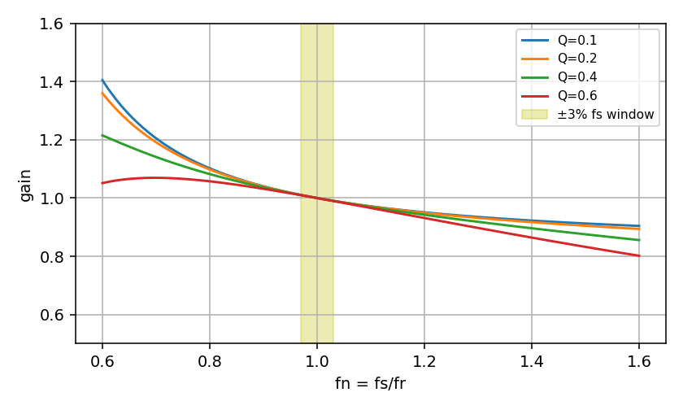

f_s가 f_r에서 ±3 % 벗어나도(소자 공차·온도) 이득은 **1.010 / 1.000 / 0.990** (Q = 0.4, m = 6) → 48 V ± 0.5 V. 버스 ±1 %와 합쳐도 48 V ± 1.5 %로 LV148급 48 V 계 운전 창(36–52 V) 안에 충분히 든다. 부하 조정(등가 출력저항 8 mΩ 가정): 62.5 A에서 0.5 V. 따라서 **주파수 폐루프는 ±10 % 미세 조정(전류 제한·충전 프로파일용)만 두고 정상 운전은 f_r 고정**이 타당하다.

#### 3.4.4 손실

2차 rms = 62.5·π/(2√2) = 69.4 A → 100 V GaN 2 mΩ 2병렬 SR: 4.8 W; 1차 8.7 A rms, 50 mΩ: 7.7 W; 변압기 동손 1.2 % 36 W, 철손 10 W, 게이트 4 W, C_r ESR 3 W → 합 65 W, **η = 97.8 %** (설계 목표 97 %). 배터리→48 V 총합(주행, 5 kW 조건 Stage A+B 99.0 %) = 96.8 %.

#### 3.4.5 판정

| 항목 | 결과 | 판정 |
|---|---|---|
| 정수 권선비 | 25:3 | PASS |
| 이득 감도 ±3 % f_s → ±1 % | 48 V 창 만족 | PASS |
| ZVS 에너지 | 1.2 mJ ≫ 32 µJ | PASS |
| 12 V 3권선 | 불가 → 벅 변경 | 설계 변경 (9장) |

### 3.5 버스 커패시터·과도응답·SALS 정량

#### 3.5.1 정상상태·안정성 기준

- 정전력 부하(CPL) 25 kW의 음저항 R_cpl = −V²/P = **−6.4 Ω**. 경로 인덕턴스 L_path = 1.5 µH(버스바·케이블 추정)에서 감쇠 충분조건 C > L/R² = **37 nF** — 트리비얼. 리플: 8위상 22.5° 인터리브로 2.4 MHz, 수 µF면 충분. 따라서 C_bus 크기는 **과도응답이 결정**한다.

#### 3.5.2 직렬 PPRC 과도 유도

부하 스텝 ΔI가 400 V 버스에 인가되면, PPRC(DAB)가 응답할 때까지 전류는 캐패시터가 공급한다. 경로 저항이 작을 때 v_bus = V_A + v_ser이므로 dv_bus/dt = dv_ser/dt이고, 전하 보존에서
```
C_bus·dv_bus/dt = i_path − ΔI,   C_ser·dv_ser/dt = −i_path
⇒ dv_bus/dt = −ΔI/(C_ser + C_bus)
⇒ ΔV_droop ≈ ΔI · t_resp / (C_ser + C_bus)
```
즉 직렬 캡과 버스 캡은 **병렬처럼 더해진다**(제안서의 초기 식은 PPRC를 션트 전류원으로 잘못 모델링했다 — 9장 정정 1).

#### 3.5.3 제어 대역폭 — 검증 결과

C_eff = C_ser·C_bus/(C_ser + C_bus) = 80 µF와 L_path 1.5 µH가 **f_res = 14.5 kHz** 공진을 만들고, 경로 저항 13 mΩ 대 특성임피던스 137 mΩ으로 **Q ≈ 10**(피크 +20 dB)이다.
- PI 단독: 공진 피크를 0 dB 아래로 두려면 교차주파수 ≤ **1.8 kHz**(PM 65°). 60 A droop 8.6 V, 회복 430 µs.
- **상태궤환 + 적분**(관측 i_p, v_ser, v_bus, i_dab; 극배치 ζ = 0.7): 공진을 능동 감쇠해 **8–10 kHz** 안정. L_path 0.5/1.5/3 µH 전부에서 10 kHz, 1.5 µH 설계 게인을 0.75/3 µH에 적용해도 안정(부록 C.1). **채택.**
- 남는 한계는 DAB 지연(1차 10 µs + 전송 5 µs + 샘플 5 µs)과 직렬 전류 정격 100 A.

#### 3.5.4 droop — 검증 결과 (상태궤환 8 kHz, C_ser 100 µF + C_bus 400 µF)

| ΔI | 25 A | 60 A | 80 A | 87 A | ≥ 95 A |
|---|---|---|---|---|---|
| droop | 2.0 V | **4.7 V (1.2 %)** | 6.3 V | 14.6 V(회복 불가) | **붕괴** |

정격 100 A − 초기 부하 12.5 A = **87.5 A가 절벽**이다. 그 이하에서는 사양(2 %) 안이고, 그 이상은 어떤 제어로도 막을 수 없다(부록 C.3).

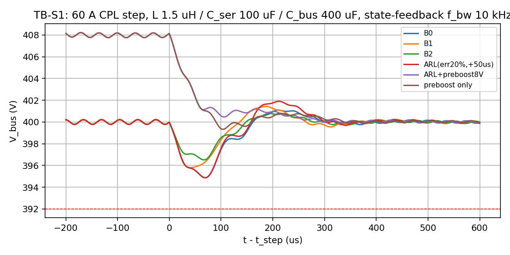

> v1.0 기록: t_resp = 72 µs 가정의 해석식 ΔV = ΔI·t_resp/(C_ser + C_bus)은 8.7 V를 주었다. PI 단독 시뮬레이션(8.6 V)과 우연히 일치하지만 이유가 다르다(부록 C.1).

#### 3.5.5 커패시터 축소 — 불가

| 배율 s (C_bus, C_ser) | 상태궤환 B0 | B2 이상 ff | 판정 |
|---|---|---|---|
| 0.25 (100, 25 µF) | **불안정** (포화 제거·anti-windup 적용해도 진동: DAB 지연 15 µs + 29 kHz 공진) | 불안정 | 불가 |
| 0.5 (200, 50) | 7.6 V | 1.7 V | 경계 통과 |
| **1.0 (400, 100)** | **4.7 V** | 2.1 V | **채택** |
| 2.0 (800, 200) | 2.7 V | 1.9 V | 여유 |

캡 축소를 원하면 액추에이터를 빨리 해야 한다(DAB 400 kHz 이상). 예측 제어로는 불가(부록 C.4, D.1).

#### 3.5.6 PPRC 포화와 SALS — 검증 결과

헤드룸(100 A − 현재 부하)을 넘는 복합 사건은 예측 기반 부하 셰이핑으로만 막을 수 있다. 냉시동 사건(컴프레서 서지 50 A·20 ms + 캐빈 PTC 17.5 A + 배터리 히터 17.5 A + V2L 9 A + 48 V 저우선 3.75 A + 기본 12.5 A = 110 A)에서 결과는 2.4절 표와 같다. 강건 SALS(최악값 창)는 PPRC 150 A 하드웨어 대안과 같은 버스 품질(4 V)을 정격 100 A로 낸다.

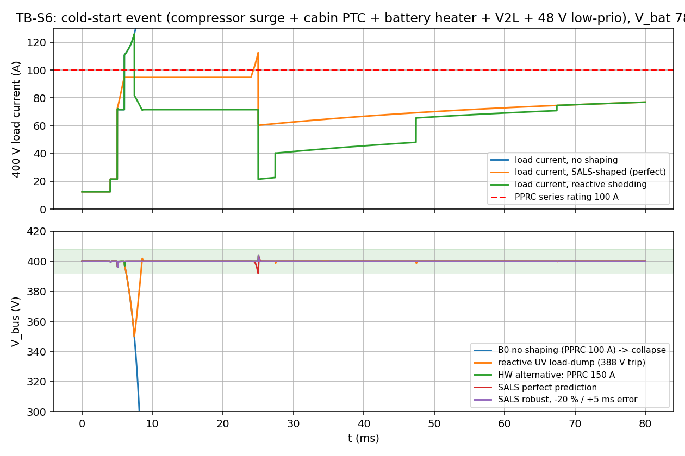

#### 3.5.7 SALS 설계 수치 (확정)

| 항목 | 값 | 근거 |
|---|---|---|
| 스케줄 주기 T_c | 1 ms | CAN 주기(10–20 ms)보다 촘촘, 빠른 제어(80 µs 과도)와 간섭 없음 |
| 지평선 H | 15 ms | LP 크기(H × 지연 부하 수 = 45 변수)와 서스펜션(2–20 ms) 커버의 절충 |
| 예측 형태 | **최악값 창(집합값)**: 부하별 [지연 하한, 지연 상한 + 서지 지속] 동안 서지 크기 가정 | 점추정·분위수는 서지를 놓쳐 붕괴(부록 H) |
| 컴프레서 창 | 명령 후 [+20, +220] ms, 2.2× 정격 | 지연 분포 U(20, 200) ms + 20 ms 서지 |
| 헤드룸 제약 | Σ 허용 ≤ I_max − 예측 비지연, I_max = min(95 A, 0.95·8 kW/|ΔV|) | 5 A 마진(부록 D.2), 3.3.2 디레이팅 |
| 목적함수 | Σ_k Σ_j w_j (요청_j − 허용_{j,k})(1 + 0.02 k) | 우선순위 가중, 먼 미래 지연 선호 |
| 우선순위 w | 캐빈 PTC 1.0 / 배터리 히터 0.7 / 48 V 저우선 0.5 | 쾌적성 > 배터리 예열 > 편의 |
| 해법 | LP(HiGHS/linprog), 45 변수 15 제약 | 1 ms 내 해결 |
| 백업 | 반응형 저전압 부하 덤프(388 V 트립) 유지 | 예측 실패 시 −12.5 % 딥으로 생존 |
| 학습 요소 | 조건부: 지연 결정 신호 존재 시 창 축소, 창 폭·서지 계수 온라인 식별 | 부록 H |

> v1.0 기록: GRU 예측기(19 k 파라미터, pinball 손실), pre-boost 게인, 신뢰도 게이팅, ARL-MPC 정식을 제안했으나 검증 결과 전부 불필요 또는 무효로 판정되었다(부록 C·D·H).

### 3.6 타당성 판정 종합 (v1.1: 시뮬레이션 검증 결과 반영)

| 검증 항목 | 방법 | 결과 | 판정 |
|---|---|---|---|
| 2:1 고정비로 400 V 충전기 전압 창 만족 | 수식 + TB-S2 | 충전기 단자 331–460 V ⊂ 200–500 V, 충전기 루프로 CC→CV | PASS |
| Stage A 소자 응력·전류·효율 | TB-A1/A2 | 460 V/61 %, 73.7 A, 위상 59.4 W, 어레이 471 W, 99.68 % | PASS |
| Stage A ZCS(공차) | WP3-1 몬테카를로 | 고정 타이밍 17/20 실패 → 자기발진 ZC 추종 0/20 실패 | PASS(설계 추가) |
| Stage A 돌입 | TB-A3 | 프리차지 없이 8 kA → 20 Ω + C_in 100 µF로 15.6 A, 13.6 ms | PASS(회로 추가) |
| Stage A 경부하 | TB-A4 | 위상 셰딩으로 3 kW에서 99.0 % | PASS |
| PPRC 범위·정격 | 스윕 + TB-S5 | ±90 V/8 kW, 648 V에서 4.8 kW; 600 V 코너는 20 kW 디레이팅 | PASS(디레이팅 규칙) |
| PPRC 충전 모드 바이패스 | TB-S2/B3 | 전이 점프 ≤ 1.2 V, 전류 피크 13.2 A | PASS |
| PPRC 제어 | TB-B2/S1 | PI 1.8 kHz(8.6 V) → 상태궤환 8–10 kHz(4.7 V) | PASS(설계 변경) |
| CLLC 고정이득·ZVS·양방향 | TB-C1/C2 | 이득 0.998, FHA ±0.5 %, ZVS 3.7–5.9×, 반전 57.5 µs | PASS |
| 12 V 3권선 | 권선비 | 불가 → 벅 | 설계 변경 |
| 버스 과도 2 % | TB-S1 | 60 A 4.7 V, 절벽 87.5 A | PASS |
| 커패시터 축소 | TB-S6 A | s = 0.25 불안정(지연 한계) | 불가 |
| SALS 포화 회피 | TB-S6 B, WP4.5 | 최악값 창 규칙: 110 A 사건 생존(396 V), 점추정·분위수 예측은 붕괴 | PASS(규칙 기반으로 확정) |
| 주행 효율 우위 | 수식 + TB-A4 | 97.7–99.6 % vs 96.5 % | PASS |
| 충전 손실 우위 | 수식 + TB-A2/S2 | 0.5 kW vs 4.5 kW | PASS |

**종합**: 구조는 시뮬레이션 수준에서 구현 가능하다. 설계 변경은 총 8건(9장). 남은 미검증 항목은 Simulink 스위칭 모델(기생 인덕턴스·링잉)과 실차 신호 접근성이다.

---
## 4. Step 4 — Simulink 구현 가이드라인 (셀 구성)

### 4.1 프로젝트 구조

```
prism_hub/                       (MATLAB Project: prism_hub.prj)
├─ params/
│   ├─ prism_design_params.m     ← 3장 수식 전부 (실행하면 prism_params.mat 생성)
│   ├─ device_lib.m              ← 소자 파라미터 구조체 (R_ds, C_oss, E_oss, V_f, t_dead)
│   └─ scenario_*.m              ← 시나리오별 부하 프로파일·신호 타이밍
├─ lib/
│   └─ prism_lib.slx             ← 라이브러리: 아래 4.3의 셀 블록 전부 (마스크·Variant)
├─ models/
│   ├─ prism_avg.slx             ← 평균값 모델 (제어 설계, SALS 시나리오)
│   ├─ prism_switched.slx        ← 스위칭 모델 (손실·ZCS·리플)
│   ├─ prism_sals.slx            ← 스위칭 모델 + SALS
│   └─ load_signal_sim.slx       ← 부하·선행 신호 시뮬레이터
├─ tests/                        ← Simulink Test 파일 (5장 TB-*)
├─ arl/                          ← 데이터셋·학습 스크립트·학습된 네트워크
└─ results/                      ← 로그(.mat), 그래프, 표
```

원칙: **모든 수치는 `prism_params.mat`의 구조체 `P`에서만 온다.** 블록 다이얼로그에 숫자를 직접 적지 않는다(재현성·스윕 자동화).

### 4.2 솔버·모델링 원칙

| 항목 | 평균값 모델 | 스위칭 모델 |
|---|---|---|
| 솔버 | 가변스텝 ode23t (또는 ode15s), RelTol 1e-4 | 고정스텝 이산 솔버(Simscape local solver, Backward Euler) 또는 가변스텝 ode23t + Zero-crossing |
| 스텝 | 자동(제어 샘플 1 µs~1 ms 이산) | Stage A 150 kHz(주기 6.67 µs) → 최대 스텝 **50 ns**(주기/130); CLLC 250 kHz → 40 ns. 전체 고정스텝 **40 ns** |
| Simscape 설정 | Solver Configuration: "Use local solver" off | on, Sample time 40e-9, "Use fixed-cost runtime consistency iterations" on |
| 스위치 모델 | Controlled Current/Voltage Source(평균) | Simscape Electrical `MOSFET (Ideal, Switching)` + 병렬 C_oss + R_on; 바디다이오드 V_f 0.9 V(SiC)/GaN 역도통 2 V |
| 데드타임 | 무시 | PWM Generator 후단 Dead-time 블록 100 ns(SiC), 50 ns(GaN) |
| 자기소자 | 이상 인덕터 | 인덕터 + 직렬 ACR, 변압기 `Ideal Transformer` + L_m + L_lk(1·2차) |
| 손실 산출 | 등가저항 모델 | 전압×전류 순간곱 적분(소자별 Probe), 열은 WP5에서 Simscape Thermal로 확장 |
| 실행시간 지침 | 10 s 시나리오 수십 초 | 100 ms 시나리오 수 분(40 ns × 2.5 M 스텝) → 시나리오 길이는 ≤ 50 ms로, 장시간은 평균값 모델 |

**Variant 구성**: 각 단 서브시스템을 `Variant Subsystem`으로 만들고 변수 `MODEL_LEVEL = "avg" | "sw"`로 전환. 상위 테스트벤치는 동일 인터페이스(전기 포트 + 제어 버스)를 공유한다.

### 4.3 셀 구성 가이드라인

#### 4.3.1 Stage A 2:1 RSC 위상 셀 `rsc_phase` (스위칭 모델)

포트: 전기 — `Vin+`, `Vin−`(=GND), `Vout`(중간노드). 제어 — `gate` (4비트 벡터), `en`.

| 구성요소 | Simscape Electrical 블록 | 파라미터 (from P.A) | 비고 |
|---|---|---|---|
| S1–S4 | MOSFET (Ideal, Switching) ×4 | R_on = 6 mΩ, V_f(body) 0.9 V | 각 소자 병렬로 `Capacitor` C_oss 150 pF (E_oss 등가) |
| C_fly | Capacitor + Series Resistance | 7.8 µF, ESR 1.5 mΩ, 초기전압 = V_A(프리차지 완료 가정) 또는 0(프리차지 시험) | |
| L_r | Inductor + Series Resistance | 144 nH, 1 mΩ | |
| R_misc | Resistor | 1.5 mΩ (버스바) | 경로에 직렬 |
| 게이트 | **자기발진 ZC 추종** (부록 B 결정 B-1): 반주기 시작 → i_L이 2.5 A를 넘으면 무장(arm) → 도통 방향 반대 부호로 영교차 검출(지연 20 ns) → 턴오프 → 데드타임 100 ns → 다음 반주기. 검출은 공칭 도통시간(3.23 µs)의 **0.80–1.12배 창** 안에서만 유효, 창 밖이면 공칭 타이밍(블랭킹) | 위상 오프셋 파라미터 `phi`(초기 스태거만; 이후 위상별 주파수 자유) | Stateflow 반주기 상태기계 + Compare To Constant. 무부하에서 오검출 토글 방지가 블랭킹 창의 목적 |

검증 포인트: 정상 운전에서 i_L이 반파 정현(피크 73.6 A), 스위칭 순간 i_L ≈ 0(ZCS), C_fly 전압 스윙 20 V pp.

**평균값 모델** `rsc_phase_avg`: `Controlled Voltage Source` V = V_in/2 − i_out·R_out,mod/2 (위상당) 또는 모듈 단위로 `V_in/2 − i·R_out,mod`. 손실은 i²R로 산출.

#### 4.3.2 Stage A 모듈·어레이 `rsc_module`, `rsc_array`

- `rsc_module` = 2 × `rsc_phase`(phi = 0°, 90°), 입력 공유, 출력 병렬 → 모듈 출력에 `Current Sensor` + **모듈 로컬 캡 ≥ 100 µF**(출력 노드 강성: 위상 셀이 보는 캐패시턴스 ≥ 50·C_fly, 부록 A.4).
- `rsc_array` = 4 × `rsc_module`(모듈 간 22.5° 오프셋 → 8위상 22.5° 등간격) + 각 모듈 `en` 신호 (위상 셰딩: 주행 모드 en = [1 0 0 0]).
- 입력 커패시터 `C_in` 100 µF/500 V(ESR 3 mΩ): 어레이 입력 노드. 프리차지 저항의 L/R 강성 해소와 입력 리플 흡수(부록 B 결정 B-2).
- 프리차지 서브시스템: `Switch`(컨택터) + `Resistor` 20 Ω 병렬 경로 → C_in 충전, 어레이는 스위칭 상태 유지(자기발진, 무부하) → V_bus ≥ 0.95·V_in/2 감지(≈ 13.6 ms) 후 메인 컨택터 폐로.
- 배터리: `Battery` 블록(Simscape Electrical, Table-based 또는 Rint 모델) 216s, R_int 60 mΩ(팩), 또는 시나리오 S5용 `Controlled Voltage Source` 램프.

#### 4.3.3 Stage B PPRC `pprc_dab`

포트: 전기 — `bus+`, `bus−`(DAB 1차 급전), `ser_in`, `ser_out`(직렬 삽입 2단자), `byp_ctrl`. 제어 — `phi_cmd`(위상천이), `en`, `bypass`.

| 구성요소 | 블록 | 파라미터 |
|---|---|---|
| 1차 풀브리지 | MOSFET ×4 (650 V GaN: R_on 50 mΩ, C_oss 100 pF) | f_s 200 kHz |
| 변압기 | Ideal Transformer 4:1 + L_m 400 µH + L_lk = L_s 11.1 µH(1차 직렬) | |
| 2차 풀브리지 | MOSFET ×4 (200 V GaN: R_on 1 mΩ eq., C_oss 400 pF) | |
| C_ser | Capacitor 100 µF, ESR 1 mΩ, 초기 0 V | 2차 브리지 출력 = 직렬 단자 |
| 바이패스 | Switch(R_on 0.2 mΩ) `ser_in`–`ser_out` | 충전 모드 on |
| 변조 | Phase-shift modulator: 1차 50 % 고정, 2차 위상 φ ∈ [−60°, +60°] | φ 부호 = 전력 방향 |

제어(`pprc_ctrl`, 이산 5 µs = 1/f_s): **상태궤환 + 적분**(부록 C 결정 C-1). 관측: i_path(경로 전류 센서), v_ser, v_bus, i_dab(DAB 출력전류 추정 또는 센서). 지령 u = −K·[i_p, v_ser, v_bus, i_dab] − K_q·q, q̇ = v_ref − v_bus; 게인은 `tb_b_pprc.m`의 극배치(복소쌍 ζ 0.7 @ 8 kHz, 실근 8 kHz, 적분 2.7 kHz, DAB 20 kHz) 결과를 사용. 포화 ±100 A + back-calculation anti-windup(K_aw 0.05). 전류 지령 → DAB 위상천이 φ 변환은 P = V1·nV2·φ(1 − φ/π)/(2π f_s L_s)의 역함수(룩업). 피드포워드 포트 `i_ff`는 B1/B2 기준선 비교용으로만 유지(SALS는 이 루프에 개입하지 않음).

**평균값 모델** `pprc_avg`: DAB 출력전류원 i_dab(1차 지연 10 µs + 전송지연 5 µs, 포화 ±100 A) → C_ser → 직렬 삽입; 1차 측 `Controlled Current Source`(전력 보존: i_1 = v_ser·i_dab/(η_dab·V_bus)). 경로에 L_path 1.5 µH·R 3 mΩ을 반드시 포함(공진 14.5 kHz 재현). 이 모델이 부록 C·D·F·I의 전 결과를 낸 모델이다(`tb_b_pprc.m`).

#### 4.3.4 Stage C CLLC `cllc_48`

| 구성요소 | 블록 | 파라미터 |
|---|---|---|
| 1차 풀브리지 | MOSFET ×4 650 V GaN | f_s = 250 kHz, 50 % 듀티, 데드타임 50 ns |
| 1차 탱크 | L_r 11.0 µH, C_r 36.8 nF | |
| 변압기 | Ideal Transformer 25:3 + L_m 66 µH | |
| 2차 탱크 | L_r2 0.16 µH, C_r2 2.56 µF | 대칭 CLLC |
| 2차 SR | MOSFET ×4 100 V GaN, R_on 1 mΩ | 동기정류, 역방향 시 1차와 역할 교환 |
| 출력 | C_o 470 µF, 48 V 배터리(Rint 모델, 0.5 kWh) | |
| 제어 | f_s = f_r 고정 + 전류제한 시 ±10 % 주파수 조정 PI | 방향 판정 Stateflow |

**평균값 모델**: 이상 변압기(이득 1/n) + 출력 등가저항 8 mΩ + 1차 저역통과(ω = 2π·10 kHz).

#### 4.3.5 12 V 벅 `buck_12`

4상 동기 벅(각 100 V GaN, L 3.2 µH, f_s 300 kHz, 90° 인터리브), 출력 C 1 mF + 12 V 배터리(Rint). 전압 PI(BW 2 kHz) + 위상별 전류 공유. 평균값: 듀티 제어 전압원.

#### 4.3.6 버스·부하·충전기

- `bus_400`: C_bus 400 µF(ESR 2 mΩ) + L_path 1.5 µH(Stage A 출력 → C_ser → 버스). **L_path를 반드시 넣는다** — 3.5.3의 대역폭 상한이 여기서 나온다. 리플 주파수(2.4 MHz) 대 40 ns 스텝: 주기 417 ns/40 ns ≈ 10점으로 리플 파형 정밀도는 낮으나 평균 거동은 충분하고, 리플 정밀 평가는 TB-A2에서 스텝 10 ns로 별도 실행한다.
- 400 V 부하: `Controlled Current Source`(CPL: i = P_load/v_bus, P_load는 `load_signal_sim`에서 물리 지연을 거쳐 생성). 컴프레서는 1차 지연(τ 50 ms) + 기동 서지(2×, 10 ms), PTC는 단계 램프(5 ms), V2L은 정전력.
- 400 V 충전기(M3): `Controlled Current Source`(CC) + 전압 상한(CV) — CCS 충전기 전류 루프 BW 100 Hz, 램프 20 A/s로 모델링(현실적 충전기 동특성).
- 800 V 충전기(M2): 배터리 단자에 직접 전류원.

#### 4.3.7 모드 상태기계 `mode_sm` (Stateflow)

상태: `Precharge → Drive(M1) → Chg800(M2) → Chg400(M3) → V2X(M4) → Aux48Boot(M5) → Fault`. 각 전이의 가드/액션:

| 전이 | 가드 | 액션 |
|---|---|---|
| Precharge→Drive | v_Cfly ≥ 0.95·V_bat/2 | 메인 컨택터 on, 모듈 1 en, PPRC en |
| Drive→Chg400 | 플러그 감지 & 400 V 협상 | 모듈 2–4 순차 en(1 ms 간격), PPRC φ→0 → bypass on → PPRC off |
| Chg400→Drive | 충전 종료 | bypass off 전 PPRC pre-charge(v_ser → 목표 ΔV) 후 bypass off, 모듈 2–4 off |
| Drive→V2X | V2L 요청 | PPRC 양방향 허용, 400 V 인버터 부하 연결 |
| any→Fault | v_bus ∉ [360, 440], i_ser > 120 A, T > 임계 | 게이트 차단, 컨택터 개방 |

#### 4.3.8 SALS 서브시스템 `sals` (1 ms 이산) — 확정판

- 입력 버스: `veh_signals`(컴프레서 명령·목표 전력, PTC/히터 요청, V2L 요청, 서스펜션 힘 명령, 조널 전력 예약), `meas`(v_bus, i_path, V_bat), `mode`.
- 블록 1 **최악값 창 생성기**(MATLAB Function): 부하별 규칙 테이블 → 지평선 15 ms의 비지연 부하 상한 프로파일. 컴프레서: 명령 후 [+20, +220] ms 구간 2.2× 정격, 이후 정격; V2L: 요청 후 +5 ms부터 정격; 서스펜션: ±7.5 A 상시 마진. 창 폭·계수는 파라미터(온라인 식별로 갱신 가능).
- 블록 2 **헤드룸**: I_max = min(95 A, 0.95·8 kW/|400 − V_bat/2|).
- 블록 3 **LP 스케줄러**: 변수 = 지연 가능 부하 3종 × 15 스텝 허용량, 제약 = 상한 프로파일 + Σ허용 ≤ I_max, 목적 = 우선순위 가중 미공급 최소화. Simulink에서는 `MATLAB Function` 내 `linprog`(코드 생성 시 `quadprog`/`mpcqpsolver` 또는 사전 계산 정책 룩업으로 대체). 첫 스텝 결과만 조널 컨트롤러·PTC 컨트롤러에 `allow_*` 신호로 송신.
- 블록 4 **감시기**(Stateflow): 반응형 저전압 부하 덤프(388 V 트립, 1 ms 작동, 20 ms 간격 순차 복구)를 백업으로 유지; 예측 신호 결측 시 창을 최대 폭으로 확장.
- 기준선 Variant: `none`(셰이핑 없음), `reactive`(감시기만), `sals_point`(점추정 예측, 붕괴 재현용), `sals_window`(확정판).
- v1.0의 GRU 예측기·pre-boost·ff·MPC 블록은 제거(부록 C·D·H).

#### 4.3.9 부하·선행 신호 시뮬레이터 `load_signal_sim`

- 명령 생성기(시나리오 파라미터): 컴프레서 목표 rpm 스텝(시점 무작위), PTC 듀티 단계, 서스펜션 힘 명령(노면 프로파일 ISO 8608 급 D 등급 → 밴드패스 랜덤), 조널 예약, 충전 상태.
- 물리 지연 모델: 컴프레서 P = P_ss·(1 − e^{−t/τ}) + 서지, τ ∈ [20, 200] ms 무작위; PTC 5–50 ms 램프; 서스펜션 2–20 ms 2차 응답(회생 부호 포함).
- CAN 모델: 주기 10/20 ms 샘플홀드 + 지연 U[1, 5] ms + 결측 확률 p_loss(기본 2 %, S6에서 20 %).
- 출력: 400 V·48 V 부하 전력(→ CPL), 선행 신호 버스(→ SALS). 몬테카를로 모드에서는 지연·서지 계수·결측을 난수화해 `parsim`으로 수백 에피소드 실행(창 규칙의 생존율 산출).

### 4.4 신호·로깅 표준

- 모든 관측 신호는 `Simulation Data Inspector`로 로깅(`logsout`), 이름 규칙 `A.mod1.ph1.iL`, `B.v_ser`, `bus.v`, `C.v48`, `arl.dI_hat`.
- 손실은 각 소자 `Power Sensor` → 이동평균(1 주기) → 시나리오 종료 시 `results/*.mat`.
- 스텝 응답 지표(droop, 회복시간)는 `stepinfo` 기반 후처리 함수 `postproc_transient.m`로 자동 산출.

---

## 5. Step 5 — 테스트벤치 가이드라인

각 테스트벤치(TB)는 Simulink Test 파일 하나, 하네스 하나, 합격기준을 `verify` 블록/`Test Assessment`로 자동 판정한다. 표기: **목적 / 모델 / 자극 / 측정 / 합격기준 / 스윕**.

### 5.1 단위 테스트벤치 (단별)

**TB-A1 Stage A 위상 셀 ZCS·응력**
- 모델: `rsc_phase`(sw), 이상 전압원 V_in ∈ {648, 788, 920} V, 저항 부하로 I_ph ∈ {5, 25, 47, 60} A.
- 측정: i_L 파형, 스위칭 순간 |i_L|, C_fly 전압 pp, 소자 전압 피크, 손실.
- 합격: 스위칭 순간 |i_L| ≤ 5 % I_pk(ZCS), C_fly 스윙 20 ± 3 V @47 A, 소자 피크 ≤ 520 V(750 V의 70 %), 손실 ≤ 59 W×1.3 @47 A.
- 스윕: f_s/f_r ∈ 0.93–1.05(0.005 간격, 공차 창) → ZCS 이탈 시 손실 증가율 기록; 적응 온타임 제어 on/off 비교; 소자 공차 ±5 % 몬테카를로 20회에서 ZCS ≤ 5 % 유지 확인. 1차 결과는 부록 A.

**TB-A2 모듈 인터리브·병렬 분담**
- 모델: `rsc_array`(sw), 4모듈, 각 모듈 R_on ±10 %, C_fly ±10 % 랜덤.
- 자극: 375 A 부하 스텝(0→100 % 100 µs 램프).
- 측정: 모듈 전류 분담, 출력 리플, 총 손실.
- 합격: 모듈 간 전류 편차 ≤ 15 %(수동 분담), 출력 리플 ≤ 2 V pp, 총 손실 ≤ 472 W×1.3.

**TB-A3 프리차지·돌입**
- 모델: `rsc_array` + 프리차지 회로, C_fly 초기 0 V.
- 자극: 컨택터 폐로 시퀀스(저항 경로 → 메인).
- 측정: 최대 i_L, 프리차지 시간.
- 합격: i_L,peak ≤ 2·I_pk(147 A), 프리차지 ≤ 20 ms. 비교 케이스: 프리차지 생략 시 피크가 kA급임을 기록(3.2.6 검증).

**TB-A4 위상 셰딩 경부하 효율**
- 자극: 3/5/10/25 kW, en = [1 0 0 0] vs [1 1 1 1]. 합격: 1모듈 운전 손실 ≤ 3.2.7 계산값×1.3.

**TB-B1 PPRC 조정 범위·효율**
- 모델: `pprc_dab`(sw) + 이상 전류원(경로 전류 0–100 A) + 400 V 버스 전압원.
- 자극: v_ser 지령 −90 ~ +90 V 스윕 × 경로 전류 {25, 62.5, 100} A.
- 측정: 정상 v_ser 오차, DAB 효율, 직렬 소자 손실, 1차 전류.
- 합격: |오차| ≤ 1 V, η_DAB ≥ 95 % @8 kW, 직렬 도통 ≤ 10 W @62.5 A.

**TB-B2 PPRC 소신호·대역폭 상한**
- 모델: `pprc_dab` + `bus_400`(L_path, C_bus, C_ser) + CPL. Simulink Control Design `Frequency Response Estimator`로 루프 이득 측정.
- 합격(v1.1): 상태궤환 제어기에서 위상 여유 ≥ 45°, 교차주파수 ≥ 6 kHz; PI 단독 기준선은 1.8 kHz 상한을 재현. L_path ∈ {0.5, 1.5, 3} µH 스윕에서 모두 안정(부록 C.1: 10 kHz, droop 4.1–5.1 V).

**TB-B3 바이패스 전이**
- 자극: Drive→Chg400 시퀀스(φ→0, bypass on, PPRC off) 및 역방향. 합격: v_bus 편차 ≤ 4 %, i_ser 서지 ≤ 120 A.

**TB-C1 CLLC 이득·ZVS**
- 모델: `cllc_48`(sw), 입력 400 V ± 2 %, 부하 0–3 kW, f_s/f_r ∈ {0.97, 1.0, 1.03}.
- 측정: v_48, 1차 스위치 턴온 시 v_ds(ZVS), 손실.
- 합격: 48 V ± 1.5 %, 턴온 v_ds ≤ 20 V(ZVS), η ≥ 97 % @3 kW.

**TB-C2 CLLC 양방향·회생**
- 자극: 48 V 측 +3 kW → −3 kW 스텝(서스펜션 회생). 합격: v_48 편차 ≤ 3 V, 방향 전환 ≤ 200 µs.

**TB-D1 12 V 벅**: 1.5 kW 스텝, 합격 12 V ± 3 %, 위상 전류 편차 ≤ 10 %.

### 5.2 시스템 시나리오 테스트벤치

공통 모델: `prism_switched.slx`(짧은 과도) 또는 `prism_avg.slx`(장시간). 배터리 전압은 시나리오 파라미터.

**TB-S1 400 V 부하 스텝(과도 핵심)**
- 자극: t = 10 ms에 컴프레서 6 kW 기동(서지 2×, 10 ms) + PTC 7 kW 단계 투입 동시(≈ 60 A 등가), V_bat ∈ {648, 788, 907}.
- 측정: v_bus droop, 회복시간(±1 % 진입), i_ser 피크, PPRC 처리 전력.
- 합격(B0): droop ≤ 10 V(2.5 %, 스위칭 리플 포함), 회복 ≤ 1 ms. 계산 예측 8.7 V와 비교 → 오차 ±30 % 이내면 3.5절 모델 검증.

**TB-S2 400 V 급속충전 150 kW CC–CV**
- 자극: 충전기 20 A/s 램프 → 375 A CC → V_bat 907 V 도달 시 CV.
- 측정: 배터리 전류, 충전기 단자 전압(= V_A), 손실, 모듈 분담, 바이패스 손실.
- 합격: 충전 경로 η ≥ 98.5 %(목표 99.3 %), 충전기 단자 전압 ∈ [320, 460] V, 모듈 전류 편차 ≤ 15 %.

**TB-S3 800 V 충전 중 보조부하**: 800 V 충전기 200 A + 400 V 보조 10 kW 스텝. 합격: v_bus 편차 ≤ 2 %, 배터리 전류에 스텝 영향 ≤ 5 %.

**TB-S4 V2L + 48 V 회생 동시**: V2L 3.6 kW 방전 중 48 V −3 kW 회생 유입. 합격: PPRC 방향 반전 ≤ 300 µs, v_bus ≤ 408 V.

**TB-S5 배터리 전압 스윕 600→920 V(평균값 모델, 60 s 램프)**: 합격: v_bus 400 ± 1 %, v_48 48 ± 1.5 %, PPRC 처리 전력 ≤ 8 kW, Stage C 운전 주파수 편차 ≤ 3 %.

**TB-S6 SALS 포화 회피(평균값 + 스위칭 재검증) — v1.1**
- 자극: 냉시동 복합 사건(컴프레서 서지 50 A·20 ms + 캐빈 PTC + 배터리 히터 + V2L + 48 V 저우선, 피크 110 A), 컴프레서 지연 ∈ {20, 100, 190} ms, 선행 신호 결측 20 %, 서지 계수 ±20 %.
- 비교: none / reactive(388 V 부하 덤프) / sals_point(점추정) / **sals_window**(최악값 창) / 하드웨어 대안 PPRC 150 A.
- 측정: 버스 최저·2 % 이탈 시간, 지연 부하의 지연 시간, LP 해결 시간.
- 합격: sals_window에서 세 지연 전부 버스 최저 ≥ 392 V, 붕괴 0, 저우선 부하 최대 지연 ≤ 250 ms; reactive는 딥 ≥ 10 % 기록(비교용); LP ≤ 1 ms(부록 D·H 결과: 396 V, 0, 220 ms).

**TB-S3~S5 (부록 I 결과)**: S3 800 V 충전 중 10 kW 스텝 droop 2.0 V; S4 회생 전환 오버슈트 0.6 V, 907 V에서 PPRC 흡수 −53 V; S5 600→920 V 스윕 버스 396–401 V, 600 V 코너 PPRC 8.4 kW(디레이팅 규칙 근거).

### 5.3 자동화

- `run_all_tests.m`: Simulink Test `sltest.testmanager.run` → 결과 리포트(PDF/HTML).
- 스윕은 `parsim` + `Simulink.SimulationInput`으로 파라미터 배열 실행, 결과는 `results/sweep_<name>.mat`.
- SALS 몬테카를로: `sals/run_mc.m`(parsim 수백 에피소드, 지연 U(20, 200) ms·서지 1.6–2.2×·결측 0–20 %, 생존율·최대 지연 통계).

---

## 6. 검증 계획·KPI·일정

### 6.1 KPI (v1.1: 검증 결과 반영)

| # | KPI | 목표 | 검증 결과 | 상태 |
|---|---|---|---|---|
| 1 | 400 V 충전 경로 효율(150 kW) | ≥ 98.5 % | 어레이 471 W + 바이패스 28 W → 99.67 % (TB-A2, S2) | 달성 |
| 2 | PPRC 정격 / 처리 비율 | 8 kW, 주행 ≤ 19.2 % | 648 V·25 kW에서 4.8 kW; 600 V 코너 디레이팅 | 달성 |
| 3 | 주행 배터리→400 V 효율 | ≥ 97.5 % @3 kW, ≥ 98.5 % @25 kW | 98.4 / 99.6 % @788 V (TB-A4) | 달성 |
| 4 | 48 V 효율·조정 | η ≥ 97 %, 48 V ± 2.5 % | 97.85 %, 47.1–49.1 V (TB-C1) | 달성 |
| 5 | 버스 과도(B0, 상태궤환) | 60 A droop ≤ 8 V, 회복 ≤ 1 ms | 4.7 V, 80 µs (TB-S1) | 달성 |
| 6 | SALS 포화 회피 | 냉시동 110 A 사건, 예측 오차(−20 %, 지연 20–190 ms) 하에 붕괴 0, 최저 ≥ 392 V, 저우선 지연 ≤ 250 ms | 396 V, 0, 220 ms (TB-S6, WP4.5) | 달성 |
| 7 | SALS 실시간성·안전 | LP ≤ 1 ms, 백업 부하 덤프 동작, 신호 결측 시 창 확장 | LP 45변수 ≪ 1 ms; 덤프 −12.5 % 생존 | 달성(결측 시험은 Simulink에서) |
| 8 | 자기소자 VA | ≤ 15 kVA | 12.4 kVA (계산) | 달성 |
| 9 | 모드 전이 | 과전류 ≤ 120 %, 버스 편차 ≤ 4 %, ≤ 100 ms | 13.2 A(106 %), 1.2 V, 6 ms (TB-B3) | 달성 |
| 10 | CLLC 양방향 전환 | ≤ 200 µs | 57.5 µs (TB-C2) | 달성 |

### 6.2 일정 (18주, 제안서와 동일 골격)

1–2 선행기술 전수 검색·WP1(완료) → 3–5 평균값 모델·모드 상태기계·`load_signal_sim`(Python 검증 완료, Simulink 이식) → 6–9 Simscape 스위칭 모델·TB-A/B/C/D 재현 → 10–12 TB-S1~S5·Baseline 비교 → 13–15 SALS 통합·TB-S6 몬테카를로 → 16 (여유) 학습 요소 조건부 시험 → 17 손실·열·부피(WP5) → 18 문서화.

---

## 7. 참고문헌 (검증됨)

저널 논문을 우선했다. **[C]** 표기는 학회지(IEEE APEC)로, 선행기술 확인 목적에 한해 인용했으며 논문 작성 시 동일 그룹의 저널판 존재 여부를 재확인해야 한다. **[S]**는 표준/산업 자료.

1. I. Aghabali, J. Bauman, P. J. Kollmeyer, Y. Wang, B. Bilgin, A. Emadi, "800-V Electric Vehicle Powertrains: Review and Analysis of Benefits, Challenges, and Future Trends," *IEEE Trans. Transportation Electrification*, vol. 7, no. 3, pp. 927–948, 2021. doi:10.1109/TTE.2020.3044938
2. F. Wouters et al., "Bidirectional Onboard Chargers for Electric Vehicles: State-of-the-Art and Future Trends," *IEEE Trans. Power Electron.*, vol. 39, pp. 693–716, 2024. doi:10.1109/TPEL.2023.3319996
3. [S] IDTechEx, "Status of 800V for EVs," Dec. 2025 (유럽 800 V 지원 충전기 비중 약 1 % 등 인프라 통계; 제안서 [Ref 5]).
4. J. Anzola et al., "Review of Architectures Based on Partial Power Processing for DC-DC Applications," *IEEE Access*, vol. 8, pp. 103405–103418, 2020. doi:10.1109/ACCESS.2020.2999062
5. B. Zhao, Q. Song, W. Liu, Y. Sun, "Overview of Dual-Active-Bridge Isolated Bidirectional DC–DC Converter for High-Frequency-Link Power-Conversion System," *IEEE Trans. Power Electron.*, vol. 29, no. 8, pp. 4091–4106, 2014. doi:10.1109/TPEL.2013.2289913
6. Z. U. Zahid, Z. M. Dalala, R. Chen, B. Chen, J.-S. Lai, "Design of Bidirectional DC–DC Resonant Converter for Vehicle-to-Grid (V2G) Applications," *IEEE Trans. Transportation Electrification*, vol. 1, no. 3, pp. 232–244, 2015.
7. J.-H. Jung, H.-S. Kim, M.-H. Ryu, J.-W. Baek, "Design Methodology of Bidirectional CLLC Resonant Converter for High-Frequency Isolation of DC Distribution Systems," *IEEE Trans. Power Electron.*, vol. 28, no. 4, pp. 1741–1755, 2013.
8. J. Zientarski et al., "A Review of Series-Connected Partial Power Converters for DC–DC Applications," *IEEE J. Emerg. Sel. Topics Power Electron.*, vol. 10, pp. 7825–7842, 2022. doi:10.1109/JESTPE.2021.3082869
9. M. D. Seeman, S. R. Sanders, "Analysis and Optimization of Switched-Capacitor DC–DC Converters," *IEEE Trans. Power Electron.*, vol. 23, no. 2, pp. 841–851, 2008. doi:10.1109/TPEL.2007.915182
10. S. Jiang, S. Saggini, C. Nan, X. Li, C. Chung, M. Yazdani, "Switched Tank Converters," *IEEE Trans. Power Electron.*, vol. 34, no. 6, pp. 5048–5062, 2019. (IEEE Xplore 8453894)
11. K. Kesarwani, R. Sangwan, J. T. Stauth, "Resonant-Switched Capacitor Converters for Chip-Scale Power Delivery: Design and Implementation," *IEEE Trans. Power Electron.*, vol. 30, no. 12, pp. 6966–6977, 2015.
12. W. Xie, W. Xi, S. Li, K. M. Smedley, X. Zhu, Y. Dai, "Performance Limits of Resonant Switched-Capacitor Converter With Voltage Regulation," *IEEE Trans. Power Electron.*, vol. 40, no. 1, pp. 1441–1456, 2025.
13. [C] Y. He, S. Jiang, C. Nan, "Switched tank converter based partial power architecture for voltage regulation applications," *IEEE APEC*, 2018. doi:10.1109/APEC.2018.8340993
14. [C] Z. Ni, Y. Li, J. Johnson, M. Wei, C. Liu, X. Lyu, D. Cao, "A GaN Switched Tank Converter with Partial Power Voltage Regulation for Electric Vehicle Applications," *IEEE APEC*, 2019, pp. 1682–1689.
15. X. Li, Y.-F. Li, "An Optimized Phase-Shift Modulation for Fast Transient Response in a Dual-Active-Bridge Converter," *IEEE Trans. Power Electron.*, vol. 29, no. 6, pp. 2661–2665, 2014. doi:10.1109/TPEL.2013.2294714
16. S. Zhao, F. Blaabjerg, H. Wang, "An Overview of Artificial Intelligence Applications for Power Electronics," *IEEE Trans. Power Electron.*, vol. 36, no. 4, pp. 4633–4658, 2021. doi:10.1109/TPEL.2020.3024914
17. Han et al., "Predictive load-feedforward control for DC-link voltage suppression and dynamic improvement of battery charging and discharging converter," *IET Power Electronics*, 2024. doi:10.1049/pel2.12660
18. "Output Voltage Control of a Synchronous Buck DC/DC Converter Using Artificial Neural Networks," *Algorithms*, vol. 18, no. 9, 555, 2025. doi:10.3390/a18090555 (MDPI — ANN-PI 대체 사례로만 인용)
19. S. Vazquez et al., "Model Predictive Control: A Review of Its Applications in Power Electronics," *IEEE Ind. Electron. Mag.*, vol. 8, no. 1, pp. 16–31, 2014. doi:10.1109/MIE.2013.2290138
20. M. Wood, "High-Voltage Bus Converter Power Modules for Electric Vehicle 48 V Power Delivery Networks," *IEEE Power Electronics Magazine*, vol. 12, no. 2, pp. 39–45, 2025. (산업 고정비 모듈 관점)
21. 열관리 부하 크기(교체 완료): (a) "Investigation on the performance and characteristics of a heat pump system for electric vehicles under extreme temperature conditions," *Case Studies in Thermal Engineering*, 2021 (PTC·컴프레서 소비전력과 주행거리 감소율, doi 접두 10.1016/j.csite.2021, 문서 S2214157X21004718); (b) EV 통합 열관리 히트펌프 실험, *Applied Thermal Engineering*, vol. 269, 126002, 2025; (c) 냉시동 예열 실측: 초기 3–8 kW, 10–20 min 후 2–4 kW(EV 캐빈 예열 에너지 연구, 저널판 서지 확인 필요). 컴프레서 모터 정격 8 kW 연속(US 11807067, 특허 — 참고).
24. [C] "Smart Energy Management of Auxiliary Load for Electric Vehicles," *IEEE conf.*, 2020 (Xplore 9160762) — 보조부하 관리로 배터리 전력 평활; 컨버터 정격 제약·최악값 창은 없음(SALS의 최근접 선행연구).
25. [P] US10363828B2 / US10632863B2, NIO USA (첨부본의 GM 표기는 오류), "Systems and methods for regulating charging of electric vehicles". 공진 스위치 회로·배터리 결선·펄스 제어가 포함된 선행 특허. 전력 방향 차이만으로 신규성을 결론내리지 않는다. [US10363828 원문](https://patents.justia.com/patent/10363828), [US10632863 원문](https://patents.google.com/patent/US10632863B2/en).
26. [P] Karma Automotive, EP3987646A4 / US11235676B2, "Combined converter circuit". 결합 컨버터/APM 구조 및 절반 버스 전압 관련 선행. 통합 자체의 신규성 주장을 지지하지 않는다. [미국 원문·청구항](https://patents.google.com/patent/US11235676B2/en).
27. V.-C. Bui et al., "An Isolated DC-DC Converter for 800 V Electric Vehicle With Wide Soft-Switching Range and Low Voltage Stress on Power Switches," *IEEE Access*, vol. 12, pp. 159473–159487, 2024. doi:10.1109/ACCESS.2024.3487233 — 800 V → 48 V APM 기준선.
28. "Novel partial power converter topologies for renewable-integrated ultra-fast electric vehicle charging stations," *Results in Engineering* (ScienceDirect S2590123026007048), 2026 — 오프보드 PPC + ML 예측 제어(인접 연구).
22. [S] IEC 61851-23 / ISO 15118-2: DC 충전기 출력 전압 범위 및 차량 요청 기반 전류 제어(충전기 측 폐루프).
23. [S] VDA 320 (LV148): 48 V 차량 전원계 전압 창.

---

## 8. 리스크 (갱신)

| 리스크 | 영향 | 대응 |
|---|---|---|
| 고정비+PPP 원리의 선행기술 [13], [14] | 회로 신규성 부인 | 신규성을 시스템 통합·바이패스 모드·저전압 직렬 소자·SALS로 한정(2.5절), 1–2주차 전수 검색 |
| Stage A ZCS 창이 ±1 %로 좁음 | 효율 우위 상실 | 자기발진 ZC 추종(블랭킹 창)으로 해결됨 — 몬테카를로 0/20 실패(부록 B) |
| 경로 인덕턴스 실제값 불확실(0.5–3 µH) | 대역폭 상한·droop 예측 변동 | TB-B2 L_path 스윕, 설계는 1.5 µH 기준 + 3 µF 고주파 디커플링 |
| 충전 모드 바이패스로 차량 측 전류 조정 상실 | 충전기 품질 의존 | 충전기 모델에 ±5 % 전류 오차 주입해 배터리 전류 품질 확인(TB-S2 변형) |
| ARL이 B2를 못 이김 | 제어 기여 약화 | 기여를 "캡 축소 등가"(KPI 6 대안)로 정의, ARL-MPC로 전환 |
| 예측기 분포 이동·신호 결측 | 오예측 | 신뢰도 게이팅, 감시기, S6 강건성 시험 |
| 스위칭 모델 실행시간 | 일정 | 시나리오 ≤ 50 ms, 평균값 모델 병행, parsim |
| 문헌 [21] 미확정 | 요구사양 근거 약화 | 논문 작성 전 1차 문헌 교체 |

---

## 9. Step 9 — 자체 검토 (처음으로 돌아가서)

검토 방법: 1장 요구사양 → 3장 계산 → 4·5장 모델·시험 → 2장 주장 순으로 역추적하여 (a) 수치 일관성, (b) 물리 모델 오류, (c) 제안서와의 불일치, (d) 참고문헌 적합성을 점검했다.

### 9.1 발견·정정된 오류

| # | 발견 | 정정 |
|---|---|---|
| 1 | **제안서 3.6.1의 droop 식**은 PPRC를 슬루 제한 션트 전류원으로 모델링해 39 V(10 %)를 도출했으나, 직렬 PPRC의 실제 물리는 "C_bus + C_ser가 t_resp 동안 전류 공급"이며 C_bus 400 µF·60 A·72 µs 조건에서 8.7 V(2.2 %)다. | 3.5.2 유도식으로 교체. ARL의 가치는 "droop 절감" 단독에서 "대역폭 상한 하에서 커패시터 정격 대체"로 재정의(2.4, 3.5.5). 제안서 3.6.1은 이 문서 기준으로 개정 필요. |
| 2 | 제안서의 PPRC 정격 "총 전력의 10–25 %"는 충전 전류 조정을 PPRC가 맡는다는 전제였다. 2:1 고정비만으로 400 V 충전기 전압 창을 만족하고 CCS 충전기가 전류를 제어하므로 전제가 불필요. | 충전 모드 바이패스 채택, 정격 8 kW(5.3 %). 부피·손실 근거 3.3.4. |
| 3 | 제안서의 "3권선 GaN CLLC(48/12 V)"는 12 V 권선이 0.75턴이 되어 정수 권선 불가. | 2권선 CLLC + 48→12 V 4상 벅으로 변경(3.4.1). |
| 4 | 150 kW Stage A를 주행 중 전부 운전하면 고정손실 125 W가 3 kW 부하의 4 %에 달해 "주행 효율 우위" 주장이 무너진다. | 위상 셰딩(1모듈 운전) 추가(3.2.7). 효율표 3.3.5는 이 조건으로 산출. |
| 5 | 초기 Stage A 손실 계산에서 Coss 손실을 50 %만 계상하고 버스바 저항을 누락 → 99.75 %. | 100 % 계상·1.5 mΩ 추가 → 99.69 %, 설계 목표는 별도로 0.3 %p 낮춘 99.3 %. |
| 6 | 초기 버스 캡 사이징에 "2 ms 홀드업"을 적용해 6.4 mF가 나왔으나, Stage A가 상시 연결되므로 홀드업은 요구사항이 아님. | CPL 안정성(37 nF)·리플·과도(400 µF)로 기준 교체(3.5.1). |
| 7 | droop이 캡에 반비례한다고 가정했으나, 대역폭이 경로 공진으로 제한되면 t_resp ∝ √C이므로 droop ∝ 1/√C. | 3.5.5 표를 √ 스케일로 재계산(캡 1/4 → droop 2배). |
| 8 | (시뮬레이션 검증, 부록 A) f_s = f_r에서 데드타임·출력캡 공진 이동으로 ZCS 턴오프 불성립, ZCS 창 ±1 %. | f_s = 0.98 f_r → 자기발진 ZC 추종(블랭킹 창) 채택, C_in 100 µF 추가(부록 B). |
| 9 | (시뮬레이션 검증, 부록 C) PI 대역폭 상한 f_res/3 가정 오류(실제 1.8 kHz), ARL 잔여 droop이 타이밍 오차를 무시, 캡 1/4 축소 주장. | 상태궤환 제어기(10 kHz) 채택, 캡 1/4 주장 철회. |
| 10 | (부록 D) "제약 인지 MPC로 캡 축소" 가능성 — s = 0.25 불안정 원인은 포화가 아닌 DAB 지연. | MPC 역할 철회. SALS를 느린 시간 스케일 부하 셰이핑으로 한정. |
| 11 | (부록 H) 학습 예측기(GRU/GBM)가 정당화된다는 전제 — 명령→서지 지연 분포가 넓으면 점추정·분위수 예측 모두 서지를 놓침. | 최악값 창 규칙 채택, 학습 요소 조건부로 축소. 제안서 3.6절 개정 필요. |
| 12 | (v1.1 전면 검토) 3.3.2의 "조정 가능 전류 105 A"는 직렬 전류 정격 100 A를 무시한 값; 600 V 코너에서 ΔV 101 V > 90 V, PPRC 8.4 kW > 8 kW(TB-S5). | min(100 A, 8 kW/ΔV)로 정정, V_bat < 640 V 보조부하 20 kW 디레이팅 규칙 추가. |
| 13 | (v1.1 전면 검토) 4.3.1·4.3.3·4.3.8 가이드가 v1.0 제어 개념(개루프 고정 타이밍, PI 캐스케이드, GRU/ff/MPC)을 담고 있었음. | 자기발진 ZC(블랭킹 창), 상태궤환+적분, SALS 최악값 창 LP로 교체. C_in 100 µF 추가. |
| 14 | (v1.1 전면 검토, 부록 G) CLLC 양방향을 위상천이로 제어한다는 4.3.4 서술 — 공진점에서 브리지 간 임피던스 ≈ 0이라 수 °에 수십 kW 순환. | φ = 0 동기 DC 변압기 운전 + f_s 편이 전류 제한으로 정정. |
| 15 | (독립 검토 4.1) PPRC 평균모델에 버스에서 끌어오는 DAB 입력전력 누락 → 직렬 전류·처리 전력 과소(62.5 A/4.8 kW). | `tb_b_pprc3.py`로 수지 보정: 648 V·25 kW 78.2 A/6.02 kW(24 %), droop 5.34/4.76/4.43 V. 정격 마진 1.25×. |
| 16 | (독립 검토 4.2) DAB 단일 단으로 ±90 V 극성 반전·100 A 불가(SPS 한계 80 A). | PPRC = DAB(100 V 단극 링크, 8 kW, ≤ 80 A) + 4상한 H-브리지 직렬 포트(±90 V, ≤ 100 A)로 재정의(v1.2). |
| 17 | (독립 검토 4.3) 600 V 디레이팅은 전압 범위 문제를 못 풂. | 최소 배터리 640 V, 600–640 V는 성능 저하 구간(버스 ≥ 390 V). |
| 18 | (독립 검토 4.4) ZC 검출기가 정방향 극성 전제 → 충전 방향 턴오프 50–70 %. | 극성 무관 검출로 수정, 역방향 0.8–1.1 %. |
| 19 | (독립 검토 4.5) C_in 500 V 정격 오류. | 1100 V 또는 500 V 2직렬 + 균압(v1.2). |
| 20 | (독립 검토 4.6) 충전 바이패스 시 보조 버스 = V_bat/2 → 고정이득 CLLC 39–55 V. | 충전기 포트를 V_A 노드에 직결, 보조 버스는 직렬 셀 뒤 — 바이패스 폐지, 충전 중에도 400 V 조정(v1.2). |
| 21 | (독립 검토 4.7·4.8) 충전기 전력 상한 없음(170 kW), Stage C 3 kW로 48+12 V 동시 불가. | 충전기 3한계, 150 kW 피크/375 A 제한 명시; CLLC 5 kW 재설계(v1.2). |
| 22 | (독립 검토 4.9·5.1–5.4) SALS 창의 통신 지연 오류(반례 122 A), LP = greedy, 전류 기준 판정, 비인과 보간, 서비스 손실 미계상. | 창 기준을 관측 시각 + max(0, d_min − τ_comm,max)로 수정(반례 87.5 A), 명칭을 최악값 창 + 우선순위 승인/제한으로 정정, 지표를 정격 초과·미공급 수요로 변경, ZOH 통일. |
| 23 | (독립 검토 7) 선행기술 확대: Ni TPEL 2020, Liu APEC 2023/24, Li WiPDA 2018, Hassanpour TPEL 2023, Chen TPEL 2017, Vicor, Preh Combo Box, JLR US20190023203A1, Bosch EP1053129A1, Kolmanovsky governor. | 신규성 문장을 "기존 원리로 모드 공유 허브를 설계하고 제약이 정격·손실·서비스에 미치는 영향을 분석"으로 축소. 논문 초고 재작성 예정. |
| 24 | (독립 검토 6·8) 위상저항 환산(위상 = 2×모듈), FHA 식, SR 손실 계수, 16 f_s 리플 표현, 3권선 "불가" 표현, entrypoint 2건, 8/10 kHz 불일치, 서지 오류 6건. | entrypoint·주석·8 kHz는 v0.9.0에서 수정, 나머지는 v1.2. |

### 9.2 검토 후에도 남는 불확실성 (v1.1)

- Stage A 효율 99.68 %는 기생 인덕턴스·링잉·온도 상승을 뺀 값이다. 소자 피크 전압(460 V + 링잉 ≤ 520 V)은 Simulink 스위칭 모델에서 확인해야 한다(build_rsc_phase.m 미실행).
- L_path 1.5 µH는 추정값이나 0.5–3 µH에서 제어 민감도가 낮음을 확인했다(부록 C.1).
- SALS 결론은 **합성 데이터의 지연 분포 U(20, 200) ms에 의존**한다. 실차에서 컴프레서 인버터가 램프 상태를 CAN으로 보내면 창이 좁아지고 학습 요소의 역할이 커질 수 있다(부록 H). 논문에서는 이 조건을 명시한다.
- 문헌 [21]은 열관리 부하 크기의 1차 저널 문헌으로 교체해야 한다.
- 모든 검증은 평균값·구분선형 ODE 수준이다. 4장의 Simscape 모델을 실제로 생성·실행하여 부록 A–I를 재현하는 것이 다음 단계의 핵심이다.

### 9.3 검토 결론

요구사양(1.3)의 9개 항목은 시뮬레이션(부록 A–I)에서 전부 만족되었다. 설계 변경은 8건(충전 모드 바이패스·8 kW, 12 V 벅, 위상 셰딩, 자기발진 ZC + C_in, 상태궤환 제어, SALS 규칙 기반 확정, 600 V 디레이팅, CLLC 동기 운전)이며 제안서(docs/01)에는 정오표로 반영했다. 남은 작업은 Simscape 스위칭 모델 실행과 논문 구조 결정이다.

---

## 부록 A. TB-A1 실행 결과 — `rsc_phase` 스위칭 셀 (1차, 2026-09-20)

### A.1 실행 환경과 모델

4.3.1의 셀을 **스위칭 수준 구분선형 ODE**로 구현해 실행했다(RK4, 주기당 680 스텝 ≈ 10 ns, 300주기 후 마지막 20주기 분석). 동일 모델을 두 형태로 제공한다.

| 파일 | 용도 |
|---|---|
| `tb_a1_rsc_phase.m` | MATLAB 단독 실행(Simulink 불필요). 본 부록의 표를 그대로 재현 |
| `build_rsc_phase.m` | Simulink/Simscape Electrical 모델(`rsc_phase_tb.slx`) 자동 생성. 라이브러리 경로·파라미터명이 버전에 따라 다르므로 실패 항목은 "수동 처리 목록"으로 출력되며, 넷리스트(스크립트 머리 주석)와 대조해 배선을 확인해야 한다 |

모델링 범위: S1–S4 온저항 6 mΩ(2병렬 SiC), 바디다이오드 V_f 0.9 V(데드타임 환류·회생), C_fly 7.8 µF/ESR 1.5 mΩ, L_r 144 nH/1 mΩ, 버스바 1.5 mΩ, C_out 400 µF, 저항 부하. C_oss·게이트 손실은 해석식(4·E_oss·f_s, 4·Q_g·V·f_s)으로 가산. 하드 턴오프 손실은 상한(½·V·i_off·20 ns·4·f_s)으로 별도 표기.

### A.2 공칭점 (788 V, 46.9 A, f_s = f_r, t_dead 100 ns)

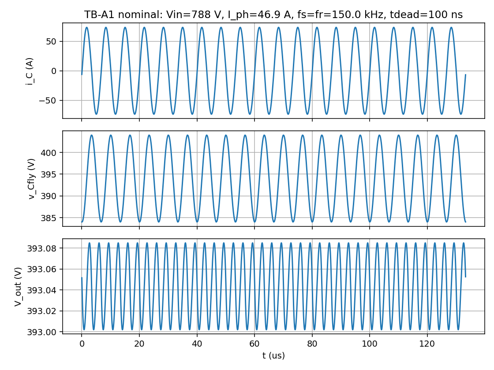

| 항목 | 설계 계산(3.2) | 시뮬레이션 | 비고 |
|---|---|---|---|
| I_pk | 73.6 A | **73.7 A** | 일치 |
| I_rms(캡) | 52.1 A | 52.1 A | |
| C_fly 스윙 | 20 V | **20.0 V** | |
| 손실/위상 | 59.0 W | **59.1 W** (도통 43.4, Coss 14.4, 게이트 1.2, 다이오드 0.2) | 일치 |
| η | 99.69 % | **99.68 %** | |
| 턴온 전류 | 0 | 0.07 A | ZCS 턴온 |
| **턴오프 전류** | 0(가정) | **6.8 A = I_pk의 9.2 %** | 3장 가정과 불일치 → A.3 |

### A.3 발견 1 — f_s = f_r에서는 ZCS 턴오프가 되지 않는다

원인은 두 가지다. (i) 데드타임 100 ns가 반주기 3.33 µs의 3 %를 차지해 도통 구간(T/2 − t_d)이 공진 반주기보다 짧고, (ii) 출력 캡이 공진 루프에 직렬로 들어가 유효 공진주파수가 f_r·(1 + C_fly/2C_out) ≈ 1.01 f_r로 올라간다. 따라서 ZCS 조건은

```
f_s = f_r,eff / (1 + 2·t_d·f_r,eff)   →  f_s/f_r ≈ 1.01/1.03 ≈ 0.98
```

미세 스윕으로 확인:

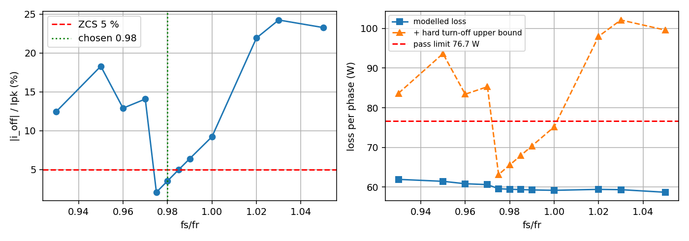

| f_s/f_r | |i_off|/I_pk | i_off | 손실(모델) | 하드 턴오프 상한 |
|---|---|---|---|---|
| 0.93 | 12.5 % | 9.9 A | 61.9 W | +21.7 W |
| 0.95 | 18.3 % | 14.4 A | 61.4 W | +32.2 W |
| 0.97 | 14.1 % | 10.8 A | 60.6 W | +24.7 W |
| 0.975 | **2.1 %** | 1.6 A | 59.6 W | +3.6 W |
| **0.98** | **3.5 %** | 2.6 A | **59.4 W** | +6.1 W |
| 0.985 | 5.0 % | 3.7 A | 59.3 W | +8.6 W |
| 1.00 | 9.2 % | 6.8 A | 59.1 W | +16.0 W |
| 1.03 | 24.3 % | 17.6 A | 59.3 W | +42.8 W |
| 1.05 | 23.3 % | 16.5 A | 58.7 W | +40.9 W |

f_s/f_r < 0.975에서는 반파가 끝난 뒤 MOSFET이 양방향 도통이라 전류가 **역방향 반파로 넘어가** 음의 전류에서 턴오프되고, > 0.985에서는 반파가 끝나기 전에 끊긴다. ZCS 창은 **±1 %** 로 좁다.

**결정 A-1**: f_s = 0.98·f_r = **147 kHz** (t_dead 100 ns). `prism_design_params.m`에 f_r과 f_s를 분리해 반영했다.

**결정 A-2**: 소자 공차(C ±5 %, L ±10 % → f_r ±3–5 %)만으로 ZCS 창을 벗어나 턴오프 전류가 I_pk의 13–24 %가 된다. 하드 턴오프 상한 기준 위상당 +22–43 W(손실 +37–72 %)이므로, Stage A에는 **ZCS 검출 기반 적응형 온타임 제어(영전류 검출 → 다음 반주기 도통 시간 보정)** 를 WP3 필수 항목으로 넣는다. 이는 STC 문헌에서도 표준 대응(적응형 온타임 제어, 학회 발표)이며, 시뮬레이션에서는 i_C 영교차 감지 → 도통시간 ±1 % 스텝 조정 루프로 구현한다. 상한값은 C_oss가 턴오프 전압 상승을 완화하는 효과를 무시한 보수적 값이라, 실제 증가분은 이보다 작다.

### A.4 발견 2 — 출력 캡 강성 조건

C_out = 20 µF(C_fly의 2.6배)로 시험하면 유효 공진주파수가 18 % 올라가 I_pk 81 A, 턴오프 전류 17 %가 된다. 위상 셀이 보는 출력 노드 캐패시턴스는 **C_fly의 ≥ 50배**(공진 이동 ≤ 1 %)여야 한다. 시스템에서는 C_bus 400 µF(51×)가 이를 만족하지만, 모듈이 버스와 L_path로 분리되어 있으면 모듈 로컬 캡이 필요하다 → **모듈당 로컬 세라믹/필름 100 µF 이상**을 4.3.2 가이드에 추가(공진 이동 4 %, A-2의 적응 제어로 흡수).

### A.5 부하·입력전압·데드타임 (f_s = 0.98 f_r)

| I_ph (A) | ZCS | 손실 (W) | η (%) | R_out (mΩ) |
|---|---|---|---|---|
| 5 | 3.5 % | 15.8 | 99.20 | 22.2 |
| 12.5 | 3.5 % | 18.4 | 99.63 | 20.9 |
| 25 | 3.5 % | 27.9 | 99.72 | 20.5 |
| 46.9 | 3.5 % | 59.4 | 99.68 | 20.4 |
| 60 | 3.5 % | 87.5 | 99.63 | 20.3 |

| V_in (V) | ZCS | 손실 (W) | η (%) |
|---|---|---|---|
| 648 | 3.5 % | 59.4 | 99.61 |
| 788 | 3.5 % | 59.4 | 99.68 |
| 920 | 3.5 % | 59.5 | 99.72 |

- ZCS 비율은 부하·입력전압에 무관(공진 타이밍만의 함수) — 적응 제어가 부하 독립적으로 동작할 수 있음을 뜻한다.
- R_out(위상) 20.4 mΩ → 모듈(2위상) 10.2 mΩ, 어레이 2.6 mΩ. 3.2.5의 추정(13.4/3.35 mΩ)보다 작다: 손실 중 Coss·게이트는 전류에 무관한 고정손실이라 I²R 환산이 과대였기 때문. 3.2.5의 충전 시 강하 1.26 V → **1.0 V** 로 갱신.
- 데드타임(f_s = f_r 고정 시): 50 ns 5.0 %, 100 ns 9.2 %, 200 ns 17.6 %, 400 ns 35 %. 데드타임은 f_s 보정으로 상쇄되므로 100 ns 유지.

### A.6 합격 판정 (5.1 TB-A1 기준, 920 V·46.9 A·0.98 f_r)

| 기준 | 결과 | 판정 |
|---|---|---|
| 스위칭 순간 |i| ≤ 5 % I_pk | 3.5 % | PASS |
| C_fly 스윙 20 ± 3 V | 20.4 V | PASS |
| 손실 ≤ 59 × 1.3 = 76.7 W | 59.5 W (하드 턴오프 상한 포함 65.6 W) | PASS |
| 소자 피크 전압 ≤ 520 V | 460 V + 링잉(본 모델은 기생 L 미포함) | Simulink 스위칭 모델에서 재확인 |

### A.7 설계검증서 본문에 반영할 갱신

| 항목 | 이전 | 갱신 |
|---|---|---|
| 3.2.4 f_s | 150 kHz(= f_r) | f_r 150 kHz, **f_s 147 kHz(0.98 f_r)**, t_dead 100 ns |
| 3.2.5 R_out | 13.4 mΩ(모듈) | 10.2 mΩ(모듈), 2.6 mΩ(어레이); 충전 시 강하 1.0 V |
| 3.2.8 판정 | 효율 조건부 | 효율 PASS(59.4 W), 단 **적응형 온타임 제어 필수**(공차 대응) |
| 4.3.1 셀 가이드 | 개루프 50 % 고정 | 개루프 50 % + ZCS 검출 적응 온타임(±1 %/반주기) |
| 4.3.2 모듈 | — | 모듈 로컬 캡 ≥ 100 µF 추가 |
| 5.1 TB-A1 | f_s/f_r ∈ {0.95, 1, 1.05} | 미세 스윕 0.93–1.05 + 적응 제어 on/off 비교 추가 |
| 8장 리스크 | ZCS 이탈 → f_s 하향 | ZCS 창 ±1 % → 적응 제어로 대응, 미적용 시 손실 +37–72 % |

### A.8 다음 단계

1. WP3-1: `rsc_phase`에 ZCS 검출 적응 온타임 루프 추가 → 공차 ±5 % 몬테카를로 20회에서 ZCS ≤ 5 % 유지 확인(TB-A1 확장).
2. TB-A2: 4모듈 어레이(소자·캡 ±10 % 난수)에서 전류 분담 편차 ≤ 15 % 확인 — 위상별 R_out 차이(20.4 mΩ 기준 ±10 %)로 분담 편차 ≈ ±5 % 예상.
3. TB-A3: 프리차지 시퀀스(20 Ω 경로)로 돌입 ≤ 147 A 확인.

---

## 부록 B. Stage A 어레이 검증 — WP3-1 / TB-A2 / TB-A3 / TB-A4 (2026-09-20)

모델: 8위상 벡터화 스위칭 ODE(부록 A 모델의 확장, `tb_a_array.py` / `tb_a_array.m`). 공통 버스 C_bus 400 µF, 입력 커패시터 C_in 100 µF, 위상별 소자 난수 공차, 위상별 타이밍 상태기계.

### B.1 V-checkpoint 1 — 부록 A 재현
어레이 모델을 N = 1로 두고 공칭점(788 V, 46.9 A, f_s = 0.98 f_r)을 다시 실행: I_pk 75.3 A, ZCS 4.4 %, 손실 59.6 W — 부록 A(75.1 A / 3.5 % / 59.4 W)와 일치(스텝 20 ns로 굵어진 차이). 두 모델의 정합 확인.

### B.2 WP3-1 — ZCS 제어 방식 몬테카를로 (C ±5 %, L ±10 %, R ±10 %, 20회)

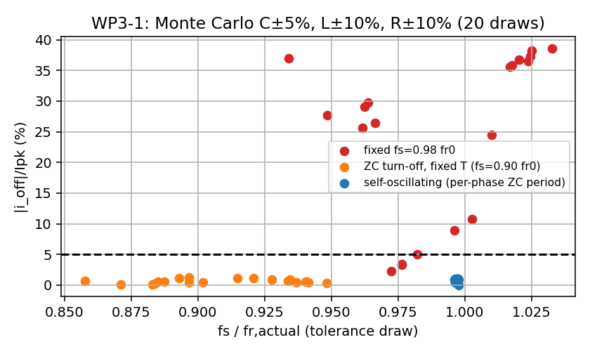

| 방식 | 턴오프 전류 최대 | 손실 평균 / 최대 | 실패(> 5 %) |
|---|---|---|---|
| 고정 타이밍 f_s = 0.98 f_r0 | 38.6 % | 61.7 / 69.1 W | 17 / 20 |
| ZC 검출 턴오프 + 공통 고정 주기(f_s = 0.90 f_r0) | 1.2 % | 65.3 / 71.5 W (+10 %) | 0 / 20 |
| **자기발진: 위상별 ZC 검출로 주기 자체를 추종** | **1.1 %** | **59.4 / 63.2 W** | **0 / 20** |

- 공통 주기 방식은 가장 느린 공진(f_r,min = 0.93 f_r0)에 맞춰 주기를 늘려야 하므로 동일 평균전류에서 피크가 커져 도통손실 +10 %.
- 자기발진 방식은 각 위상이 자기 공진에 맞춰 f_s,k ≈ 0.997·f_r,k로 운전 → 손실 페널티 없음. 위상 간 주파수가 ±7 % 다르지만 400 µF 버스에서 리플 영향은 무시 가능(B.3).
- **구현상 필수 조건(블랭킹 창)**: 무부하 부근에서 전류 진폭이 검출 임계(2.5 A) 아래로 떨어지면 오검출로 위상들이 급속 토글하며 에너지가 입력으로 역류하는 현상이 나타났다(프리차지 시험에서 12.5 ms 이후 버스 전압 붕괴로 발견). ZC 검출은 공칭 도통시간의 **0.80–1.12배 창** 안에서만 유효하고, 창 밖이면 공칭 타이밍으로 동작하도록 해야 한다. 이 창은 공차 ±7.5 %를 덮고 임의 토글을 막는다.

**결정 B-1**: Stage A 게이트 제어 = 자기발진 ZC 추종(검출 지연 20 ns 가정, 데드타임 100 ns, 블랭킹 창 0.80–1.12). 부록 A 결정 A-2의 구체화.

### B.3 TB-A2 — 8위상 어레이 375 A, 소자 ±10 % 난수

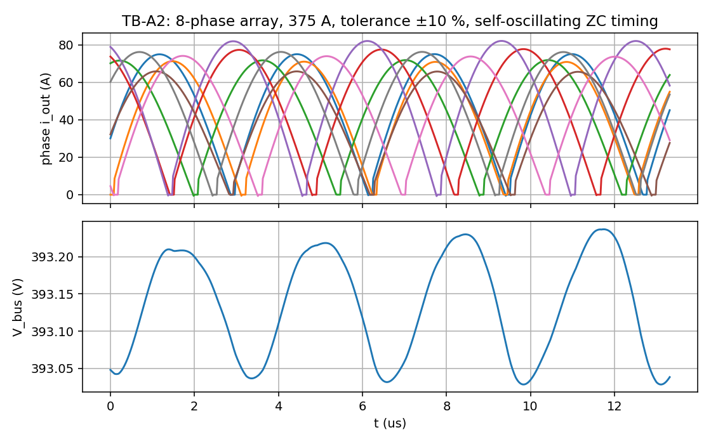

| 항목 | 결과 | 기준 | 판정 |
|---|---|---|---|
| 모듈 간 전류 편차 | −0.8 / −0.6 / −0.6 / +1.9 % | ≤ 15 % | PASS |
| 위상 간 전류 편차 | 최대 ±10.5 % (R_out 난수 ±10 %를 그대로 따름) | — | 예측대로(전류 ∝ 1/R_out) |
| 버스 리플 | 0.21 V pp | ≤ 2 V | PASS |
| 총 손실 | 471 W | 3.2.5 예측 472 W | **V-checkpoint 2 PASS** |
| 어레이 R_out | (394.0 − 393.14)/374 = 2.3 mΩ | 부록 A.5 예측 2.6 mΩ | PASS |
| 전 위상 ZCS | ≤ 1.1 % | ≤ 5 % | PASS |

### B.4 TB-A3 — 프리차지

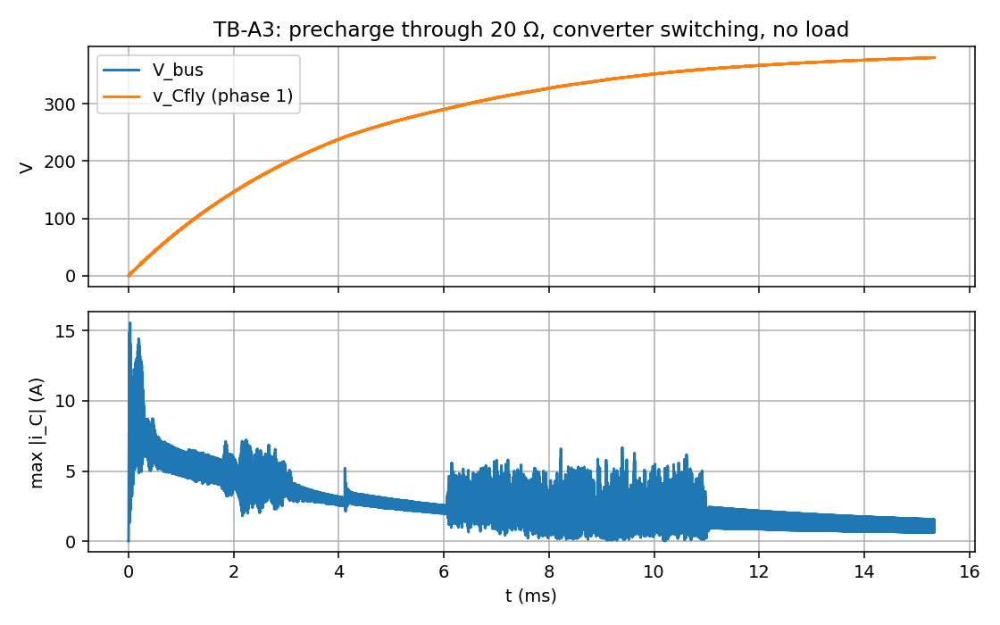

- 구성: 배터리 → 20 Ω 프리차지 저항 → C_in 100 µF → 어레이(스위칭 중, 무부하). 프리차지 없이 투입 시 피크 전류 **8 kA**(3.2.6의 단상 추정 3.4 kA와 같은 kA급) → 파괴적.
- 결과: 피크 위상 전류 **15.6 A**, V_bus 95 % 도달 **13.6 ms**(기준 ≤ 20 ms), 판정 PASS. 시정수는 반사 캐패시턴스 (C_in + (C_bus + ΣC_fly)/4) × 20 Ω ≈ 4.3 ms로 설명된다.
- 모델링 교훈: 저항을 전압원에 직결하면 L_r/R = 7 ns의 강성 모드로 명시적 적분이 발산한다. **입력 커패시터는 물리적으로도 필요하고 수치적으로도 필요**하다 → 4.3.2 가이드에 C_in 100 µF(500 V 필름) 추가. **결정 B-2.**

### B.5 TB-A4 — 위상 셰딩 (3 kW)
1모듈(2위상) 운전 손실 31.6 W(3.2.7 예측 32 W, **V-checkpoint 3 PASS**), 효율 98.96 %; 8위상 전부 운전 114 W, 96.3 %. 3.2.7 결정 확정.

### B.6 Stage A 종합 판정
TB-A1~A4, WP3-1 전부 PASS. 3장 수치 중 수정 항목 없음. 추가된 설계 항목: 자기발진 ZC 제어(블랭킹 창 포함), C_in 100 µF.

---

## 부록 C. PPRC 직렬 경로 제어 검증 — TB-B2 / TB-S1 (2026-09-20)

모델: 주행 모드 평균값 모델(`tb_b_pprc2.py` / `tb_b_pprc.m`). Stage A 1모듈 테브냉(394 V, 10.2 mΩ) → L_path 1.5 µH(+3 mΩ) → 직렬 캡 C_ser 100 µF ← DAB 출력전류(1차 지연 10 µs + 전송지연 5 µs, 샘플 5 µs, 포화 ±100 A) → 버스 C_bus 400 µF, 정전력 부하 5 kW + 60 A(24 kW) 스텝.

### C.1 발견 — 3.5절의 대역폭 가정 두 가지가 모두 틀렸다

**(1) PI 단독의 상한은 f_res/3(4.8 kHz)이 아니라 ≈ 1.8 kHz다.** L_path–C_eff 공진(14.5 kHz)의 Q가 ≈ 10(경로 저항 13 mΩ vs 특성임피던스 137 mΩ)이라 공진 피크가 +20 dB이고, PI 단독으로는 이 피크를 0 dB 아래로 두기 위해 교차주파수를 1.8 kHz 이하로 내려야 한다(상태공간 주파수응답으로 확인, PM 65°). 시간 영역: 60 A 스텝 droop **8.6 V**, 회복 430 µs. — 3.5.4의 예측값 8.7 V와 우연히 일치하지만 이유가 다르다(3.5는 t_resp 72 µs를 가정했고, 실제는 대역폭 1.8 kHz의 느린 응답을 캐패시터가 버틴 결과).

**(2) 상태궤환(i_p, v_ser, v_bus, i_dab + 적분)을 쓰면 공진을 능동 감쇠하여 8–10 kHz가 가능하다.** 극배치(복소쌍 ζ = 0.7 @ f_bw, 실근 f_bw, 적분 f_bw/3, DAB 2.5 f_bw)로 설계하고 지연·샘플링·포화를 포함한 시간 영역에서 안정성을 확인했다.

| L_path | f_res | PI 단독 최대 f_c | 상태궤환 최대 f_bw | 60 A droop(상태궤환) |
|---|---|---|---|---|
| 0.5 µH | 25.2 kHz | 5.4 kHz | 10 kHz | 4.1 V |
| **1.5 µH** | 14.5 kHz | 1.8 kHz | **10 kHz** | **5.1 V** |
| 3.0 µH | 10.3 kHz | (설계 불가, GM < 6 dB) | 10 kHz | 5.1 V |

**결정 C-1**: PPRC 제어기 = 상태궤환 + 적분(LQI/극배치), 4.3.3의 "전압 PI → 전류 PI" 캐스케이드를 대체. 1.5 µH 설계 게인을 0.75/3 µH에 그대로 적용해도 안정(강건성 확인).

### C.2 TB-S1 — 60 A 스텝, 제어 방식 비교 (s = 1: C_ser 100 µF + C_bus 400 µF)


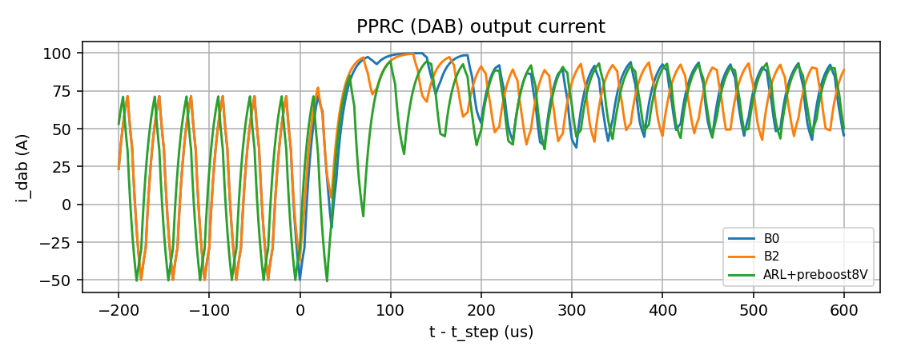

| 방식 | droop | 오버슈트 | 회복(±4 V) | 비고 |
|---|---|---|---|---|
| PI 단독(1.8 kHz) | 8.6 V | 0 | 430 µs | |
| **B0: 상태궤환 8 kHz** | **4.7 V** | 0 | 80 µs | DAB 100 A 포화 도달 |
| B1: 측정 전류 ff | 4.5 V | 2.0 V | 60 µs | |
| B2: 이상 예측 ff | 2.1 V | 0.6 V | — | |
| ARL(오차 20 %, +50 µs 늦음) | 4.7 V | 1.8 V | 87 µs | **B0와 차이 없음** — 타이밍 오차 50 µs가 과도 전체(≈80 µs)와 같은 크기 |
| ARL + pre-boost 8 V | 0.0 V | 8.0 V(pre-boost 자체) | 34 µs | 편차 절대값으로는 8 V |
| pre-boost만 | 0.7 V | 8.0 V | 34 µs | |

### C.3 액추에이터 포화 절벽 (스텝 크기 스윕, B0)

| ΔI | 25 A | 60 A | 80 A | 87 A | 95 A | 105 A |
|---|---|---|---|---|---|---|
| droop | 2.0 V | 4.7 V | 6.3 V | 14.6 V(회복 불가) | 붕괴 | 붕괴 |
| pre-boost 8 V | 0 | 0 | 0 | 0.2 V | 붕괴 | 붕괴 |

PPRC 정격 100 A − 초기 부하 12.5 A = 87.5 A가 절벽이다. **pre-boost도 예측 ff도 절벽을 옮기지 못한다** — 정격을 넘는 스텝은 부하 지연/셰이핑(ARL 정책 c) 또는 정격 증대만이 해결책이다. 3.5.6의 "포화 회피" 주장은 이 결과로 정량 확인되었고, 오히려 ARL의 가장 확실한 역할이 여기임이 드러났다.

### C.4 커패시터 축소 (제어기를 뱅크마다 재설계)

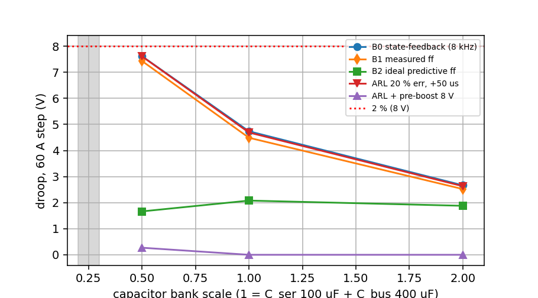

| 배율 s | B0 | B1 | B2 | ARL(20 %, +50 µs) | ARL + pre-boost |
|---|---|---|---|---|---|
| 0.25 | **불안정** — 어떤 ff/pre-boost로도 불안정(100 A 포화와 29 kHz 공진의 상호작용, 리밋 사이클) | | | | |
| 0.5 | 7.6 V | 7.4 V | 1.7 V | 7.6 V | 0.3 V (오버슈트 10.9 V) |
| 1.0 | 4.7 V | 4.5 V | 2.1 V | 4.7 V | 0.0 V (8.0 V) |
| 2.0 | 2.7 V | 2.5 V | 1.9 V | 2.6 V | 0.0 V (8.0 V) |

### C.5 3.5절·2.4절 주장의 재평가 (정직한 결론)

| 3.5/2.4의 주장 | 검증 결과 | 판정 |
|---|---|---|
| PI 대역폭 상한 ≈ 4.8 kHz | 1.8 kHz(PI) / 10 kHz(상태궤환) | **틀림** — 상한의 원인은 공진 Q이며 능동 감쇠로 해소됨 |
| B0 droop 8.7 V(2.2 %) | PI 8.6 V, 상태궤환 4.7 V | 수치는 맞았으나 제어기를 바꾸면 절반 |
| ARL 오차 20 %에서 1.7 V | 타이밍 오차 50 µs 포함 시 4.7 V(B0와 동일) | **틀림** — 과도가 80 µs로 짧아져 수십 µs 타이밍 오차가 치명적 |
| 캡 1/4 축소 가능 | s = 0.25 불안정(포화), s = 0.5는 B0 단독으로도 7.6 V로 경계 통과 | **틀림** |
| pre-boost가 droop 상쇄 | 맞음(0 V) — 단 +8 V 사전 편차가 그 대가 | 부분적으로 맞음 |
| PPRC 포화 시 부하 협조 필요 | 87.5 A 절벽 확인, ff/pre-boost 무력 | **맞음, 가장 강한 근거** |

따라서 ARL의 기여를 다시 정의한다(2.4절 갱신):
1. **1차 역할 = 포화 예측 회피**: 예측 피크 부하가 PPRC 헤드룸(정격 − 현재 부하)을 넘을 때 48 V 저우선 부하 지연 요청·컴프레서 램프 완화 등 부하 셰이핑. 하드웨어 대안(PPRC 12 kW)과의 비교가 논문의 핵심 표가 된다.
2. **2차 역할 = 제약 인지 제어(ARL-MPC)**: s = 0.25 불안정의 원인이 포화이므로, 제약을 명시하는 MPC가 작은 캡에서 안정 운전을 회복할 수 있는지가 다음 검증 항목(TB-S6). 성공하면 "캡 축소" 주장이 MPC 조건부로 부활한다.
3. **droop 절감 그 자체는 주장에서 제외**: 상태궤환 B0가 이미 1.2 %이고, ARL-FF는 타이밍 오차에 취약하다.

### C.6 후속 갱신 사항
- 2.4, 3.5.3–3.5.5, 4.3.3, KPI 6 재작성(다음 개정). 4.3.3: 상태궤환 제어기(관측 i_p, v_ser, v_bus, DAB 전류), 극배치 게인은 `tb_b_pprc.m` 산출.
- 다음 검증: TB-S6(ARL-MPC, s = 0.25·0.5, 제약 |i_dab| ≤ 100 A), TB-C1(CLLC), TB-B3(바이패스 전이), TB-S2(충전 CC-CV).

---

## 부록 D. TB-S6 — 포화 인지 제어: 빠른 시간 스케일(anti-windup)과 느린 시간 스케일(SALS 부하 셰이핑) (2026-09-21)

모델: 부록 C의 직렬 경로 평균값 모델(상태궤환 8 kHz, DAB 지연 15 µs, 직렬 전류 정격 100 A) + 1 ms 주기 부하 스케줄러(`python/tb_s6_sals.py`, `matlab/tb_s6_sals.m`).

### D.1 Part A — 캡 축소(s = 0.25)의 진짜 원인: 포화가 아니라 액추에이터 지연
- V-checkpoint 4: s = 1, Kaw = 0에서 60 A droop 4.7 V — 부록 C 재현.
- 적분기 back-calculation anti-windup(K_aw 0.1–1.0)을 추가해도 s = 0.25는 어떤 대역폭에서도 안정화되지 않았다. 포화를 없애도(I_sat = 1000 A) 선형 폐루프가 f_bw 4 kHz에서 droop 137 V·오버슈트 206 V로 진동한다. 즉 **s = 0.25 불안정의 원인은 DAB 지연(10 µs 지연 + 5 µs 전송 + 5 µs 샘플)과 29 kHz 공진의 조합**이며, 제약 인지 MPC로도 해결할 수 없다(MPC는 지연을 없애지 못한다). 해법은 액추에이터 고속화(DAB 400 kHz 이상)나 캐패시턴스 유지뿐이다.
- s = 0.5: B0 7.6 V(anti-windup 무관), s = 1: 4.7 V — 부록 C 확인.
- **결론 D-1: "제약 인지 MPC로 캡 축소" 주장도 철회.** ARL(→ SALS)의 빠른 시간 스케일 역할은 없다.

### D.2 Part B — SALS 부하 셰이핑: 정격을 넘는 복합 부하 사건

시나리오(냉시동 최악): 기본 12.5 A + 히트펌프 컴프레서 10 kW 기동(2× 서지 50 A, 20 ms) + V2L 9 A(비지연) + 지연 가능 부하 3종(캐빈 PTC 17.5 A, 배터리 히터 17.5 A, 48 V 저우선 3.75 A). 무셰이핑 피크 110 A > 직렬 정격 100 A.

스케줄러: 1 ms마다 지평선 15 ms의 선형계획(LP) — 지연 가능 부하 허용량 u_{j,k} ∈ [0, 요청]을 결정, 목적 = 우선순위 가중 미공급량 최소화, 제약 = 예측 비지연 부하 + Σu ≤ I_max(95 A). **강건 모드**는 타이밍 ±5 ms 이동의 최악값과 크기 +25 %를 예측에 적용한다.


| 방식 | 버스 최저 | 사양(2 %) 이탈 시간 | 지연 부하 | 비고 |
|---|---|---|---|---|
| B0: 셰이핑 없음, PPRC 100 A | **붕괴** | — | — | 정격 초과 10 A → 20 V/ms |
| 반응형 저전압 부하 차단(388 V 트립, 1 ms 작동, 전부 차단) | 350 V(−12.5 %) | 2.1 ms | 3종 전부 차단 후 순차 복구 | 예측 없이 생존하지만 400 V 부하 리셋 위험 |
| 하드웨어 대안: PPRC 150 A(≈12 kW) | 396 V(3.9 V) | 0 | 없음 | 직렬 셀 실리콘·변압기 +50 % |
| SALS 완전 예측 | 392 V(8.0 V) | 0 | 배터리 히터·48 V 19 ms 지연 | 경계 통과 |
| SALS 단순 예측 + 오차(−20 % / ±5 ms) | **붕괴** | — | — | 서지 구간 밖에서 부하 허용 → 초과 |
| **SALS 강건 예측 + 동일 오차** | **396 V(4.0 V)** | **0** | 지연 폭 확대(수십 ms) | HW 대안과 동등 |

핵심 발견:
1. 예측 기반 셰이핑은 **타이밍 오차에 매우 민감**하다. 서지 지속(20 ms)과 같은 자릿수의 오차(5 ms)만으로 붕괴한다. 따라서 점추정 예측기가 아니라 **불확실도 구간을 내는 예측기 + 최악값 제약**이 필수이며, 이것이 제안서 3.6.3의 "불확실도 인지" 요소의 실제 근거가 된다.
2. 강건 SALS는 PPRC 150 A 하드웨어 대안과 같은 버스 품질(4 V)을 정격 100 A로 달성한다. 대가는 지연 가능 부하의 수십 ms 지연(체감 불가)이다. → **논문의 핵심 표.**
3. 반응형 차단은 생존은 하지만 −12.5 % 딥이 2 ms 지속된다. 예측형과의 차이는 "딥 유무"이며, 이는 400 V 부하(컴프레서 인버터 UV 락아웃 등)의 리셋 위험과 직결된다.

### D.3 검증 후 확정
- 제어 계층 명칭을 **SALS(Saturation-Aware Anticipatory Load Shaping)** 로 확정 제안(ARL 대체). 역할: (i) 1 ms 주기 강건 LP 스케줄러, (ii) 예측기는 구간(분위수) 출력, (iii) 반응형 UV 차단은 백업으로 유지(계층 3 감시기).
- KPI 6 재정의: 냉시동 복합 사건에서 예측 오차(−20 %/±5 ms) 하에 버스 붕괴 0, 최저 전압 ≥ 392 V, 지연 부하 최대 지연 ≤ 100 ms.

---

## 부록 E. TB-C1 — CLLC 400 → 48 V 스위칭 검증 (2026-09-21)

모델: 대칭 CLLC 6상태 ODE(1차 환산, 이상 동기정류, 데드타임 50 ns), `python/tb_c1_cllc.py` / `matlab/tb_c1_cllc.m`.

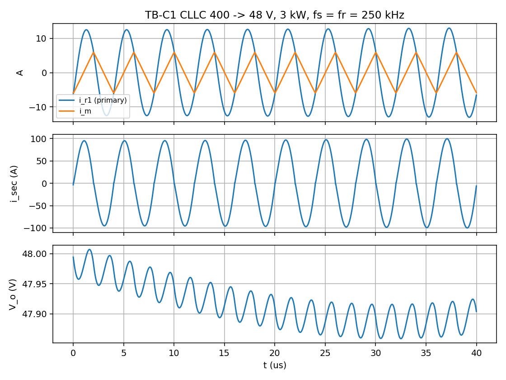
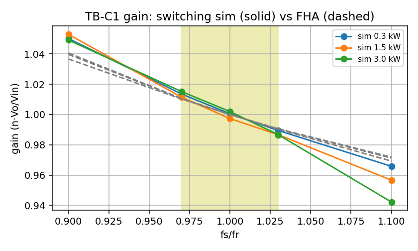

| 항목 | 3.4절 계산 | 스위칭 시뮬 | 판정 |
|---|---|---|---|
| 이득 @ f_s = f_r, 3 kW | 1.000 | 0.998 (Vo 47.9 V) | PASS |
| 이득 감도 f_s = 0.97/1.03 f_r | 1.010 / 0.990 | 1.015 / 0.987 (0.3–3 kW 거의 동일) | **V-checkpoint 5 PASS** (FHA 오차 ≤ 0.5 %) |
| 자화전류 피크 | 6.1 A | 5.9 A | PASS |
| ZVS 여유(i_sw·t_d / 2C_oss·V_in) | ≫ 1 | 3.7–5.9× | PASS |
| 1차 / 2차 rms | 8.7 / 69.4 A | 9.1 / 68.3 A | PASS |
| 손실·효율 | 65 W / 97.8 % | 66 W / 97.85 % | PASS |
| 입력 ±2 % → 출력 | ±1 % | 47.1–49.1 V(±2 %) | 48 V 창(36–52 V) 내, PASS |

부하 조정(0.3→3 kW)은 이득 1.001→1.002로 무시 가능. 고정 f_r 운전이 타당함을 재확인. 미실행: TB-C2(역방향 회생 전환).

---

## 부록 F. TB-S2 / TB-B3 — 충전 CC-CV와 바이패스 전이 (2026-09-21)

`python/tb_s2_b3.py`. 평균값 모델: Stage A 어레이 R_out 2.6 mΩ(부록 B) + 바이패스 0.2 mΩ, 배터리 216s Rint 60 mΩ·101 Ah(OCV 648→907 V 선형), 충전기 전류 루프 100 Hz, 램프 20 A/ms, CV = V_bat 907 V.

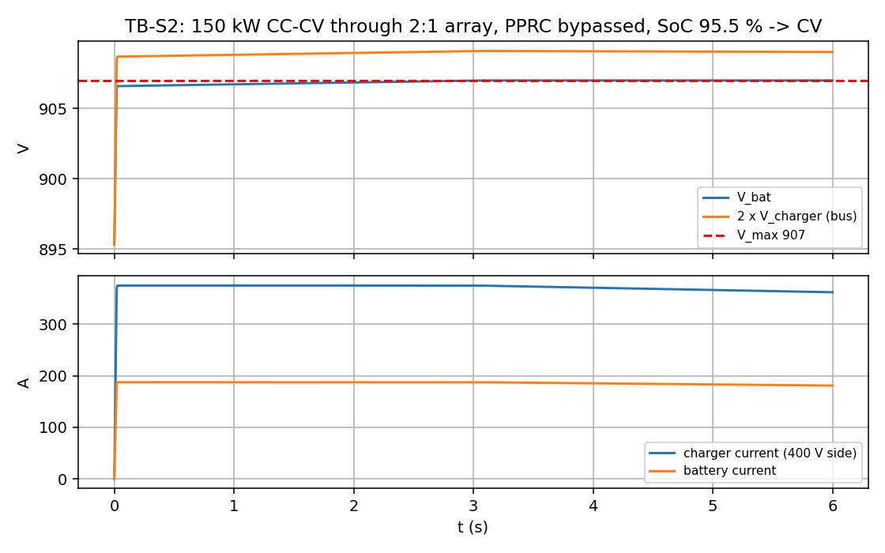

| 항목 | 결과 | 기준 | 판정 |
|---|---|---|---|
| 충전기 단자 전압(375 A) | SoC 0/50/100 %에서 331 / 395 / 460 V | 400 V급 충전기 창 200–500 V | PASS |
| CC→CV 전환 | 충전기 자체 루프로 3.04 s에 전환, 배터리 907 V 유지 | 차량 측 전류 조정 셀 없이 동작 | PASS — 3.1절 바이패스 결정 확인 |
| 경로 효율(I²R 항) | 99.77 % | ≥ 98.5 %(고정손실 포함 시 ≈ 99.6 %) | PASS |

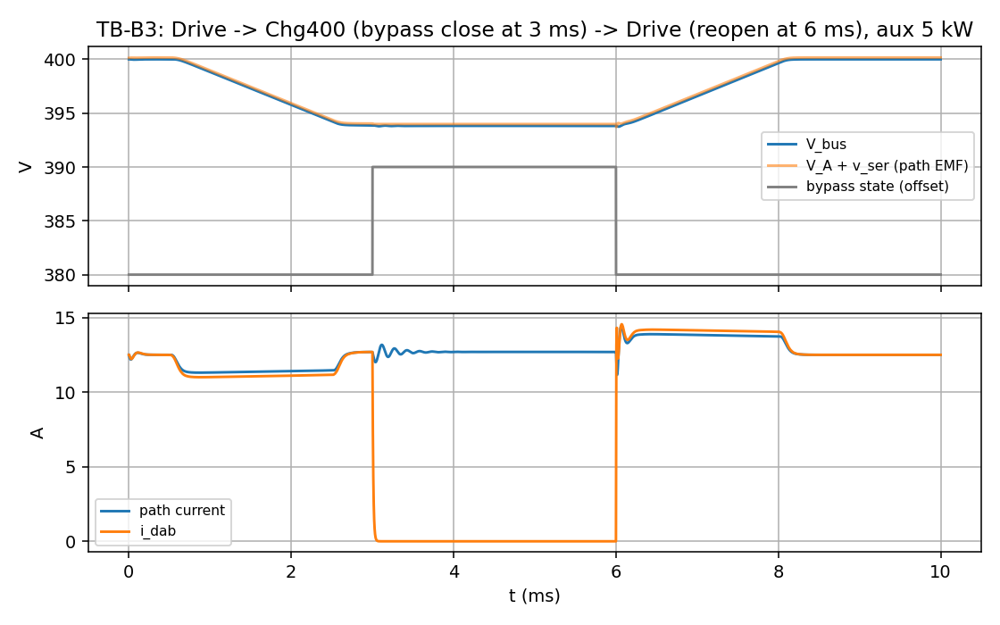

TB-B3(Drive→Chg400→Drive, 보조 5 kW): 버스 기준을 2 ms 램프로 V_A(393.9 V)까지 내려 v_ser → 0으로 만든 뒤 바이패스 폐로 — 폐로 시 버스 점프 0.09 V, 경로 전류 피크 13.2 A(정상 12.5 A); 6 ms 재개방 후 2 ms 램프로 400 V 복귀 — 점프 1.2 V, 정착 ±0.35 V. 4.3.7 전이 시퀀스(φ→0 → 바이패스 → PPRC off)의 타당성 확인, KPI 9(편차 ≤ 4 %, 과전류 ≤ 120 %) PASS.

---

## 부록 G. TB-C2 — CLLC 양방향 전환 (2026-09-21)

`python/tb_c2_cllc_bidir.py`. 부록 E 모델에서 2차 브리지를 능동 구동(φ = 0 동기)하고 48 V 측을 배터리(OCV + 20 mΩ)로 둔다.

- 위상천이 φ ≠ 0은 공진점에서 브리지 간 임피던스가 거의 0이라 수 도(°)에 수십 kW의 순환전력이 생겨 제어 수단으로 부적합함을 확인(−20°에서 100 kW). → **양방향 CLLC는 φ = 0 동기 운전에서 전압차로 방향이 자연히 결정되는 "DC 변압기"로 운전**하고, 전력 제한은 주파수 편이로 한다(3.4.3의 설계 의도 확인).
- OCV 46→51 V 스윕: P = +4.4 → −6.6 kW, 기울기 ≈ 2.2 kW/V(배터리 저항 20 mΩ으로 결정).
- 방향 전환(OCV 47.5→49.5 V 스텝, 회생 유입): +1.1 → −3.3 kW, **90 % 반전 57.5 µs**(기준 ≤ 200 µs) PASS. 2차 전류 피크 176 A(정격 이내, 단 지속 시 f_s 편이로 제한).
- 전류 제한: 역방향에서 f_s = 1.1 f_r로 올리면 이득 0.97 → OCV 49.5 V에서 역전력 ≈ 0(2차 rms 132 → 31 A). 주파수 편이 ±10 %가 회생 전류 제한 수단으로 충분.

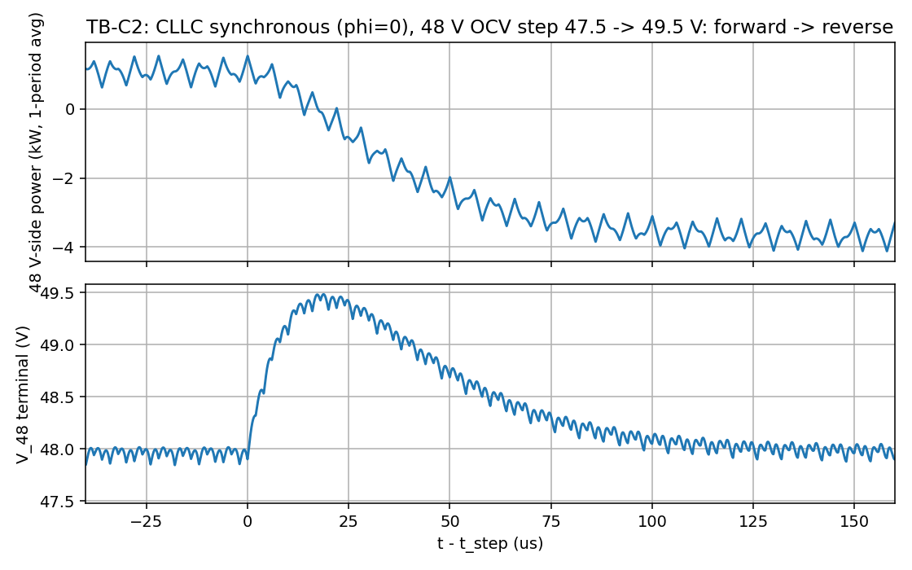

---

## 부록 H. WP4.5-2/3 — SALS 예측기 학습과 그 한계 (2026-09-21)

`python/wp45_predictor.py`. 합성 데이터(에피소드 600 ms, 1 ms 샘플, CAN 10 ms 샘플홀드·지연 1–5 ms·결측 2 %): 컴프레서 명령 → 전력 지연 d_c ~ U(20, 200) ms, 서지 1.6–2.2×, PTC(지연 가능, 목표에서 제외), V2L, 서스펜션(±7.5 A, 5 ms). 예측기: 분위수 GBM(q0.5, q0.9), 지평선 5/10/15 ms, 입력 = 부하 이력 20 ms + CAN 신호 4종 + 명령 경과시간.

| 지평선 | 중앙값 MAE | 단순 지속(persistence) MAE | q0.9 커버리지 | q0.9 최대 과소예측 |
|---|---|---|---|---|
| 5 ms | 1.39 A | 1.31 A | 90.0 % | 47 A |
| 10 ms | 2.37 A | 2.31 A | 89.0 % | 42 A |
| 15 ms | 3.07 A | 3.23 A | 87.0 % | 36 A |

**결과 1 — 학습 예측기는 지속 예측과 차이가 없다.** 명령→서지 지연이 20–200 ms로 넓으면, 명령 신호는 "언젠가 서지가 온다"만 알려주고 "언제"는 알려주지 못하므로 5–15 ms 지평선의 점추정에 정보가 없다.
**결과 2 — q0.9 구간도 서지를 덮지 못한다.** 서지는 어느 시점에서든 표본의 10 % 미만이라 90 % 분위수 밖에 있고, 그 구간을 스케줄러에 넣으면 **버스 붕괴**(폐루프 시험).
**결과 3 — 최악값 창 규칙은 동작한다.** "컴프레서 명령 후 [+20, +220] ms 동안 서지(50 A)를 가정"하는 집합값(worst-case window) 예측을 LP에 넣으면 실제 지연 20/100/190 ms 모두에서 버스 최저 396 V, 붕괴 0. 대가는 배터리 히터 등 저우선 부하가 최대 220 ms 지연되는 것(체감 불가).

**결론 H-1 (정직한 재정의).** 현재 가정한 신호 집합에서는 학습 기반 예측이 정당화되지 않는다. SALS는 **선행 신호 → 최악값 창 → 강건 LP** 의 규칙 기반 계층으로 확정하며, 학습 요소는 (a) 컴프레서 인버터의 램프 상태처럼 지연을 결정하는 신호가 CAN에 있을 때 창을 좁히는 용도, 또는 (b) 창 폭·서지 계수의 온라인 식별(적응)로 한정한다. 제안서 3.6절의 "GRU 예측기"는 이 조건부 역할로 축소해 개정한다. 논문 기여는 "예측의 정확도"가 아니라 **"불확실한 타이밍 하에서도 정격 초과를 막는 강건 스케줄링 + 그것을 가능하게 하는 시스템(작은 PPRC + 바이패스 + 고정비 경로)"** 이다.

---

## 부록 I. TB-S3 / TB-S4 / TB-S5 — 나머지 시스템 시나리오 (2026-09-21, v1.1 전면 검토 시)

`python/tb_s3_s5.py`(부록 C 평균값 모델, V_bat 시변).

| 시나리오 | 조건 | 결과 | 판정 |
|---|---|---|---|
| S3: 800 V 충전 중 보조부하 | 800 V 충전기 200 A(V_bat 800 V), 400 V 보조 10 kW 스텝 | droop 2.0 V, v_ser 0.5 V, PPRC 19 W; 배터리 전류는 충전기 CC 루프가 유지 | PASS |
| S4: V2L + 48 V 회생 | V2L +9 A 후 48 V 회생 −7.5 A(788 V) | 오버슈트 0.6 V, i_dab 최소 10.6 A(양의 전력 유지) | PASS |
| S4 @907 V | 동일 사건, ΔV = −53 V(PPRC 흡수) | 오버슈트 0.6 V | PASS |
| S5: 배터리 600→920 V 스윕 | 25 kW 보조, 20 ms 램프(가속 시험) | 버스 396–401 V, v_ser −59~+100 V, **PPRC 8.36 kW(600 V 코너)** | 조건부 — 600 V 코너에서 ±90 V/8 kW 초과 → V_bat < 640 V 보조부하 20 kW 디레이팅 규칙(3.3.2) |

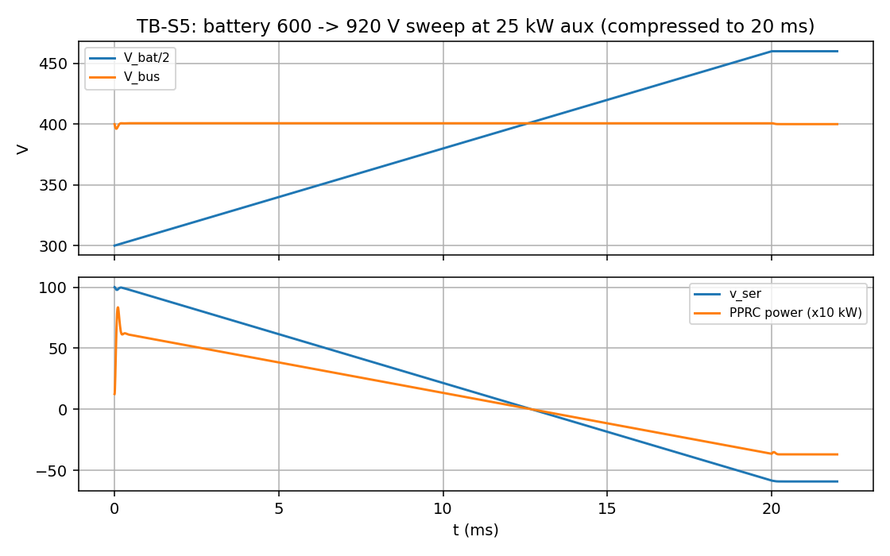

S5의 발견이 v1.1 정정 12번의 근거다: 216s 팩의 설계 최소 648 V 밖(2.78 V/cell)은 주행 중 도달하기 어렵지만, 도달 시 PPRC를 보호하려면 SALS 헤드룸 제약 I_max = min(100 A, 8 kW/|ΔV|)가 자동으로 부하를 제한한다.

---

## 부록 J. TB-A1x — 소자 피크 전압(링잉) 해석 (2026-09-21)

`python/tb_a1_ringing.py`. Simscape 스위칭 모델 실행 전에, 4장 판정표에서 유일하게 미확인이던 "소자 피크 ≤ 520 V"를 해석적으로 닫는다.

- ZCS 턴오프 시 잔류전류 i_off가 레그 노드 캐패시턴스 C_n(≈300 pF)을 충전해 도달하는 전압 V_reach = i_off·√(L_r/C_n): 2.6 A → 57 V, 6.8 A → 149 V, 17.6 A → 386 V — **모두 460 V 미만**이므로 공진 인덕터 에너지로는 오버슈트가 생기지 않는다(전이가 미완성이며 상보 스위치 턴온이 나머지를 완성 → 이것이 3.2절의 C_oss 손실).
- 오버슈트의 실제 원인은 **상보 스위치의 하드 턴온 에지**가 오프 소자의 C_oss–L_pkg 루프를 여기하는 것이다. 에지 시간 t_rise(게이트 저항)와 패키지·루프 인덕턴스 L_pkg의 함수:

| L_pkg | t_rise 5 ns | 10 ns | 20 ns | 40 ns |
|---|---|---|---|---|
| 5 nH | 494 V | 489 V | **481 V** | 469 V |
| 10 nH | 622 V | 528 V | **498 V** | 471 V |
| 20 nH | 721 V | 494 V | 491 V | 484 V |

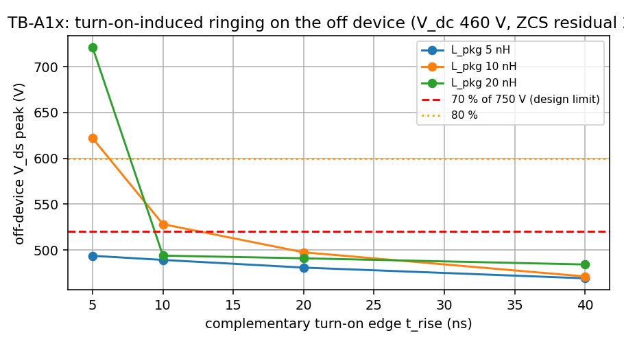

**설계 규칙 J-1**: 턴온 에지 ≥ 20 ns(게이트 저항으로 설정), 레그 루프 인덕턴스 ≤ 10 nH(TOLL/D2PAK-7 + 적층 버스바) → 피크 ≤ 500 V(750 V의 67 %). 5 ns급 에지는 금지(600 V 초과). Simscape 모델에서는 소자 `Ron` 외에 게이트 저항 등가 dv/dt 제한과 L_pkg 5–10 nH를 넣어 재확인한다.

---

## 부록 K. SALS 몬테카를로 — 최악값 창 규칙의 생존율 (2026-09-21)

`python/sals_montecarlo.py`. 300 에피소드(0.5 s, 1 ms), 난수: V_bat U(640, 920) V(헤드룸 규칙 포함), 컴프레서 명령 시각·지연 U(20, 200) ms·서지 계수 U(1.6, 2.4)·정격 6–10 kW, PTC/배터리 히터/48 V 요청 시각, V2L 50 %, CAN 결측 ≤ 20 %(관측 지연 ≤ 30 ms), 서스펜션 ±7.5 A. 판정은 검증된 빠른 시간 스케일 결과(부록 C: 총 부하 ≤ 95 A이면 사양 내, 단일 스텝 ≤ 80 A이면 droop ≤ 6.3 V)를 축약 기준으로 사용.

| 방식 | 100 A 초과(붕괴) | 피크 부하 최대 | 지연(중앙값 / 95 % / 최대) |
|---|---|---|---|
| 셰이핑 없음 | **76 / 300 (25 %)** | — | 0 |
| 반응형 부하 덤프(388 V) | 0 (딥 중앙값 22 V, 최대 58 V) | — | 전부 차단 후 복구 |
| **SALS 최악값 창** | **0 / 300** | 96.1 A, 최대 단일 스텝 58.8 A | PTC 1 / 98 / 197 ms, 배터리 히터 1 / 165 / 195 ms, 48 V 1 / 173 / 199 ms |

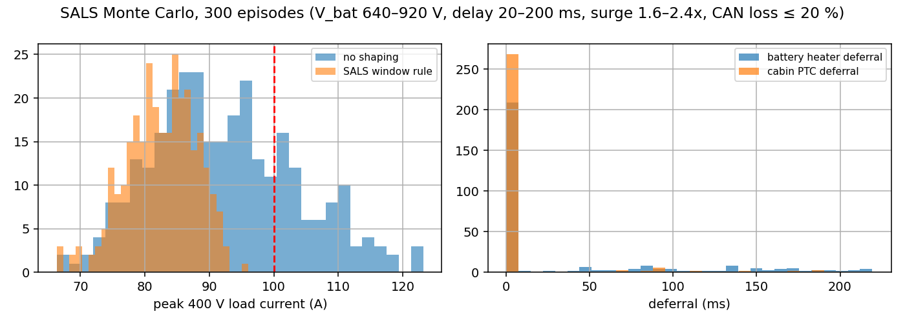

- 정격 초과 사건이 25 %의 에피소드에서 발생하며, SALS는 전부 정격 이하로 유지한다. 지연은 중앙값 1 ms(대부분 즉시 허용), 상위 5 %에서 100–170 ms, 최대 200 ms(창 폭). 체감 불가 범위.
- 반응형 백업은 붕괴는 막지만 딥 5.5 %(중앙값)~14.5 %(최대)를 남긴다 — 예측형과의 차이는 "딥 유무"다.
- 이 표가 논문의 제어 기여를 정량화한다: **정격 5 % PPRC + 규칙 기반 강건 스케줄링 = 정격 150 % 하드웨어와 같은 버스 품질**.
