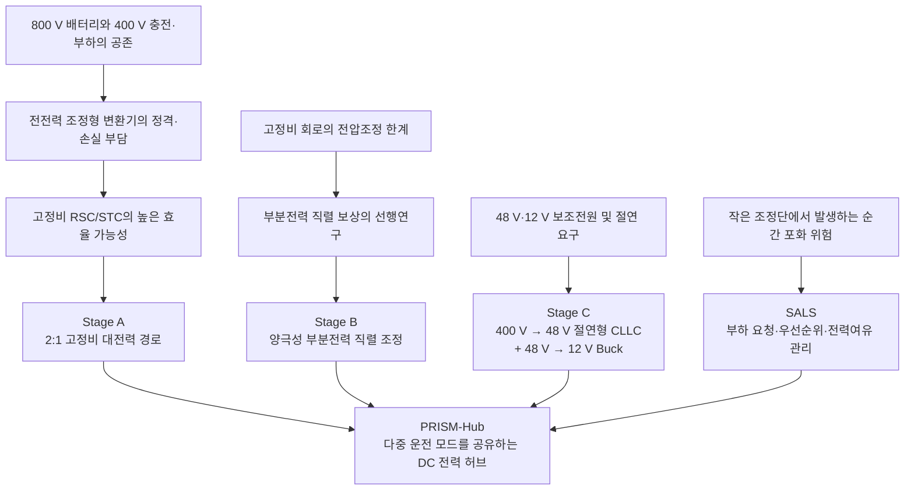
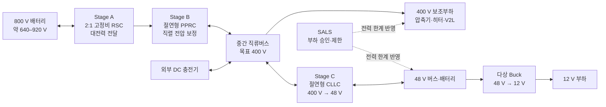

# PRISM-Hub 프로젝트 기술 개요 및 검토 결과 보고서

> **읽는 순서:** 1~14절은 v0.7.0과 2026-09-21 독립 검토를 기록하고, 15절은 v0.9.0~v0.9.1 대응을 정리한다. 16절은 최신 통합 커밋 `377d1bf`의 실행 결과를 반영한 현재 판정이다. 17절은 공통 제어기·60 A 후속 시험이며, 현재 제어기 판정은17절을 우선한다. 상세 구현 근거는 [검토 대응 통합 및 후속 개발](10_검토대응_통합개발.md)에 있다.

문서 기준일: 2026-09-22\
최초 검토 기준: PRISM-Hub v0.7.0, commit `959efdf`\
최신 보강 기준: `codex/review-response-integration`, commit `377d1bf`\
문서 목적: 프로젝트의 기술적 배경, 구성, 검증 결과, 선행기술과의 관계 및 후속 개발 과제를 하나의 문서에서 설명한다.

---

## 1. 선행연구 분석과 아이디어 도출

### 1.1 800 V 차량에서 발생하는 전압 호환 문제

전기자동차의 배터리 전압을 400 V급에서 800 V급으로 높이면 같은 전력을 더 작은 전류로 전달할 수 있다. 전류가 감소하면 케이블과 커넥터의 도통손실을 낮추고 고출력 충전에 대응하기 쉬워진다. 이 때문에 800 V급 구동계는 차세대 전기자동차의 중요한 개발 방향이 되었다.

그러나 차량 배터리의 전압만 높인다고 전체 전력망이 단순해지는 것은 아니다. 실제 차량과 충전 환경에는 다음과 같은 서로 다른 전압이 공존한다.

- 외부 직류 급속충전설비는 넓은 전압범위를 가지며, 차량이 요구하는 모든 전압을 항상 제공하는 것은 아니다.
- 전동식 공조 압축기와 히터 중에는 400 V급 장치가 존재한다.
- 조널 제어기, 능동 섀시 및 고출력 전장부하는 48 V 전원망을 사용할 수 있다.
- 기존 전자제어장치, 조명 및 안전 관련 전장품은 12 V 전원을 사용한다.

따라서 800 V 차량에는 충전전압 호환, 400 V 보조부하, 48 V 전원망 및 12 V 전원망을 연결하는 여러 전력변환 기능이 필요하다. 이 문제가 PRISM-Hub 아이디어의 출발점이다.

### 1.2 기존의 400 V 충전 호환 방식

800 V 배터리를 400 V급 충전설비에서 충전하려면 충전기 출력보다 높은 배터리 전압을 만들 수 있어야 한다. 선행 차량 및 산업 자료에서 확인되는 대표적인 해결방법은 다음과 같다.

| 방식 | 기본 원리 | 장점 | 고려사항 |
|---|---|---|---|
| 별도 승압형 직류-직류(DC-DC) 변환기 | 충전기 전압을 배터리 충전전압까지 높임 | 충전경로와 차량 구동경로를 명확히 분리할 수 있음 | 전체 충전전력을 처리하는 반도체·자기소자·냉각장치가 필요 |
| 배터리 재구성 | 배터리 모듈의 직렬·병렬 연결을 충전 시 변경 | 대형 자기소자를 줄일 가능성이 있음 | 고전압 접촉기, 절연, 셀 균형 및 고장처리가 복잡해짐 |
| 구동계 통합 충전 | 인버터와 모터 권선을 충전 승압회로 일부로 활용 | 별도 대전력 부품을 줄일 가능성이 있음 | 충전 중 구동계를 사용하며 모터 전류·소음·안전 제어가 필요 |
| 2:1 고정비 변환 | 약 400 V와 약 800 V를 정해진 비율로 연결 | 변환범위를 좁혀 높은 효율과 전력밀도를 목표로 할 수 있음 | 실제 전압비가 2:1에서 벗어나면 정밀 조정이 어려움 |

고정비 2:1 방식은 이미 산업계에서 제안되어 있다. [Vicor의 400/800 V 고정비 양방향 모듈 자료](https://www.vicorpower.cn/resource-library/articles/automotive/power-modules-provide-high-efficiency-conversion)는 충전 시에는 400 V급 입력을 800 V 배터리 측에 대응시키고, 비충전 시에는 800 V 배터리에서 400 V 보조부하를 공급하는 구성을 설명한다. 따라서 충전과 주행에서 고정비 경로를 함께 사용하는 발상 자체는 알려진 기술영역에 속한다.

PRISM-Hub는 이 고정비 경로를 시스템의 주전력 경로로 채택하되, 고정비만으로 해결하기 어려운 전압 조정을 별도의 소전력 회로에 맡기는 방향으로 발전하였다.

### 1.3 전전력 변환 방식의 장점과 부담

일반적인 승압형 변환기나 절연형 듀얼 액티브 브리지(Dual-Active-Bridge, DAB)는 입력전압이 변해도 원하는 출력전압과 전력을 조절할 수 있다. 이러한 전전력 변환기는 제어 자유도가 높고, 절연이 필요한 경우 명확한 절연 경계를 제공한다.

반면 150 kW 충전전력을 모두 처리한다면 반도체, 변압기, 인덕터, 버스바와 냉각장치도 전체 전력에 맞추어 설계해야 한다. 차량이 주행 중 사용하는 400 V 보조전력이 수 kW에서 수십 kW 수준이라면, 충전용 150 kW 변환기를 보조전원 용도로 계속 운전하는 방식은 저부하 효율과 부품 활용도 측면에서 불리할 수 있다.

이 관찰에서 다음 설계 질문이 나온다.

> 전체 전력을 정밀하게 변환하지 않고, 대전력은 단순한 고효율 경로로 전달하면서 필요한 전압 차이만 별도의 작은 변환기가 조정할 수 있는가?

### 1.4 고정비 공진형 스위치드 커패시터 연구

공진형 스위치드 커패시터(Resonant Switched-Capacitor, RSC) 또는 스위치드 탱크 변환기(Switched-Tank Converter, STC)는 커패시터 연결 상태와 공진전류를 이용해 정해진 비율로 전압을 바꾼다. 변환비를 좁게 정하면 영전류 스위칭(Zero-Current Switching, ZCS)을 이용해 스위칭 손실을 줄이고 높은 전력밀도를 목표로 할 수 있다.

선행연구는 이 방식이 실험실 규모를 넘어 수십·수백 kW로 확장될 수 있음을 보여 준다.

- [Ni 등의 IEEE TPEL 2020 연구](https://doi.org/10.1109/TPEL.2019.2954801)는 300 V와 600 V 사이에서 동작하는 100 kW급 양방향 실리콘 카바이드(Silicon Carbide, SiC) STC를 제작하고, 약 30 kW에서 98.7%의 최고효율과 100 kW에서 약 97.4%의 실측 효율을 보고했다.
- Liu 등의 연구는 [500 kW급 다상 STC 설계](https://doi.org/10.1109/APEC43580.2023.10131540)와 [후속 실험](https://doi.org/10.1109/APEC48139.2024.10509275)을 다루었다.
- Vicor의 산업자료는 400/800 V 고정비 모듈의 병렬 확장과 차량 충전·보조전원 적용을 제시한다.

이 연구들은 고정비 공진 변환이 대전력 차량 응용에 적합할 가능성을 보여 준다. 동시에 실제 전부하 효율은 반도체 도통손실, 공진 커패시터의 실효전류, 버스바, 냉각 및 제어에 따라 달라진다는 점도 보여 준다. 따라서 고정비 회로를 사용한다는 이유만으로 특정 효율이 자동으로 보장되지는 않는다.

### 1.5 고정비 변환기의 한계와 부분전력처리 연구

고정비 변환기는 높은 효율을 얻기 유리하지만 출력전압을 정밀하게 조절하기 어렵다. 예를 들어 2:1 변환기에서 배터리가 648 V이면 이상적인 출력은 324 V이고, 배터리가 920 V이면 460 V이다. 400 V 버스를 일정하게 유지하려면 부족한 전압을 더하거나 초과한 전압을 빼는 기능이 필요하다.

부분전력처리(Partial Power Processing, PPP)는 전체 부하전력 중 조정에 필요한 일부만 전력전자 변환기가 처리하고, 나머지는 직접 또는 고정비 경로로 전달하는 접근이다. 관련 검토논문과 직렬 부분전력 변환기 연구는 작은 직렬 전압 보상으로 전체 출력전압을 조절하는 다양한 연결방식을 제시한다.

PRISM-Hub와 특히 가까운 선행연구는 다음과 같다.

- [He, Jiang, Nan의 2018년 연구](https://doi.org/10.1109/APEC.2018.8340993)는 STC와 부분전력 조정단을 결합해 고정비 변환기의 전압조정 능력을 보완했다.
- [Ni 등의 2019년 연구](https://doi.org/10.1109/APEC.2019.8722301)는 전기자동차 응용을 목표로 질화갈륨(Gallium Nitride, GaN) 기반 STC와 부분전력 전압조정 회로를 결합한 4 kW 시제품을 다루었다.
- [Hassanpour 등의 2023년 연구](https://doi.org/10.1109/TPEL.2023.3289061)는 양극성 직렬 포트를 갖는 부분전력 변환기에서 0 V 부근 운전, 소자 스트레스, 보호 및 소프트스타트를 분석했다.

따라서 “고정비 STC와 부분전력 조정단을 결합한다”는 넓은 원리는 이미 연구되어 있다. PRISM-Hub의 아이디어는 이 원리를 800 V 차량의 충전, 400 V 보조부하 및 저전압 전원망을 공유하는 구체적인 시스템으로 확장하려는 데서 형성되었다.

### 1.6 보조전원과 통합 전력전자 연구

차량의 48 V 및 12 V 전원은 보통 보조전원 모듈(Auxiliary Power Module, APM)이 담당한다. CLLC는 변압기 양쪽에 인덕터(L)와 커패시터(C)로 이루어진 공진망을 두는 절연형 변환기이다. 이 회로는 양방향 전력전달과 높은 공진점 효율을 목표로 하는 차량용 보조전원 연구에서 널리 다루어진다.

산업계에는 여러 기능을 하나의 하우징과 냉각계에 통합하려는 제품도 존재한다. [Preh의 Combo Box](https://www.preh.com/en/products/e-mobility/combo-box/en)는 800 V 부스터, 전력분배장치와 3.5 kW DC-DC 변환기를 하나의 제품으로 통합한 사례를 공개한다. 따라서 장치 통합 자체만으로 기술적 유일성을 주장하기는 어렵다.

다만 기존 통합 제품의 내부 회로가 모두 공개되는 것은 아니며, 다음 사항은 여전히 연구가 필요한 시스템 설계 문제다.

- 충전과 주행에서 같은 대전력 경로를 어떻게 공유하는가
- 충전 중에도 400 V 및 48 V 보조부하에 적절한 전압을 어떻게 공급하는가
- 모드 전환에 필요한 바이패스와 프리차지를 어떻게 구성하는가
- 절연 경계와 고장 전파를 어떻게 관리하는가
- 기능 통합이 실제 부피·질량·손실·비용을 얼마나 줄이는가

PRISM-Hub의 Stage C는 400 V 버스가 일정하다는 조건에서 48 V 절연형 공진 변환기를 좁은 운전점에 최적화하려는 선택이다. 12 V 출력은 48 V 뒤의 별도 강압 변환기로 분리해 출력 간 제어 결합을 줄인다.

### 1.7 차량 부하 관리와 예측 제어 연구

부분전력 조정단의 정격을 줄이면 여러 보조부하가 동시에 시작할 때 순간 전류가 변환기 한계를 넘을 수 있다. 이를 해결하는 한 방법은 하드웨어 정격을 키우는 것이고, 다른 방법은 부하의 실행 시점을 조정하는 것이다.

[Jaguar Land Rover의 공개특허 US20190023203A1](https://patents.google.com/patent/US20190023203A1/en)은 차량 통신망의 부하 요청, 고전압·저전압 전력망, DC-DC 변환기 포화, 관리 가능한 부하와 필수 부하, 우선순위 및 가용전류 기반의 승인·제한을 설명한다. [Bosch의 공개특허 EP1053129A1](https://patents.google.com/patent/EP1053129A1/en)은 차량 부하의 피크 전력요구를 미리 평가하고, 우선순위와 전력망 상태에 따라 부하 실행을 승인하거나 다음 계산주기로 지연하는 방식을 다룬다. [Reference Governor와 Command Governor 연구](https://merl.com/publications/docs/TR2014-119.pdf)도 빠른 내부 제어기 위에 명령 조정 계층을 두어 상태와 입력 제약을 만족시키는 일반적인 제어구조를 제공한다.

따라서 차량 제어기 통신망(Controller Area Network, CAN)의 명령, 우선순위 및 전력여유를 이용해 부하를 제한한다는 원리도 새롭게 등장한 개념은 아니다. PRISM-Hub에서 제안한 SALS(Saturation-Aware Anticipatory Load Shaping)의 가능한 차별점은 다음과 같이 더 구체적으로 정의할 필요가 있다.

- 배터리 전압에 따라 달라지는 직렬 부분전력 조정단의 전압·전력·전류 한계를 직접 반영한다.
- 부하 명령과 실제 서지 사이의 시간 불확실성을 집합 형태의 가능구간으로 다룬다.
- 추가 에너지 저장장치 없이 줄일 수 있는 변환기 정격과 그에 따른 서비스 지연을 함께 정량화한다.

### 1.8 선행연구에서 확인되는 연구 공백

선행연구와 제품은 PRISM-Hub를 구성하는 주요 원리를 각각 보여 준다. 그러나 공개자료를 기준으로 보면 다음 항목을 하나의 일관된 차량 전력시스템에서 함께 검증하는 일은 여전히 연구가 필요하다.

1. 150 kW급 2:1 고정비 대전력 경로와 양극성 직렬 부분전력 조정단의 결합
2. 같은 고정비 경로를 400 V 충전과 주행 중 400 V 보조부하 공급에 공유하는 모드 설계
3. 충전 바이패스 중 변화하는 중간버스와 48 V·12 V 서비스의 동시 유지
4. 대전력 공진 변환기의 양방향 ZCS, 다상 전류공유 및 저부하 모듈 셰딩의 동시 구현
5. 실제 차량 통신 지연과 부하 응답을 반영한 부분전력 조정단 보호
6. 동일한 서비스 수준에서 최신 대안보다 줄어드는 손실·부피·정격·비용의 정량적 입증

여기서 연구 공백은 동일한 전체 시스템을 공개자료에서 확인하지 못했다는 뜻이다. 개별 원리의 최초성이나 특허 등록 가능성을 의미하지 않는다. 프로젝트의 기여는 위 항목 중 실제로 완성하고 검증한 범위에 맞추어 제시해야 한다.

### 1.9 PRISM-Hub 아이디어의 도출 과정

선행연구 분석을 설계 논리로 연결하면 PRISM-Hub의 구조는 다음 순서로 도출된다.



설계의 기본 판단은 다음과 같다.

- 전체전력의 대부분은 Stage A의 고정비 공진 경로로 전달한다.
- 배터리 전압 변화로 생기는 차이만 Stage B가 직렬로 더하거나 뺀다.
- 충전 대전류가 Stage B를 통과하지 않도록 400 V 충전 시 Stage B를 바이패스한다.
- 400 V 버스가 안정적이라는 전제에서 Stage C를 공진점 부근에 최적화해 48 V를 만든다.
- 12 V는 48 V 뒤의 강압 변환기로 분리한다.
- Stage B의 순간 정격을 넘을 수 있는 부하 중첩은 SALS가 미리 조정한다.

이 구조는 완전히 새로운 개별 회로를 제안하기보다, 알려진 전력변환 원리를 특정 차량 운전 모드와 정격에 맞추어 결합한 시스템 아키텍처에 가깝다. 그러므로 프로젝트의 성패는 각 블록의 최고 효율값보다, 모드 전환과 포트 서비스까지 포함한 전체 시스템이 일관되게 동작하는지를 통해 판단해야 한다.

---

## 2. 프로젝트 핵심 요약

PRISM-Hub는 800 V급 전기자동차에서 다음 기능을 하나의 직류 전력변환 장치로 통합하려는 설계안이다.

1. 800 V 배터리와 400 V 전력망 사이의 양방향 전력변환
2. 400 V급 급속충전기와 800 V 배터리의 전압 호환
3. 공조장치와 같은 400 V 보조부하 공급
4. 48 V 및 12 V 전장부하 공급
5. 전력변환기의 순간 처리 한계를 고려한 부하 관리

이 설계의 중심 원리는 큰 전력을 담당하는 변환단과 정밀한 전압 조정을 담당하는 변환단의 역할을 나누는 것이다. 큰 전력은 변환비가 고정된 고효율 회로가 처리하고, 배터리 전압 변화에 따른 작은 전압 차이는 비교적 정격이 작은 직렬 조정 회로가 보상한다. 보조전원은 별도의 절연형 공진 변환단이 담당한다.

프로젝트는 초기 제안 이후 충전 모드 바이패스, 저부하 위상 셰딩, 영전류 검출 기반 제어, 상태궤환 제어 및 부하 스케줄링을 추가하며 구체화되었다. 이러한 변경은 회로의 역할과 연구 범위를 명확하게 했다는 점에서 의미가 있다.

독립 검토 결과, 기본 개념은 연구를 계속할 가치가 있으나 전체 시스템의 성능이 확정되었다고 판단하기에는 몇 가지 중요한 정합성 검증이 남아 있다. 우선 확인할 사항은 다음과 같다.

- 직렬 조정 회로가 400 V 버스에서 소비하는 전력을 평균 모델에 반영할 것
- 충전 방향에서도 Stage A의 영전류 스위칭이 성립하도록 검출 로직을 보완할 것
- 충전 바이패스 중 변화하는 중간버스 전압에서도 48 V 출력이 허용범위에 있도록 설계할 것
- 8 kW, ±90 V, 100 A로 제시된 직렬 조정단의 실제 회로와 정격을 일치시킬 것
- 150 kW 충전 시험에 전압·전류·전력 제한을 모두 적용할 것
- 부하 관리 알고리즘의 통신 지연, 서비스 제한량 및 버스 전압 평가를 동일한 동적 모델로 검증할 것

고정비 공진형 스위치드 커패시터, 부분전력 조정, 차량 부하 우선순위 관리 및 통합 전력전자 장치에는 관련 선행연구와 제품이 존재한다. 따라서 프로젝트의 학술적 기여는 개별 원리의 최초 제안보다는, 이들을 하나의 구체적인 차량 시스템으로 연결했을 때 얻는 정격·손실·부피·서비스 품질의 개선을 정량적으로 입증하는 방향으로 설정하는 것이 적절하다.

---

## 3. 프로젝트가 해결하려는 문제

### 3.1 차량 내부에는 여러 전압이 필요하다

800 V급 배터리는 같은 전력을 더 작은 전류로 전달할 수 있어 케이블 손실과 중량을 줄이는 데 유리하다. 그러나 차량 안의 모든 장치가 800 V를 직접 사용하는 것은 아니다.

- 구동계와 급속충전 경로는 수백 V의 고전압을 사용한다.
- 전동식 공조 압축기나 히터 중에는 400 V급 제품이 있다.
- 조널 제어기, 능동 섀시 및 고출력 전장부하는 48 V를 사용할 수 있다.
- 기존 전자제어장치와 조명 등은 12 V를 사용한다.

따라서 차량에는 전압을 낮추거나 높이고, 필요한 경우 전기적으로 절연하며, 각 부하에 안정적인 전압을 공급하는 직류-직류 변환기가 필요하다.

### 3.2 400 V 충전기와 800 V 배터리 사이에는 전압 차이가 있다

충전기 전압이 배터리 전압보다 낮으면 전류를 배터리로 밀어 넣을 수 없다. 800 V 차량이 400 V급 충전기를 사용하려면 다음과 같은 방법이 필요하다.

- 충전 전압을 800 V급으로 높이는 별도 승압 변환기
- 배터리 팩의 연결을 일시적으로 변경하는 방식
- 구동 인버터나 모터 권선을 충전 회로의 일부로 사용하는 방식
- 2:1 고정비 변환기로 충전기의 400 V를 배터리 측 800 V에 대응시키는 방식

PRISM-Hub는 마지막 방식을 중심으로 하며, 같은 전력 경로를 주행 중 400 V 보조전원 공급에도 활용하려고 한다.

### 3.3 모든 전력을 정밀하게 변환하면 장치가 커질 수 있다

입력 전압이 크게 변해도 출력 전압을 일정하게 유지하는 변환기는 제어 범위가 넓고 모든 전력을 처리해야 한다. 정격이 150 kW라면 반도체, 변압기, 인덕터, 냉각장치도 그 전력 수준을 고려해야 한다.

PRISM-Hub는 다음과 같이 역할을 분담한다.

- 큰 전력은 구조가 단순한 고정비 변환단을 통과한다.
- 목표전압과 실제전압의 차이에 해당하는 부분만 작은 조정단이 처리한다.

이 접근을 부분전력처리라고 한다. 실제 장점은 조정단이 처리하는 유효전력뿐 아니라 전류의 실효값, 소자의 전압 정격, 자기소자의 크기, 냉각 및 보호회로까지 포함해 평가해야 한다.

---

## 4. 주요 용어와 약어

이 문서에서 사용하는 주요 용어는 다음과 같다. 약어는 처음 등장한 이후 간결한 표기를 위해 사용한다.

| 약어·용어 | 전체 명칭 | 설명 |
|---|---|---|
| EV | Electric Vehicle, 전기자동차 | 배터리의 전기에너지로 구동되는 차량 |
| DC | Direct Current, 직류 | 전류의 방향이 일정한 전기 형태. 배터리와 차량 직류버스에 사용됨 |
| DC-DC converter | 직류-직류 변환기 | 한 직류 전압을 다른 직류 전압으로 바꾸는 전력전자 장치 |
| Bus | 전력 버스 | 여러 변환기와 부하가 공동으로 연결되는 전력 배선 또는 전압 노드 |
| Stage | 변환단 | 전체 시스템 안에서 특정 기능을 수행하는 전력변환 부분 |
| RSC | Resonant Switched-Capacitor converter, 공진형 스위치드 커패시터 변환기 | 커패시터의 직렬·병렬 연결과 공진을 이용해 정해진 비율로 전압을 변환하는 회로 |
| STC | Switched-Tank Converter, 스위치드 탱크 변환기 | 공진형 스위치드 커패시터 계열의 한 형태. 프로젝트의 선행기술 비교에서 자주 사용됨 |
| PPRC | Partial-Power Regulation Converter, 부분전력 조정 변환기 | 전체 전력 중 전압 조정에 필요한 부분만 처리하는 변환기. PRISM-Hub의 Stage B에 해당 |
| PPP | Partial Power Processing, 부분전력처리 | 부하로 전달되는 전체 전력을 모두 변환하지 않고 일부만 전력전자 회로가 처리하는 설계 개념 |
| DAB | Dual-Active-Bridge converter, 듀얼 액티브 브리지 변환기 | 변압기 양쪽에 능동 브리지를 두어 절연과 양방향 전력전달을 수행하는 변환기 |
| SPS | Single-Phase-Shift modulation, 단일 위상천이 변조 | DAB 양쪽 브리지 파형의 위상 차이로 전달전력을 조절하는 기본 방식 |
| CLLC | 양쪽에 LC 공진망을 둔 절연형 공진 변환기 | 변압기 1차와 2차에 인덕터와 커패시터로 구성된 공진망을 두는 양방향 변환기 |
| Buck converter | 강압 변환기 | 입력전압보다 낮은 출력전압을 만드는 변환기. 프로젝트에서는 48 V를 12 V로 변환 |
| ZCS | Zero-Current Switching, 영전류 스위칭 | 스위치 전류가 0에 가까울 때 스위칭하여 전력손실과 전기적 스트레스를 줄이는 방법 |
| ZVS | Zero-Voltage Switching, 영전압 스위칭 | 스위치 양단 전압이 0에 가까울 때 켜서 스위칭 손실을 줄이는 방법 |
| SiC | Silicon Carbide, 실리콘 카바이드 | 높은 전압과 온도에 적합한 전력반도체 재료 |
| GaN | Gallium Nitride, 질화갈륨 | 고속 스위칭과 낮은 손실에 유리한 전력반도체 재료 |
| SALS | Saturation-Aware Anticipatory Load Shaping | 변환기의 전류·전력 한계를 예상하고 우선순위가 낮은 부하를 미리 조절하는 제어 계층 |
| CAN | Controller Area Network | 차량 전자제어장치들이 명령과 상태 정보를 교환하는 통신망 |
| LP | Linear Programming, 선형계획법 | 선형 목적함수와 선형 제약조건을 이용해 최적 해를 구하는 방법 |
| SoC | State of Charge, 충전상태 | 배터리에 남아 있는 에너지의 비율 |
| BMS | Battery Management System, 배터리 관리 시스템 | 배터리 전압·전류·온도·충전상태를 감시하고 보호하는 시스템 |
| APM | Auxiliary Power Module, 보조전원 모듈 | 고전압 배터리 전력을 48 V 또는 12 V 전장부하용으로 변환하는 장치 |
| EVSE | Electric Vehicle Supply Equipment, 전기차 충전설비 | 차량에 충전 전력을 제공하고 차량과 통신하는 외부 충전장치 |
| V2L/V2H | Vehicle-to-Load / Vehicle-to-Home | 차량 배터리 전력으로 외부 부하 또는 가정에 전력을 공급하는 기능 |
| RMS | Root Mean Square, 실효값 | 교류 또는 맥동 전류가 만드는 열 효과를 같은 직류값으로 나타낸 값 |
| PWM | Pulse-Width Modulation, 펄스폭 변조 | 스위치의 켜짐·꺼짐 시간을 조절해 평균 전압과 전력을 제어하는 방식 |
| CPL | Constant-Power Load, 정전력 부하 | 입력전압이 변해도 거의 일정한 전력을 소비하려는 부하. 전압이 낮아지면 전류가 증가할 수 있음 |
| OCV | Open-Circuit Voltage, 개방회로전압 | 부하 전류가 거의 없을 때 측정되는 배터리 전압 |
| EMI | Electromagnetic Interference, 전자기 간섭 | 스위칭 전력회로에서 발생해 다른 전자장치에 영향을 줄 수 있는 전자기 잡음 |
| HIL | Hardware-in-the-Loop | 실제 제어기 일부를 실시간 시뮬레이터와 연결해 시험하는 검증 방식 |
| Monte Carlo simulation | 몬테카를로 시뮬레이션 | 입력값과 사건 시점을 확률적으로 바꾸어 많은 사례를 반복 시험하는 방법 |

---

## 5. 시스템 구성

### 5.1 전체 구조

PRISM-Hub는 세 개의 전력변환단과 하나의 상위 부하 관리 계층으로 구성된다.



이 그림은 기능 관계를 설명하기 위한 개념도이다. Stage B의 정확한 에너지 공급점과 양극성 출력 회로는 후속 설계에서 스위치 수준 회로도로 확정해야 한다.

### 5.2 Stage A: 대전력 고정비 변환단

Stage A는 배터리 전압을 대략 절반으로 만드는 2:1 공진형 스위치드 커패시터 변환기이다. 예를 들어 배터리가 800 V이면 이상적인 출력은 약 400 V이다.

설계 목표는 다음과 같다.

- 최대 약 150 kW의 양방향 전력전달
- 4개 모듈, 모듈당 2개 위상을 사용한 총 8위상 구성
- 공진을 이용한 영전류 스위칭
- 주행 저부하에서는 일부 모듈만 운전하여 고정손실 감소
- 충전 시에는 400 V 충전 전력을 800 V 배터리 측으로 전달

고정비 변환단은 입력과 출력의 비율을 정밀하게 조절하지 않는다. 배터리 전압이 648 V이면 이상 출력은 324 V이고, 920 V이면 460 V이다. 이 차이를 보정하는 역할은 Stage B가 담당한다.

### 5.3 Stage B: 부분전력 직렬 조정단

Stage B는 Stage A 출력과 목표 400 V 사이의 차이를 직렬 전압으로 더하거나 빼는 조정단이다.

예를 들면 다음과 같다.

- Stage A 출력이 324 V이면 약 +76 V를 더해 400 V를 만든다.
- Stage A 출력이 394 V이면 약 +6 V만 보정한다.
- Stage A 출력이 454 V이면 약 −54 V를 적용해 400 V로 낮춘다.

이처럼 전체 400 V를 새로 만드는 대신 부족하거나 초과한 부분을 보상하므로 조정단의 처리전력을 줄일 가능성이 있다. 프로젝트는 Stage B를 8 kW, ±90 V, 100 A급 절연형 DAB로 제시한다.

절연은 Stage B 출력이 배터리 전위에 대해 떠 있는 상태로 직렬 연결되기 때문에 필요하다. 양의 전압과 음의 전압을 모두 만들기 위해서는 양극성 직렬 출력 회로도 필요하다. 일반적인 DAB가 전력의 방향을 바꿀 수 있다는 사실과 직류 출력전압의 극성을 바꿀 수 있다는 것은 서로 다른 기능이므로, 최종 회로에서는 이 부분을 구체적으로 제시해야 한다.

### 5.4 Stage C: 48 V 절연형 보조전원

Stage C는 400 V 버스의 전력을 48 V로 낮추는 CLLC 공진 변환기이다. 변압기를 사용하므로 고전압 계통과 저전압 계통을 전기적으로 분리할 수 있다. 프로젝트의 공칭 설계는 400 V 입력, 48 V 출력, 3 kW, 250 kHz 운전이다.

CLLC는 공진점 부근에서 높은 효율을 얻기 쉽지만 입력전압이 크게 변하면 출력전압과 공진전류도 달라질 수 있다. 따라서 Stage C가 고정이득으로 운전하려면 입력 버스가 400 V 부근으로 유지되어야 한다.

### 5.5 48 V–12 V 강압단

12 V 출력은 Stage C의 변압기에 별도 권선을 추가하는 대신, 48 V 버스 뒤에 4상 강압 변환기를 두어 만든다. 이 구조는 48 V와 12 V의 제어를 분리하는 장점이 있다. 다만 12 V 부하가 사용하는 전력도 Stage C를 통과하므로 Stage C 총 정격을 산정할 때 포함해야 한다.

### 5.6 SALS: 전력 한계를 고려한 부하 관리

SALS는 전력변환 회로를 직접 스위칭하는 빠른 제어기가 아니라, 차량 부하의 실행 시점과 허용량을 조정하는 상위 계층이다.

예를 들어 공조 압축기, 캐빈 히터, 배터리 히터 및 외부전원 부하가 동시에 시작하면 순간 전류가 Stage B의 한계를 넘을 수 있다. SALS는 CAN 명령과 미리 정한 부하 특성을 이용해 앞으로 발생할 가능성이 있는 부하 범위를 만들고, 우선순위가 낮거나 지연 가능한 부하를 제한한다.

이 접근은 전력변환기 정격을 무조건 크게 만드는 대신, 차량 기능의 실행 시점을 조정해 전력 피크를 관리하려는 것이다. 평가할 때는 버스 전압뿐 아니라 지연시간, 공급하지 못한 에너지, 재기동 횟수, 온도 및 승객 편의에 대한 영향도 함께 고려해야 한다.

---

## 6. 운전 모드와 전력 흐름

### 6.1 주행 중 400 V 및 저전압 부하 공급

주행 중에는 배터리 전력이 Stage A를 통해 중간버스로 전달된다. Stage B가 중간버스를 400 V로 조정하고, 400 V 부하와 Stage C가 이 전력을 사용한다.

```text
배터리 → Stage A → Stage B의 직렬 보정 → 400 V 버스
                                          ├─ 400 V 부하
                                          └─ Stage C → 48 V → 12 V
```

보조부하가 작은 경우에는 Stage A의 일부 모듈만 운전하여 전체 8위상을 계속 스위칭할 때 발생하는 고정손실을 줄이는 구상이다.

### 6.2 400 V급 충전기를 이용한 충전

충전 시에는 Stage B를 바이패스하고 Stage A의 2:1 변환을 이용한다.

```text
400 V급 충전기 → 중간버스 → Stage A의 역방향 변환 → 800 V 배터리
```

이 방식은 Stage B에 수백 A의 충전전류를 흘리지 않아도 된다는 장점이 있다. 반면 Stage B를 우회하면 중간버스가 정밀한 400 V 조정 버스가 아니라 배터리 전압의 절반에 가까운 값으로 변한다. 따라서 충전 중에도 연결된 400 V 및 48 V 부하가 허용전압을 만족하는지 별도로 검증해야 한다.

### 6.3 800 V급 충전기를 이용한 충전

외부 충전기 전압이 배터리 전압에 직접 대응할 수 있다면 고정비 변환단을 사용하지 않는 별도 고전압 경로 또는 시스템 구성에 맞는 바이패스가 필요하다. 프로젝트 문서는 400 V와 800 V 충전 호환을 목표로 하므로 다음 사항을 회로도와 모드표에서 명확히 해야 한다.

- 어떤 접촉기와 스위치가 열리고 닫히는가
- 각 모드에서 Stage A와 Stage B가 운전하는가
- 충전 중 400 V 및 48 V 보조부하는 어디서 전력을 받는가
- 프리차지와 고장 차단은 어떤 순서로 수행되는가

### 6.4 회생 및 외부 전력공급

48 V 배터리나 외부 부하에서 고전압 측으로 전력이 흐를 수 있다면 Stage C와 Stage B는 역방향 전력 및 전류 제한을 지원해야 한다. 단순히 회로가 양방향이라는 표시만으로는 충분하지 않으며, 전력 지령의 변화, 배터리 전압 차이, 과전류 제한 및 방향 전환 시 과도응답을 시험해야 한다.

---

## 7. 설계가 발전한 내용

초기 제안과 최신 저장소를 비교하면 다음과 같은 변화가 있다.

| 변경 사항 | 기술적 의미 | 현재 확인된 범위 |
|---|---|---|
| 충전 시 Stage B 바이패스 | 충전 대전류가 8 kW 조정단을 통과하지 않도록 함 | 기본 전력경로는 합리적이며, 충전 중 공유 버스 사양 검증이 남아 있음 |
| Stage B 정격을 주행 보조부하 기준 8 kW로 조정 | 충전 정격과 주행 조정 정격을 분리 | 실제 DAB 전류·전압 한계와 전력수지를 반영해 재산정 필요 |
| 12 V 출력을 별도 강압단으로 분리 | 48 V 및 12 V 제어의 독립성 향상 | 두 출력 동시 사용 시 Stage C 총 정격 확인 필요 |
| Stage A 모듈 셰딩 | 저부하에서 스위칭되는 모듈 수를 줄여 고정손실 저감 | 두 정상상태 비교는 있으며 실제 투입·차단 과도시험은 남아 있음 |
| 고정 타이밍에서 영전류 검출 방식으로 변경 | 부품 공차에 따라 공진주기가 달라져도 전류 영점을 추종 | 정방향 개선은 관찰되며 충전 방향 검출 보완 필요 |
| 비례-적분 제어에서 상태궤환 제어로 변경 | 공진성 경로의 여러 상태를 이용해 과도응답 개선 | 공칭 평균모델에서 60 A 부하 스텝의 약 4.74 V 강하 재현 |
| 학습 중심 ARL에서 규칙 기반 SALS로 변경 | 현재 신호 조건에서 학습 예측의 효용이 제한되어 물리적 최악범위를 사용 | 연구 범위가 명확해졌으며 통신 지연 모델과 서비스 지표 보완 필요 |

여기서 ARL은 Anticipatory Regulation Layer, 즉 부하를 미리 예상해 전압 조정을 보조하는 계층을 뜻한다. 최신 설계에서는 빠른 전압 제어와 느린 부하 관리를 구분하면서 SALS로 역할을 좁혔다.

---

## 8. 확인된 장점과 의미

### 8.1 역할 분담이 명확하다

Stage A는 대전력 전달, Stage B는 전압 미세조정, Stage C는 절연형 저전압 공급을 담당한다. 모든 기능을 하나의 복잡한 변환단에 집중하지 않으므로 각 단을 특정 운전점에 최적화할 수 있다.

### 8.2 저부하 손실을 줄이려는 설계가 포함되어 있다

150 kW를 위해 구성한 전체 Stage A를 수 kW의 보조부하 공급에도 계속 운전하면 게이트 구동, 커패시터 충·방전 및 코어 손실과 같은 고정손실의 비중이 커질 수 있다. 모듈 셰딩은 이 문제를 직접 다룬다.

### 8.3 부품 공차의 영향을 실제 제어 문제로 다루었다

공진형 회로는 인덕터와 커패시터 공차에 따라 공진주기가 변한다. 프로젝트는 고정된 스위칭 시간만으로는 영전류 턴오프가 항상 성립하지 않는다는 점을 수치적으로 확인하고, 전류 영점을 검출하는 방식으로 설계를 변경했다. 역방향 검출 보완은 필요하지만, 공차를 제어 설계에 반영한 과정 자체는 유용하다.

### 8.4 기대와 다른 결과도 설계 변경에 반영했다

학습 기반 예측, 피드포워드 및 커패시터 축소가 처음 기대한 효과를 충분히 보이지 않았을 때 이를 숨기지 않고 연구 범위를 수정했다. 이 기록은 어떤 방법이 특정 조건에서 효과가 없었는지를 보여 주며, 후속 시험의 기준선으로 활용할 수 있다.

### 8.5 재현 가능한 코드와 수치가 제공된다

Python과 MATLAB 코드, 결과 JSON 및 실행 이력이 함께 제공된다. 전체 시스템 검증을 완료한 상태는 아니지만, 제시된 계산의 출발점과 변경 과정을 추적할 수 있다는 장점이 있다.

---

## 9. 주요 검토 결과

이 절의 표현은 설계 전체의 가능성을 부정하는 의미가 아니다. 현재 문서와 모델에서 확인된 범위, 그 영향 및 필요한 후속 검증을 구분해 설명한다.

### 9.1 Stage B 전력수지 모델

#### 현재 모델

Stage B의 DAB는 400 V 버스에서 에너지를 받아 직렬 보정 전압을 만든다. 따라서 DAB가 공급하는 직렬 전력만큼의 입력전력이 400 V 버스에서 빠져나가야 한다.

현재 주요 평균 모델의 버스 방정식은 다음 관계를 사용한다.

```text
버스 커패시터 전류 = Stage A 경로 전류 − 부하 전류
```

이 식에는 DAB의 버스 입력전류가 포함되어 있지 않다. 에너지 보존을 만족하려면 다음 관계가 필요하다.

```text
버스 커패시터 전류
= Stage A 경로 전류 − 부하 전류 − DAB 입력전류
```

#### 수치적 영향

배터리 648 V, 버스 부하 25 kW, 목표버스 400 V 조건에서 문서는 직렬 경로전류를 62.5 A로 두고 약 4.8 kW의 부분전력을 계산했다. DAB가 같은 버스에서 입력전력을 가져간다는 조건을 포함한 이상 모델에서는 다음 값이 계산된다.

- 직렬 경로전류: 약 77.4 A
- 직렬 보정전압: 약 +77.0 V
- Stage B 처리전력: 약 5.96 kW
- 부하전력 대비 처리 비율: 약 23.8%

이는 Stage B의 기본 원리를 사용할 수 없다는 의미가 아니다. 정격, 효율, SALS의 전류 여유 및 제어기 운전점을 실제 전력수지에 맞추어 다시 산정해야 한다는 의미다.

#### 권고 사항

모든 에너지 저장소와 포트에 대해 순간 전력수지 검산을 추가한다. 정상상태에서는 입력전력이 출력전력과 손실의 합과 일치해야 하며, 과도상태에서는 그 차이가 인덕터와 커패시터 저장에너지의 변화와 일치해야 한다.

### 9.2 Stage B의 8 kW·±90 V·100 A 정격

프로젝트에 제시된 단일 위상천이 DAB 식과 `400 V, 권선비 4, 200 kHz, 11.1 µH, 최대 위상차 60°`를 적용하면 직접 연결된 2차 직류포트의 평균전류는 약 80.1 A이다. 90 V에서의 전력은 약 7.21 kW이다.

100 A를 유지하려면 누설 또는 직렬 인덕턴스를 변경하거나 다른 변조법을 사용하거나, 별도의 출력 조정단을 포함해야 한다. 이 경우 순환전류, 실효전류, 스위칭 조건과 손실도 함께 달라진다.

또한 DAB의 전력전달 방향을 바꾸는 기능과 직렬 출력전압을 +90 V에서 −90 V로 바꾸는 기능은 구분된다. 최종 설계에는 다음 내용이 포함되어야 한다.

- 실제 스위치 수준의 양극성 출력 회로
- 0 V 부근에서의 제어 방법
- 극성 전환 중 전류 경로
- 고장 및 단락 시 보호 방법
- 변압기와 반도체의 실효전류 및 열정격

### 9.3 600 V 저전압 운전범위

배터리 전압이 600 V이면 Stage A의 이상 출력은 300 V이다. 400 V 버스를 만들려면 부하가 없어도 약 +100 V의 보정이 필요하다. 따라서 부하전력을 20 kW로 낮추는 것만으로 Stage B의 +90 V 전압한계가 해결되지는 않는다.

가능한 설계 선택은 다음과 같다.

- 보장하는 최소 배터리 전압을 높인다.
- 낮은 배터리 전압에서는 400 V 버스의 목표값을 낮춘다.
- Stage B의 양의 보정전압 범위를 넓힌다.
- 별도의 저전압 운전 모드를 둔다.

전력 제한과 전압 변환 가능 범위는 별도의 제약으로 관리해야 한다.

### 9.4 Stage A의 충전 방향 영전류 검출

현재 영전류 검출 조건은 정방향에서의 전류 부호를 기준으로 한다. 독립 재현에서 8위상, 총 −375 A 역방향 전류 및 부품 공차를 적용했을 때 턴오프 전류의 절댓값은 각 위상 피크전류의 약 50.8–69.5%였다. 프로젝트에서 사용한 5% 기준을 충족하지 못했다. 같은 조건의 정방향 시험은 약 0.78–1.12%였다.

이는 공진형 스위치드 커패시터 회로가 본질적으로 역방향 영전류 운전을 할 수 없다는 뜻이 아니다. 현재 검출 조건이 전력 방향별 전류 변화를 구분하도록 보완되어야 함을 뜻한다.

권고 시험은 다음과 같다.

- 정방향과 역방향 각각의 영교차 검출
- 전력 방향이 전환되는 순간의 상태천이
- 센서 오프셋, 필터 지연 및 비교기 지연
- 최소·최대 도통시간 제한
- 여러 위상의 주파수 차이와 전류 분담
- 영전류 조건을 벗어날 때의 실제 스위칭 손실

### 9.5 고전압 입력 커패시터 정격

Stage A 입력 노드의 `C_in`은 문서에서 100 µF, 500 V로 제시되어 있다. 그러나 이 노드는 최대 920 V급 배터리에 연결된다. 따라서 단일 500 V 커패시터 정격은 해당 노드의 최대전압을 충족하지 않는다.

수정 시에는 정상 최대전압뿐 아니라 과도전압, 온도에 따른 수명, 전압 디레이팅 및 직렬 연결 시 전압 균등화도 고려해야 한다. 400 V측 flying capacitor와 고전압 입력 커패시터의 정격을 명확히 구분할 필요가 있다.

### 9.6 충전 바이패스 중 Stage C 입력범위

Stage B를 바이패스하면 중간버스는 정밀한 400 V가 아니라 배터리 전압의 약 절반이 된다.

| 배터리 전압 | 이상적인 중간버스 | 25:3 고정비의 이상적인 48 V측 전압 |
|---:|---:|---:|
| 648 V | 324 V | 38.88 V |
| 788 V | 394 V | 47.28 V |
| 907 V | 453.5 V | 54.42 V |
| 920 V | 460 V | 55.20 V |

원본 CLLC 모델의 입력만 460 V로 바꾼 독립 시험에서는 약 54.95 V가 계산되었다. 이는 문서에 제시된 36–52 V 범위를 넘는다.

48 V 배터리가 연결되어 있으면 출력전압이 그대로 54.95 V까지 올라가지 않을 수 있다. 대신 전압 차이에 따른 큰 충전전류가 발생할 수 있으므로 전류제어와 배터리 제한을 포함한 시험이 필요하다.

설계 대안은 다음과 같다.

- 충전 중 보조전원용 버스를 분리한다.
- Stage B 전체가 아닌 소전력 조정 기능만 유지한다.
- Stage C가 324–460 V 입력을 실제로 조정할 수 있도록 설계한다.
- 충전 중 허용 가능한 보조부하와 배터리 전압범위를 제한한다.

각 선택은 효율, 부품 수 및 원래의 통합 장점에 영향을 주므로 시스템 수준에서 비교해야 한다.

### 9.7 150 kW 충전 조건

현재 충전 시험은 375 A 정전류 구간을 사용하지만 150 kW 전력상한을 함께 적용하지 않는다. 재현된 시험의 최대 충전전력은 약 170.46 kW였다.

한편 중간버스가 324 V일 때 375 A는 약 121.5 kW이며, 150 kW를 전달하려면 손실을 제외해도 약 463 A가 필요하다. 따라서 150 kW와 375 A는 400 V 부근에서만 동시에 성립한다.

충전 요구사항은 다음 세 한계의 조합으로 정의하는 것이 적절하다.

- 최대전압
- 최대전류
- 최대전력

저전압에서는 전류한계 때문에 전력이 줄고, 고전압에서는 전력한계 때문에 전류가 줄어드는 충전곡선을 적용해야 한다. 충전기 통신 지연, 배터리 관리 시스템의 전류요청 및 Stage A 역방향 손실도 포함해야 한다.

### 9.8 Stage C 및 12 V 출력의 총 정격

48 V 부하 3 kW와 12 V 부하 1.5 kW를 동시에 연속 공급하고 48→12 V 변환효율을 96.5%로 가정하면 Stage C가 공급해야 하는 전력은 약 4.55 kW이다.

```text
Stage C 필요 출력 ≈ 3.0 kW + 1.5 kW / 0.965 ≈ 4.55 kW
```

현재 Stage C 설계는 3 kW이다. 두 포트의 합계가 3 kW인 공유 전력예산이라면 이를 요구사항에 명시해야 한다. 두 포트가 각각 3 kW와 1.5 kW를 동시에 제공해야 한다면 Stage C 정격, 변압기, 공진소자 및 냉각을 다시 설계해야 한다.

### 9.9 Stage C 양방향 시험

현재 양방향 시험은 +3 kW에서 −3 kW로 전력지령을 바꾸는 폐루프 시험 대신, 48 V 배터리의 개방회로전압을 47.5 V에서 49.5 V로 바꾼다. 저장 결과의 전력은 약 +1.09 kW에서 −3.31 kW로 변하고 2차 피크전류는 약 176 A이다.

이 시험은 회로가 전압 차이에 따라 전력 방향을 바꾸는 현상을 보여 준다. 다만 다음 성능을 확인하려면 별도의 폐루프 시험이 필요하다.

- 지정한 충·방전 전력의 추종
- 정격전류 제한
- 배터리 전압 변화에 따른 자동 제어
- 센서·연산·통신 지연
- 방향 전환 중 출력전압 편차
- 정방향과 역방향의 열정격

### 9.10 SALS의 통신 지연 반영

SALS는 압축기 명령을 관측한 시점에 최소 물리 지연 20 ms를 더해 서지 가능 구간을 만든다. 그러나 명령이 CAN을 통해 늦게 도착한 경우, 실제 장치는 이미 동작을 시작했을 수 있다.

선언된 변수 범위 안에서 구성한 독립 사례에서는 다음 결과가 나왔다.

- 명령 발생: 50 ms
- 실제 서지 시작: 71 ms
- SALS가 만든 보수적 구간 시작: 85 ms
- 최대 전류: 약 122.16 A
- 100 A 초과 지속시간: 14 ms

이 결과는 원본 코드가 사용하는 전류 초과 기준에서 제한을 충족하지 못한 사례이다. 실제 버스 전압이 완전히 붕괴했다는 의미는 아니다. 강건성을 주장하려면 명령의 원래 시각, 메시지의 나이, 최대 통신 지연과 결측을 포함해 실제 서지의 가능한 시작시점을 계산해야 한다.

명령을 받기 전에 부하가 시작될 수 있는 구조라면 다음 중 하나가 필요하다.

- 부하가 승인을 받은 뒤에만 동작하는 요청-승인 절차
- 부하 시작 전에 전력예약을 수행하는 절차
- 짧은 미예측 구간을 견디는 버스 에너지 또는 지역 보호제어

### 9.11 SALS의 15 ms 예측 지평선

현재 선형계획 문제는 각 시간의 부하 허용량을 다른 시간과 연결하지 않는다. 미공급 에너지, 마감시간, 최소 동작시간, 부하 램프 및 재기동 비용이 없기 때문에 정상적으로 해가 존재하는 조건에서는 현재 시점의 행동이 현재 전력여유만으로 결정된다.

독립 비교의 네 조건에서 1개 시점만 계산한 `H=1`과 15개 시점을 계산한 `H=15`의 현재 허용전류 차이는 0 A였다. 따라서 현재 구현은 “15 ms 예측 최적화”보다는 “최악범위와 우선순위를 사용한 매 시점 부하 할당”으로 설명하는 편이 정확하다.

시간 지평선의 이점을 만들려면 다음 변수를 시간에 따라 연결할 수 있다.

- 지연된 부하의 남은 에너지 요구량
- 서비스를 완료해야 하는 시간
- 최소 켜짐·꺼짐 시간
- 부하의 상승·하강 속도
- 온도나 압력과 같은 물리 상태
- 스위칭 및 재기동 비용

### 9.12 몬테카를로 결과의 의미

300회 몬테카를로 시험에서 SALS의 기준 초과가 0회로 기록되었지만, 이 시험의 판정 조건은 주로 1 ms 샘플에서 전류가 100 A를 넘는지 여부이다. 같은 시험 안에서 실제 버스 커패시터와 인덕터 상태를 적분해 전압을 계산하지 않는다.

따라서 이 결과는 “정의한 확률분포와 축약 전류 모델에서 300회 동안 100 A 초과가 기록되지 않았다”는 의미로 해석하는 것이 적절하다. 전압 안정성, 모든 허용 오차 또는 실차 전체 조건을 보장한다는 의미는 아니다.

향후 평가에서는 모든 비교방식에 동일한 동적 모델과 동일한 판정기준을 적용해야 한다. 버스 최저전압, 전류 및 전력한계, 포화시간, 미공급 에너지와 서비스 지연을 함께 기록하는 것이 바람직하다.

---

## 10. 검증 상태의 해석

프로젝트의 시험 결과를 읽을 때는 검증 수준을 구분할 필요가 있다.

| 수준 | 의미 | 이 프로젝트의 예 |
|---|---|---|
| 해석 계산 | 수식과 정격값으로 예상 성능을 계산 | PPRC 처리비율, 손실 예산, 자기소자 정격 합계 |
| 평균값 시뮬레이션 | 스위칭을 평균화한 상태방정식으로 느린 동작을 평가 | Stage B 과도응답, SALS 고속 버스 모델 |
| 스위칭 파형 시뮬레이션 | 스위치 상태와 공진전류를 시간에 따라 계산 | Stage A 및 Stage C Python ODE 시험 |
| 상세 회로 시뮬레이션 | 소자 기생성분과 제어회로를 포함 | Simscape 실행이 후속 과제로 남아 있음 |
| HIL 시험 | 실제 제어기와 실시간 모의 전력계를 연결 | 아직 수행되지 않음 |
| 하드웨어 시험 | 실제 전압·전류·온도·효율·EMI를 측정 | 아직 수행되지 않음 |

현재 저장소의 `PASS`는 해당 시험 모델과 판정식 안에서 기준을 만족했다는 의미로 이해해야 한다. 예를 들어 전류와 데드타임으로 계산한 ZVS 여유는 유용한 사전 설계 지표이지만, 실제 스위치의 드레인-소스 전압 파형을 직접 측정한 결과와 동일하지 않다. 평균값 모델의 전압 응답도 절연내력이나 전자기 간섭을 검증하지 않는다.

독립 재현에서 확인된 대표 결과는 다음과 같다.

| 항목 | 결과 | 해석 |
|---|---:|---|
| 원본 8 kHz 제어, 60 A 부하 스텝 | 전압강하 약 4.74 V | 공칭 평균모델의 결과 재현 |
| 원본 충전 함수 | 최대 약 170.46 kW | 150 kW 전력상한이 없는 시험 |
| Stage A 정방향 영전류 지표 | 약 0.78–1.12% | 시험한 공차 조건에서 5% 기준 만족 |
| Stage A 역방향 영전류 지표 | 약 50.8–69.5% | 현재 검출 로직으로 5% 기준 미충족 |
| CLLC 입력 460 V | 출력 약 54.95 V | 충전 바이패스 고전압 조건의 출력범위 보완 필요 |
| SALS H=1 대 H=15 | 현재 허용전류 차이 0 A | 현재 LP의 시간결합 효과가 나타나지 않음 |
| 통신 지연 독립 사례 | 122.16 A, 100 A 초과 14 ms | 최악범위 생성 방법 보완 필요 |

---

## 11. 선행기술과의 관계

### 11.1 선행기술 검토의 목적

선행기술 검토는 프로젝트의 가치를 낮추기 위한 절차가 아니라, 이미 알려진 부분과 새로 입증해야 할 부분을 구분하기 위한 절차이다. 비슷한 구성요소가 존재하더라도 특정 차량 조건에서 새로운 시스템 설계법이나 검증 결과를 제시할 수 있다.

이번 조사는 주요 논문, 공개특허, 저자 소속기관 자료 및 제조사 공개자료를 중심으로 수행했다. 모든 특허 family와 유료 데이터베이스를 포함한 법률적 신규성 판단은 아니다.

### 11.2 가까운 기술 사례

| 자료 | 확인되는 내용 | PRISM-Hub와의 관계 |
|---|---|---|
| He, Jiang, Nan, APEC 2018 | STC와 부분전력 조정단을 결합한 전압조정 구조, 48→12 V 500 W 시제품 | 고정비 변환과 작은 조정단의 역할 분담 원리는 이미 제시됨. 구체적 결선과 차량 기능은 다름 |
| Ni 등, APEC 2019 | 전기자동차용 GaN STC와 부분전력 전압조정, 4 kW 시제품 | EV 적용, STC 및 부분전력 조정의 결합 자체는 알려져 있음 |
| Ni 등, IEEE TPEL 2020 | 300↔600 V, 100 kW 양방향 SiC STC, 전부하 실측 효율 약 97.4% | Stage A의 대전력 성능을 비교할 중요한 기준 |
| Li 등, WiPDA Asia 2018 | 부품 공차에 대응하는 적응형 온타임 제어 | 공진 공차에 맞춘 ZCS 제어의 관련 선행연구 |
| Hassanpour 등, IEEE TPEL 2023 | 양극성 직렬 부분전력 변환기, 0 V 부근 운전과 소자 스트레스 | Stage B 실제 회로와 직접 비교할 자료 |
| Vicor 400/800 V 고정비 모듈 | 2:1 양방향 변환, 병렬 확장, 충전과 400 V 부하 공급 | 충전·주행에서 고정비 경로를 공유하는 산업 사례 |
| Preh Combo Box | 800 V 부스터, 전력분배장치 및 저전압 DC-DC의 통합 | 여러 전력전자 기능의 단일 장치 통합 사례 |
| JLR US20190023203A1 | CAN 요청, 변환기 포화, 부하 우선순위와 가용전류에 따른 승인·제한 | SALS의 넓은 부하 관리 원리와 관련 |
| Bosch EP1053129A1 | 차량 부하의 피크 요구를 미리 평가하고 우선순위에 따라 실행을 지연 | 차량 부하의 선제적 협조라는 개념과 관련 |

주요 자료 링크는 다음과 같다.

- [STC 기반 부분전력 구조, APEC 2018](https://research.google/pubs/switched-tank-converter-based-partial-power-architecture-for-voltage-regulation-applications/)
- [EV용 STC와 부분전력 전압조정, APEC 2019](https://doi.org/10.1109/APEC.2019.8722301)
- [100 kW SiC STC, IEEE TPEL 2020](https://doi.org/10.1109/TPEL.2019.2954801)
- [Adaptive On-Time Control, 2018](https://doi.org/10.1109/WiPDAAsia.2018.8734623)
- [양극성 부분전력 변환기, IEEE TPEL 2023](https://doi.org/10.1109/TPEL.2023.3289061)
- [Vicor 400/800 V 고정비 모듈 자료](https://www.vicorpower.cn/resource-library/articles/automotive/power-modules-provide-high-efficiency-conversion)
- [Preh 통합 전력전자 제품](https://www.preh.com/en/products/e-mobility/combo-box/en)
- [JLR 차량 부하 관리 공개특허](https://patents.google.com/patent/US20190023203A1/en)
- [Bosch 차량 소비전력 관리 공개특허](https://patents.google.com/patent/EP1053129A1/en)

### 11.3 현재 제시하기 적절한 기여 범위

확인된 선행기술을 고려하면 다음과 같은 표현이 적절하다.

> 기존의 고정비 공진형 스위치드 커패시터 변환과 직렬 부분전력 조정 원리를 활용하여, 800 V 차량의 주행·충전·보조전원 운전 모드를 공유하는 직류 전력 허브를 설계하고, 모드별 전압·전류·전력 제약과 부하 관리가 정격·손실·서비스 품질에 미치는 영향을 분석한다.

다음 표현은 추가 비교와 검증이 확보된 뒤 사용하는 것이 바람직하다.

- 최초 또는 유일한 전력변환 원리
- 전기자동차에 STC와 부분전력 조정을 최초로 적용
- 통합 허브 자체가 업계 최초
- 8 kW 조정단이 150 kW 전체를 5.3% 처리만으로 조정
- 자기소자 부피 또는 원가 93% 절감
- 하드웨어로 99.7% 효율 달성
- 모든 차량 지연조건에서 SALS가 안정성을 보장

8 kW가 150 kW의 5.3%라는 값은 서로 다른 운전 모드의 장치 정격을 비교한 값이다. 충전 중에는 8 kW Stage B가 바이패스되므로, 150 kW 충전전력을 8 kW 회로가 조정하는 동작을 의미하지 않는다. 주행 최대 25 kW와 비교하면 설치정격은 32%이며, 실제 처리전력 비율은 배터리 전압과 회로 결선에 따라 달라진다.

### 11.4 발전 가능한 연구 기여

다음 결과를 완성하면 프로젝트의 차별성을 더 분명하게 제시할 수 있다.

1. 양극성 Stage B의 실제 스위치 회로와 0 V 통과, 보호 및 모드 전환을 포함한 설계법
2. 충전 중 변화하는 중간버스에서도 400 V 및 48 V 서비스를 유지하는 전력경로
3. Stage A의 양방향 영전류 검출, 다상 동기, 전류공유 및 모듈 셰딩을 함께 만족하는 제어
4. 통신 지연과 실제 부하 응답을 포함해 검증된 부하 상한 생성 방법
5. 동일한 서비스 품질을 유지하면서 줄일 수 있는 변환기 정격, 손실, 부피 및 비용의 정량화
6. 최신 대안과 동일한 반도체 기술, 온도, 냉각, 절연 및 EMI 조건을 적용한 공정한 비교

---

## 12. 권장 개발 및 검증 순서

### 12.1 1단계: 요구사항과 회로 연결 확정

먼저 모든 운전 모드의 전력경로를 하나의 표와 회로도로 확정한다.

- 배터리 최소·공칭·최대전압
- 400 V 버스의 모드별 허용범위
- 48 V 및 12 V의 연속·피크·동시 정격
- 400 V 충전기의 전압·전류·전력 범위
- Stage B 에너지 공급점과 양극성 출력 회로
- 각 접촉기와 바이패스 스위치의 상태
- 절연 경계, 프리차지 및 고장 차단 경로

이 단계가 완료되면 블록마다 서로 다른 전압범위를 가정하는 문제를 줄일 수 있다.

### 12.2 2단계: 전력수지와 정격 재계산

입력부터 각 출력까지 정상상태 전력수지를 계산한다. 각 반도체와 자기소자에 대해서는 평균전류뿐 아니라 실효전류, 피크전류, 전압 스트레스 및 손실을 계산한다.

특히 다음 값을 갱신해야 한다.

- 배터리 전압별 Stage A 경로전류
- Stage B 직렬전압, 처리전력, DAB 위상차와 실효전류
- Stage C와 12 V 강압단의 동시 부하 정격
- 충전 저전압 구간의 최대전류와 전력 디레이팅
- 모드별 효율 지도와 열손실

### 12.3 3단계: 확인된 구현 항목 보완

- Stage A의 방향별 영전류 검출
- 고전압 입력 커패시터 정격
- Stage B 버스 입력전류가 포함된 동적 모델
- 600 V 운전정책
- 충전 중 48 V 출력 조정
- Python 및 MATLAB 기본 실행경로

각 항목은 수정 전 재현시험과 수정 후 회귀시험을 같은 조건에서 비교한다.

### 12.4 4단계: 통합 모드 전환시험

다음 사건을 개별 블록이 아닌 연결된 시스템 모델에서 시험한다.

- 저충전상태와 고충전상태의 400 V 충전
- Stage A 모듈의 투입과 차단
- Stage B 바이패스의 개방과 폐로
- 주행에서 충전, 충전에서 주행으로의 전환
- 48 V 회생과 12 V 부하 동시 동작
- 통신 지연, 센서 이상 및 부하 중첩
- 과전압·저전압·과전류 시 안전상태 전환

### 12.5 5단계: SALS 비교시험 재구성

모든 방식에 동일한 전력변환 모델과 판정기준을 적용해 다음 방법을 비교한다.

1. 부하 관리 없음
2. 과전압·저전압 발생 후 반응하는 방식
3. 현재 전력여유만 사용하는 우선순위 할당
4. 최악범위와 우선순위를 사용하는 방식
5. 시간에 따른 서비스 제약을 포함한 최적화
6. Stage B의 하드웨어 정격을 높인 방식

평가지표는 다음을 포함한다.

- 버스 최저·최고전압과 허용범위 이탈시간
- Stage B 전압·전류·전력 및 포화시간
- 각 부하의 최초 시작지연
- 총 미공급 에너지
- 가장 긴 연속 중단시간과 재기동 횟수
- 온도, 제상, 배터리 예열 등 서비스 목표 변화
- 제어기 연산시간과 통신을 포함한 전체 지연

### 12.6 6단계: 상세 회로 및 하드웨어 검증

평균 모델의 정합성이 확보된 뒤 다음 순서로 검증 수준을 높이는 것이 효율적이다.

1. 스위칭 모델과 소자 기생성분 추가
2. 실제 부품 데이터시트를 사용한 손실·열 계산
3. 제어기 코드와 실시간 모델을 연결한 HIL 시험
4. 축소전력 시제품
5. 절연, 보호, 열, 효율 및 EMI 측정
6. 목표 정격 시제품과 차량 운전 시나리오 시험

---

## 13. 결론

PRISM-Hub는 800 V 배터리, 400 V 충전 및 보조부하, 48 V·12 V 전장망을 하나의 전력 허브에서 다루기 위해 대전력 고정비 변환과 부분전력 조정을 결합한 설계안이다. 큰 전력을 담당하는 Stage A, 정밀 전압을 담당하는 Stage B, 절연형 저전압 전원을 담당하는 Stage C로 기능을 나눈 구조는 명확한 설계 방향을 제공한다.

프로젝트는 초기 아이디어에 머물지 않고 공진 공차, 저부하 손실, 제어 대역폭, 충전 바이패스 및 부하 피크 관리와 같은 구체적인 문제를 코드와 수치로 다루었다. 일부 가정이 기대한 효과를 보이지 않았을 때 설계를 변경하고 결과를 기록한 점도 후속 연구에 유용하다.

현재 단계에서는 각 블록의 개별 결과를 하나의 완성된 차량 시스템 성능으로 연결하기 위한 정합성 검증이 필요하다. 특히 Stage B 전력수지, 충전 방향의 영전류 검출, 충전 중 Stage C 입력범위, 정격 간 일관성 및 SALS의 실제 통신조건이 우선 과제이다. 이 항목들은 설계 개념 전체를 부정하는 요소가 아니라, 정격과 성능 주장을 신뢰할 수 있는 수준으로 높이기 위해 필요한 단계이다.

관련 선행기술을 고려하면 개별 회로 원리나 통합이라는 표현만으로 유일성을 주장하기는 어렵다. 반면 실제 양극성 회로, 모드 전환, 포트 서비스 및 부하 관리까지 하나의 일관된 시스템으로 구현하고, 동일 조건의 최신 대안보다 정격·손실·부피를 얼마나 줄이는지 입증한다면 명확한 시스템 설계 기여가 될 수 있다.

따라서 다음 연구의 중심은 새로운 성능 숫자를 추가하는 것보다, 모든 전력경로의 에너지 보존과 정격을 먼저 일치시키고, 동일한 시험조건에서 설계 대안과 서비스 품질을 함께 비교하는 데 두는 것이 적절하다.

---

## 14. 관련 프로젝트 문서

- [아키텍처 제안서](01_제안서_EV컨버터_아키텍처.md)
- [엔지니어링 설계검증서](02_엔지니어링_설계검증서.md)
- [논문 구조안](03_논문_구조안.md)
- [Simulink 검증대조표](04_Simulink_검증대조표.md)
- [독립 엔지니어링·선행기술 종합 검토](reviews/2026-09-21/PRISM_Hub_종합검토.md)
- [독립 검토 재현자료 안내](reviews/2026-09-21/README.md)

상세 계산식, 코드 위치, 독립 재현 결과 및 서지 교정은 독립 종합 검토와 분야별 부속 보고서에서 확인할 수 있다.

---

## 15. 이 문서 이후의 변경 (v0.9.0~v0.9.1, 2026-09-21~22)

이 보고서는 v0.7.0과 독립 검토(2026-09-21)를 기준으로 작성되었다. 이후 저장소 v0.9.0에서 검토 지적에 대응한 내용은 [검토 대응 문서](reviews/2026-09-21/response_v0.9.md)에 있으며 요약은 다음과 같다. 본문 9절의 각 항목과 대응 관계를 표시한다.

| 본문 항목 | v0.9.0 조치 | 상태 |
|---|---|---|
| 9.1 Stage B 전력수지 | `python/tb_b_pprc3.py`: DAB 버스 입력전류 항 추가. 648 V·25 kW에서 직렬 전류 78.2 A, +77 V, 6.02 kW(24 %); 60 A 스텝 강하 5.34/4.76/4.43 V(648/788/907 V) | 수정·재현 완료 |
| 9.2 Stage B 정격·양극성 | PPRC를 DAB(400 V↔100 V 단극 링크, 8 kW, 링크 전류 ≤ 80 A) + 4상한 H-브리지 직렬 포트(±90 V, 경로 전류 ≤ 100 A)의 2단으로 재정의 | v0.9.1 당시 설계 결정; 후속 평균모델 결과는 16절 참조 |
| 9.3 600 V 운전범위 | 보장 최소 배터리 전압 640 V. 600–640 V는 버스 목표 = V_bat/2 + 90 V(≥ 390 V)의 저하 구간. 전력 디레이팅 규칙은 폐기 | 결정 |
| 9.4 충전 방향 ZCS | 검출기를 극성 무관(무장 시 극성 기억 → 0 복귀 검출)으로 수정. 역방향 375 A에서 턴오프 0.8–1.1 % | 수정·재현 완료 |
| 9.5 C_in 정격 | 1100 V 필름 또는 500 V 2직렬 + 균압으로 정정 예정 | v1.2 |
| 9.6 충전 중 Stage C 입력 | 충전기 포트를 Stage A 출력 노드에 직결하고 보조 버스(400 V 부하 + Stage C)를 직렬 셀 뒤에 두는 구조로 변경. 충전 전류가 직렬 셀을 지나지 않으므로 바이패스 스위치가 없어지고 충전 중에도 보조 버스는 400 V로 조정된다. 본문 5.1 그림과 6.2 설명은 이 변경으로 대체된다 | 설계 결정, 모델 예정 |
| 9.7 150 kW 조건 | 충전기에 전압·전류·전력 3한계 적용, "150 kW 피크·375 A 제한·324 V에서 121 kW"로 명시 예정 | v1.2 |
| 9.8 Stage C 정격 | CLLC 5 kW 재설계(L_r 6.6 µH, C_r 61 nF, L_m 40 µH), 회생 전류 제한 폐루프 추가 예정 | v1.2 |
| 9.10 SALS 통신 지연 | 창 시작을 관측 시각으로 당겨 당시 반례는 87.5 A로 낮아졌으나, 실제 부하가 관측보다 먼저 시작하는 인과적 경계조건은 남음 | 특정 반례 개선; 일반 문제는 미해결, 16절 참조 |
| 9.11 15 ms 지평선 | LP·지평선 주장 철회. 명칭을 "최악값 창 + 우선순위 승인/제한"으로 정정 | 문서 수정 완료 |
| 9.12 몬테카를로 의미 | 지표를 "정격 초과(>100 A, ≥1 ms) 0/300"으로 표기하고 전압 시뮬레이션이 아님을 명시; 미공급 수요(A·ms) 통계 추가 | 수정 완료 |
| 11.3 기여 범위 | 검토 9절의 표현을 채택하고 논문 초고의 완료·유일성 주장을 최신 증거 범위로 축소 | 문서 반영; 실험적 우월성·유일성은 미입증 |

남은 순서는 본문 12절과 같다(12.1 요구사항·회로 확정 → 12.2 전력수지·정격 재계산 → 12.3 구현 보완 → 12.4 모드 전환 → 12.5 SALS 비교 재구성 → 12.6 상세 회로).

---

## 16. 최신 통합 개발 결과와 현재 판정

### 16.1 보강 범위와 판정 원칙

최신 통합 커밋 `377d1bf`는 v0.9.1의 계획 가운데 두 항목을 코드와 회귀시험으로 구체화했다. 첫째, Stage B를 유한한 100 V 링크를 갖는 DAB와 4상한 H-브리지로 나눈 2단 평균모델을 구현했다. 둘째, SALS가 명령을 관측하기 전에 실제 부하가 시작될 수 있다는 반례를 공식 시험으로 편입하고, 부하 승인이 성립하기 위한 외부 사건 계약을 명시했다.

이 절의 `통과`는 정의된 평균모델과 시험조건 안에서 수식, 정격 판정 및 구현이 일치한다는 뜻이다. 스위칭 회로, 실제 부품, 열, 절연, 전자기 간섭(Electromagnetic Interference, EMI) 및 차량 안전 요구가 검증됐다는 뜻은 아니다.

### 16.2 유한 링크 2단 PPRC 모델

최신 모델은 부분전력 조정기(Partial-Power Regulating Converter, PPRC)를 다음 두 부분으로 나눈다.

1. **DAB 링크단:** 400 V 버스와 공칭 100 V 직류 링크 사이에서 절연된 양방향 전력을 전달한다. 링크전류 80 A, 링크전력 8 kW 및 단일 위상천이(Single-Phase Shift, SPS) 전력전달 한계를 함께 적용한다.
2. **4상한 H-브리지 직렬단:** 링크전압을 펄스폭변조(Pulse-Width Modulation, PWM)하여 양·음의 직렬 보상전압을 만든다. 평균 변조율은 ±0.95, 직렬전압은 ±90 V, 경로 및 필터 전류는 ±100 A로 판정한다.

상태변수에는 Stage A 경로전류, 직렬전압, 400 V 버스전압, H-브리지 필터전류, 링크전압 및 DAB 링크전류가 포함된다. 이에 따라 v0.9.0의 이상적인 직렬 전류원 모델에서 표현하지 못했던 링크 저장에너지, 변조율, 링크전류 및 포트별 전력 한계를 계산할 수 있다.

25 kW 정상상태의 대표 결과는 다음과 같다.

| 배터리 조건 | 경로전류 | 직렬전압 | DAB 링크전류 | 링크전력 | 400 V 버스에서 공급되는 DAB 전력 |
|---|---:|---:|---:|---:|---:|
| 648 V | 78.224 A | +77.033 V | 60.380 A | 6.038 kW | 6.290 kW |
| 640 V | 79.261 A | +81.046 V | 64.364 A | 6.436 kW | 6.705 kW |

링크전력과 버스 입력전력의 차이는 고정 96% 효율 근사에서 발생한다. 따라서 “8 kW 정격”은 링크 측 기준이며, 400 V 일차측 반도체와 열설계에는 더 큰 입력전력을 적용해야 한다.

에너지 보존식은 임의 상태 1,000개에서 최대 잔차 `2.18×10⁻¹¹ W`, 정상상태 24개에서 최대 상태미분 `1.27×10⁻⁹`로 계산됐다. 이는 모델 방정식의 내부 일관성을 확인하는 수치이며 측정 정확도를 의미하지 않는다.

### 16.3 동적 시험 결과

시험은 미리 충전된 정상상태에서 시작해 1 ms에 부하를 변경하고 총 6 ms를 계산했다. 제어명령 갱신은 5 µs, 전달지연은 5 µs, DAB 전류응답 시정수는 10 µs로 두었다. 버스전압 합격범위는 스텝 후 392~408 V, 최종값은 400±4 V이며 전압 외에 전류, 전력, 변조율 및 링크전압 90~110 V를 별도로 판정했다.

| 배터리 | 부하 변화 | 버스 최대강하 | 경로전류 피크 | 결과 |
|---|---|---:|---:|---|
| 640 V | 5→25 kW | 5.082 V | 96.803 A | 전압·포트 한계 통과 |
| 648 V | 5→25 kW | 4.971 V | 96.612 A | 전압·포트 한계 통과 |
| 788 V | 5→25 kW | 3.827 V | 93.503 A | 전압·포트 한계 통과 |
| 907 V | 5→25 kW | 3.702 V | 91.233 A | 전압·포트 한계 통과 |
| 920 V | 5→25 kW | 3.691 V | 91.005 A | 전압·포트 한계 통과 |
| 640 V, 전류지령 여유 제거 | 5→25 kW | 4.050 V | **106.922 A** | 전압은 통과하나 실제 전류정격 초과 |
| 648 V | 20→36 kW | 285.480 V | **243.007 A** | 의도한 과부하 실패 검출 |

부하 제거, ±5 kW 회생 전환 및 직렬전압의 0 V 통과를 포함해 총 12개 동적 사례를 시험했다. 정상 요구조건 10개는 통과했고, 정격 초과를 검출해야 하는 2개 사례는 의도한 실패로 확인됐다. 특히 전류지령 상한을84 A에서100 A로 높이면 버스전압만으로는 이상을 발견하지 못해도 실제 경로전류가 100 A를 넘는다. 따라서 전압품질과 포트 정격을 독립적으로 판정해야 한다.

Python과 MATLAB에서 평형점과 상태방정식을 별도로 구현하고 동일 제어이득으로 12개 사례를 계산한 결과, 스칼라 지표의 최대 차이는 `1.91×10⁻¹⁰`이었다. 적분간격을 0.2 µs에서 0.1 µs로 줄였을 때 640 V 정격 사례의 버스파형 최대차이는 0.000391 V였다. 이 결과는 소프트웨어 재현성을 높이지만 두 구현이 같은 평균 방정식을 사용하므로 물리모델 자체를 독립적으로 검증한 결과는 아니다.

### 16.4 2단 모델이 해결한 범위와 남은 범위

| 기존 지적 | 최신 상태 | 현재 판정 |
|---|---|---|
| DAB 입력전력이 버스 수지에서 누락됨 | 방향별 효율을 포함해 링크전력과 버스 입력전력을 분리 | 평균모델 수지 문제 해결 |
| 100 A 경로전류와 80 A 링크전류가 혼재함 | 경로·필터·링크전류를 별도 상태와 제한으로 관리 | 모델 정의 개선 |
| 양·음 직렬전압과 0 V 통과가 불명확함 | 평균 H-브리지 변조와 0 V 통과 시험 추가 | 평균모델에서 동작 확인 |
| 과부하에서 전류가 강제로 제한됨 | 명령만 제한하고 실제 상태의 위반을 별도 검출 | 실패 검출 개선 |
| 실제 회로의 실현 가능성 | 2 mF 링크와 5 µH 필터는 잠정값이며 스위칭·보호·열 모델 없음 | 미완료 |

600 V에서 ±90 V만으로 400 V를 만들 수 없다는 기존 판정도 유지된다. 이상 무부하 도달 한계는 620 V이며 부하 저항강하와 동적 여유를 고려하면 더 높은 전압이 필요하다. 현재 640 V는 시험범위의 하한이며 모든 부하와 공차에서 보장된 수학적 최소전압은 아니다.

### 16.5 SALS의 인과성 검증과 운용 계약

포화 인지형 선제 부하조정(Saturation-Aware Anticipatory Load Shaping, SALS)은 관측한 신호를 이용해 조정 가능한 부하를 제한한다. 그러나 원인이 되는 명령이 제어기에 도착하기 전에 실제 부하가 먼저 시작되면, 관측 이후의 최악값 창만으로는 그 사건을 막을 수 없다.

최신 회귀시험은 선언된 지연범위 안에서 다음 반례를 고정 시험으로 재현한다.

```text
명령 발생 50 ms → 실제 서지 시작 70 ms → 제어기 관측 80 ms
기본부하 14.9 A + 컴프레서 24.9 A×2.39 + V2L 9 A
+ 이미 승인된 조정부하 38.75 A = 122.161 A
관측 전 10 ms 동안 100 A 초과
```

따라서 “관측 시점부터 창을 시작하면 모든 통신 지연 문제를 해결한다”는 결론은 성립하지 않는다. 최신 승인 함수는 이 한계를 숨기지 않고 다음 계약을 요구한다.

- 생산자 제어기가 부하를 켜기 전에 SALS 승인을 받는 선행 승인 절차
- 또는 관측되지 않은 사건을 견딜 수 있도록 상시 확보하는 예비용량
- 사건 범위를 보장할 수 없으면 조정 가능한 부하 승인을 0으로 두는 fail-closed 동작
- 필수부하가 하드웨어 용량을 넘으면 SALS로 해결됐다고 표시하지 않는 불가능 판정

648 V, 25 kW 정격과 95% 여유에서 계산한 정적 버스 부하예산은 59.375 A다. 정상 예제에서는 PTC 17.5 A와 배터리 히터 16.875 A를 승인하고 48 V 저우선 부하는 승인하지 않는다. 반면 필수부하의 최악 상한 91.16 A는 예산보다 31.785 A 크다. 이 경우 조정 가능한 부하를 모두 꺼도 해결되지 않으므로 컴프레서 등의 기동 승인, 자체 램프 제한 또는 하드웨어 증대가 필요하다.

이 승인 함수는 한 시점의 전력예산과 우선순위를 계산한다. 버스전압 안전, 과도응답, 최소 동작시간, 재기동 횟수, 제상·난방 성능과 같은 서비스 품질을 보증하지 않는다. `voltage_safety_verified=false`를 결과에 명시한 이유도 여기에 있다.

### 16.6 선행기술 및 신규성 표현의 정정

최근 문헌·특허 재확인에 따라 다음 사항을 현재 기준으로 사용한다.

- `US10363828B1`과 `US10632863B2`는 GM이 아니라 **NIO USA**의 공진 스위치드 커패시터 충전 관련 특허다.
- `US11235676B2`와 `EP3987646` 계열은 **Karma Automotive**의 800/400 V 변환 및 보조전원모듈 결합 기술이다.
- 고정비 STC와 부분전력 전압조정의 결합은 기존 연구가 있으므로 회로 원리 자체를 최초라고 표현하지 않는다.
- 차량 가용전류와 우선순위에 따른 부하 승인·제한 역시 JLR과 Bosch 특허 및 reference/command governor 연구와 비교해야 한다.

현재 제시할 수 있는 기여는 “유일한 회로”가 아니라, 고정비 대전력 경로와 유한 링크 부분전력 조정단을 차량의 여러 운전모드에 배치하고, 포트 정격과 인과적 부하 승인 조건을 같은 검증체계에서 드러낸 시스템 설계 연구다. 동일 조건의 비교시험과 하드웨어 측정 전에는 효율·부피·비용 우월성 또는 특허상 신규성을 확정적으로 표현하지 않는다.

### 16.7 최신 종합 판정

| 분야 | 판정 | 근거와 제한 |
|---|---|---|
| Stage A 역방향 ZCS | 스위칭 동작을 포함한 ODE 모델에서 개선 확인 | 방향 전환, 센서 오차 및 하드웨어 검증 필요 |
| Stage B 전력수지 | 평균모델에서 해결 | 고정 효율 근사이며 상세 손실맵 없음 |
| 2단 PPRC 정격 | 시험한 640~920 V, 5→25 kW 조건에서 성립 | 잠정 수동소자와 제어이득, 6 ms 사전충전 시험 |
| SALS 통신 지연 | 관측 전 반례를 재현하고 한계를 명시 | 선행 승인 또는 상시 예비용량 구현 전에는 안전보장 불가 |
| SALS 우선순위 승인 | 정적 전력예산에서 재현 | 전압 및 서비스 품질의 동적 보장은 아님 |
| 충전·Stage C 통합 | 설계 방향만 확정 | 충전기 포트, 400 V 보조버스 및 5 kW CLLC 통합모델 필요 |
| 연구 신규성 | 과대 표현과 특허 출원인 오류 정정 | 전수검색·청구항 판단·동등 비교는 미완료 |
| 프로젝트 상태 | 재현 가능한 평균모델과 실패 회귀시험을 갖춘 연구 개발 단계 | 시제품 또는 차량 검증 완료 단계가 아님 |

### 16.8 다음 개발의 수락 기준

후속 개발은 다음 증거가 확보될 때 완료로 판정한다.

1. DAB와 H-브리지의 실제 스위칭 결선, 펄스폭변조, 데드타임, 실효전류, 소프트 스위칭, 프리차지 및 고장 차단 검증
2. 2 mF 링크 커패시터와 5 µH 필터의 부품 선정, 리플, 손실, 질량, 온도 및 공차 검증
3. 충전기 포트와 400 V 보조버스를 함께 포함한 통합 모델에서 충전 연결·해제와 150 kW 전압·전류·전력 제한 검증
4. 48 V와 12 V 동시부하를 반영한 5 kW Stage C 및 회생 전류 폐루프 검증
5. 생산자 선행 승인 또는 상시 예비용량을 실제 통신·액추에이터 지연과 결합한 SALS 폐루프 검증
6. 동일한 전력변환 모델과 서비스 조건에서 무관리, 반응형 차단, 단일시점 우선순위, 창 기반 승인 및 하드웨어 증대안을 비교
7. 동일 반도체 기술, 절연, 냉각 및 주변조건을 적용한 기존 승압기와 DCX/APM 기준선 비교

실행 코드, 입력조건, JSON 결과 및 그림은 [2026-09-22 통합 검증자료](../validation/2026-09-22-integration/README.md)에 정리되어 있다. 모델 구성과 한계에 대한 상세 설명은 [검토 대응 통합 및 후속 개발](10_검토대응_통합개발.md)을 참조한다.


## 17. 공통 제어기와 60 A 후속 검증 (2026-09-22)

16절의 운전점별 이득 재계산과 5→25 kW(50 A 상당) 시험 한계를 보완했다. 새 후보는 788 V·5 kW에서 한 번 계산한 이득을 고정하고, 제어기 공칭값과 실제 회로 파라미터를 분리한다. 공차값을 제어기에 알려주지 않는다.

| 항목 | 현재 결과 |
|---|---|
| 공통 제어기 | 극배치 주파수 파라미터 4.8 kHz, 동일 5개 이득·84 A 지령 상한 |
| 정격 내 60 A | 1→25 kW 정전력 부하, 640–920 V의 32개 표본 모두 통과 |
| 정상 시험 전체 | 부하 제거·회생 포함 41/41 통과; 20 ms 관측 |
| 최악 정상 수치 | 강하 5.077 V, 경로 피크 98.038 A, ±4 V 회복 353 µs |
| 단일 변수 공차 | 7개 회로 파라미터를 각각 ±10%, 640/920 V에서 28/28 통과 |
| 공차 여유 | 최대 경로 99.947 A로 100 A에 매우 가까움. 실제 리플·공차 조합·센서 오차를 더해야 함 |
| 남은 60 A 조건 | 5→29 kW를 640 V에서 유지하면 실패. 정격 내 시험 통과로 과부하 요구를 해결한 것은 아님 |
| 지연 증가 | 전달 지연 10/15 µs는 640/920 V에서 실패 |

전압 판정에 회복 1 ms와 마지막 1 ms의 평균 모델 잔류 진동≤0.1 V를 추가했다. MATLAB은 동일 이득과 조건에서 평형점·상태방정식을 별도 계산한다. 이는 고정 제어기 표본 검증이며, 스위칭·열·통합모드·시제품 검증은 아직 남는다.

상세 결과·수락 기준은 [공통 제어기 및 60 A 검증](11_공통제어기_60A_검증.md), 실행과 JSON은 [검증자료](../validation/2026-09-22-fixed-control/README.md)에 있다.
