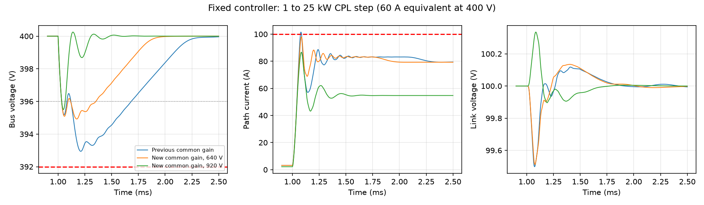

# 공통 제어기와 60 A 요구조건 검증

2026-09-22. 기존 운전점별 이득 재계산을 대체할 **고정 이득 후보**를 검증한다. 이전 기록은 [2단 모델 통합 검증](../2026-09-22-integration/README.md)에 보존한다.

## 실행

저장된 실행 결과: 정상 조건 **41/41**, 단일 변수 공차 **28/28** 통과. 지연 10/15 µs의 4개 조건과 640 V의  5→29 kW 조건은 실패했다. Python과 MATLAB R2024b의 **80개 조건 판정이 모두 일치**했으며, 기존 12개 사례의 MATLAB 회귀검사도 통과했다. 정상 조건의 최악 전압 강하는 5.077 V, 회복시간은 353 µs다.

저장소 루트에서:

```sh
python python/validate_fixed_control.py
python python/sweep_fixed_control_delay.py
```

MATLAB에서 `cd matlab; validate_fixed_control` 실행 후:

```sh
python python/compare_fixed_control.py
```

Python은 NumPy/SciPy/Matplotlib, MATLAB은 R2024b에서 확인한다. 수치가 들어 있는 JSON은 위 스크립트가 생성한다. 정상 조건의 요구사항 실패는 실행을 중단하고, 공차·지연·정격 초과 진단은 성공/실패 모두 기록한다.

## 시험의 정의

| 항목 | 정의 |
|---|---|
| 공통 이득 | 788 V·5 kW, 극배치 주파수 파라미터 4.8 kHz에서 한 번 계산한 5개 계수. 모든 시험에서 동일 |
| 제어기 파라미터 | `pprc_fixed_control.NOMINAL`. 공차값을 제어기에 알려주거나 보상하지 않음 |
| 정격 내 60 A | **1→25 kW 정전력 부하**. 공칭 400 V 기준 24 kW/400 V=60 A 상당 |
| 정격 초과 60 A | **5→29 kW**. 25 kW 연속 정격과 별도 분류; 통과해도 연속 정격 승격 아님 |
| 기간 | 미리 충전된 평형점에서 20 ms, 1 ms에 부하 변경 |
| 전압 | 스텝 후 400±8 V, 최종 400±4 V |
| 회복 | ±4 V를 마지막으로 벗어난 뒤 다시 들어오는 시각이 스텝 후 1 ms 이내. 끝까지 벗어나 있으면 `null` |
| 잔류 진동 | 마지막 1 ms 버스 전압의 최대−최소 ≤0.1 V. 평균 모델의 잔류 진동 기준이며 실제 스위칭 리플 기준이 아님 |
| 소자/포트 | 경로·필터 100 A, 링크 80 A·8 kW·SPS 한계, 직렬 ±90 V, 링크 90–110 V, 변조율 ±0.95 |

적분 0.2 µs, 제어 갱신 5 µs, 기본 전달 지연 5 µs다. 실제 상태를 강제로 제한하지 않으며 위반을 판정한다. 제어기가 아는 공칭값과 실제 회로 파라미터를 분리했다. 전압원은 각 시험 동안 일정하므로 운전 중 배터리 전압 변화나 모드 전환을 검증한 것은 아니다.

## 파일

| 파일 | 내용 |
|---|---|
| python_results.json | 고정 이득, 조건별 결과, 공차/지연 진단, 기존 공통 4 kHz 제어기의 반례, 적분 수렴 |
| cases.json | 독립 MATLAB 재현 입력. 제어기 설정과 실제 회로값을 별도 저장 |
| matlab_results.json | MATLAB 독립 적분. 기존 12사례 공유 커널 회귀검사도 수행 |
| cross_language.json | 전압·전류·회복 시간·모든 판정 일치 검사 |
| delay_sweep.json | 전달지연 5.0–10.0 µs 진단 스윕. 시험한 640/920 V 조건은 6.2 µs까지 모두 통과하고 6.3 µs에서 640 V 경로전류 한계를 처음 위반 |
| tuning_5000.json | 초기 5 kHz 후보의 시험 요약. 필터 공차에서 잔류 진동으로 탈락한 이력 |
| fixed_control.png | 기존/새 공통 제어기 비교 |

정상 운전점 표본과 한 변수씩 바꾼 공차 시험은 전 운전영역의 강건성 증명이 아니다. 공차 조합, 센서 지연·잡음, 동적 배터리 전압, 실제 스위칭, 고장 차단 및 열 시험은 포함되지 않는다.

지연 스윕의 6.2–6.3 µs 경계는 이산 시험점에서 얻은 진단 결과이며, 연속시간 안정성 증명이나 하드웨어 허용지연 인증이 아니다.


