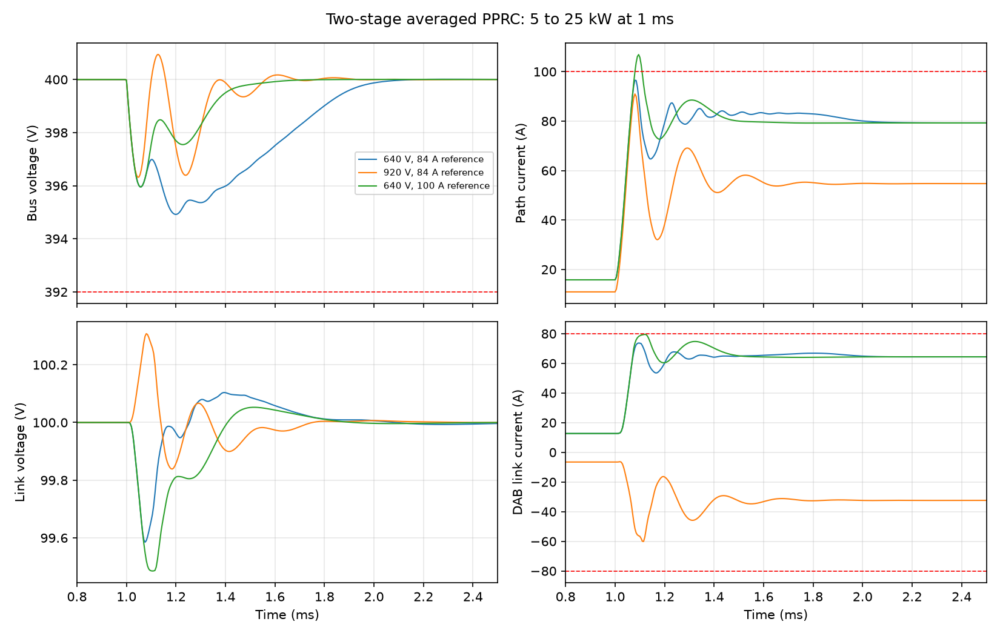

# v0.9.1 통합 후 검증

2026-09-22. Python 3.12 / NumPy 2.3.5 / SciPy 1.18.1, MATLAB R2024b Update 8에서 실행.

저장소 루트에서 `python python/validate_two_stage.py`, `python python/validate_sals_contract.py`를 실행한다. MATLAB에서 `cd matlab; validate_two_stage` 실행 후, 루트에서 `python python/compare_two_stage.py`를 실행한다.

| 파일 | 의미 |
|---|---|
| two_stage_python.json | 정상상태 24점, 임의 상태 에너지 수지 1,000점, 동적 시험 12건, 시간 간격 수렴 |
| two_stage_cases.json | 각 시험의 파라미터와 제어 이득. MATLAB 입력이며 위 Python 시험이 생성 |
| two_stage_matlab.json | 별도로 구현한 MATLAB 평형점 계산·중점법 적분·포트 판정 |
| two_stage_cross_language.json | MATLAB/Python 수치·모든 실패 플래그 대조 |
| sals_contract.json | 관측 전 사건 반례, 우선순위 승인·전력 예산·불가능 조건 시험 |
| sync_checks.json | PowerShell/Bash helper의 현재 브랜치 push, main 보존, 실패 중단을 로컬 bare 원격으로 검사 |
| provenance.json | 첨부 파일 SHA-256, 네 패치의 커밋과 bundle 이력, 실행 환경 |
| two_stage.png | 정격 시험의 버스/링크 전압 및 경로/링크 전류 |

총 12개 동적 사례 중 **10개 요구사항 통과, 2개 의도한 실패**다. 과부하와 100 A 지령 사용의 정격 초과를 검출해야 회귀시험이 PASS다. PASS가 전체 아키텍처 완성이나 모든 운전 조건 만족을 뜻하지 않는다.

정상 동작 6 ms를 계산하며 1 ms에 부하를 바꾼다. 명령 갱신 5 µs, 전달 지연 5 µs, 적분 0.2 µs. 640 V 정격 사례에서 적분 간격을 0.1 µs로 줄이면 버스 파형 차이가 최대 0.000391 V다. 최대 미분 에너지 잔차는 2.18×10⁻¹¹ W, 두 언어의 스칼라 지표 차이는 최대 1.91×10⁻¹⁰이다. 에너지 식의 일관성과 소프트웨어 재현성을 확인한 것이며 하드웨어 정확도 수치가 아니다.

이전 이상 직렬 포트 및 Simulink 결과는 [별도 폴더](../2026-09-22/README.md)에 보존했다. 새 2단 모델은 Python/MATLAB ODE이며, 이전 `.slx`가 새 모델로 바뀐 것은 아니다.

